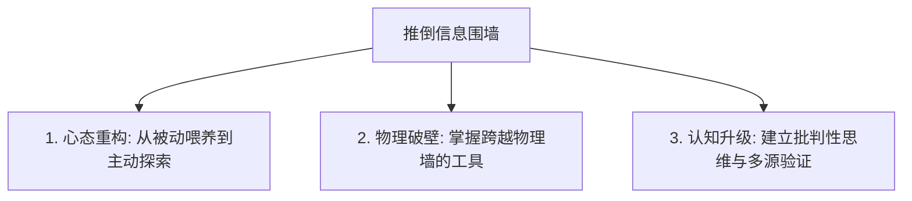

# 1.1 信息围墙：你被困住了吗？

> [!quote] 赫胥黎《美丽新世界》
> 人们会渐渐爱上那些宽容他们思考的科技，而遗忘掉那些需要独立思考和批判性阅读的信息。

你好，少年。

在正式开始教你任何具体的“工具”或“方法”之前，我想先请你停下来，做一次冷静的自我审视。

如果你现在拿出手机，打开你的常用 App（微信、抖音、小红书、微博或知乎），划动两下屏幕，你会看到什么？是根据你的兴趣量身定制的娱乐视频？是让你感到愤怒或热血沸腾的热搜新闻？还是各种包装精美但毫无信息增量的“干货”？

你可能觉得，在这个信息爆炸的时代，只要有一部联网的手机，你就拥有了全世界的知识。

**但真相是，你可能正被关在一座无形的“信息围墙”里。**

---

## 一、 什么是“信息围墙”？

所谓“信息围墙”，并不是一块物理上的高墙，而是由 **技术、算法、语言和认知** 共同编织的一张无形巨网。它主要由三层墙组成：

### 1. 物理层：网络审查的“防火墙”
这是最直观的墙。出于各种复杂的考虑，很多全球主流的搜索引擎、学术数据库、开发社区和多媒体平台（如 Google、Wikipedia、YouTube、GitHub、OpenAI 等）在中国大陆是无法直接访问的。
如果你只使用国内局域网，那么全球至少 **70% 以上的一手信息流** 就已经与你绝缘了。

### 2. 算法层：投其所好的“信息茧房”
如今的互联网服务商几乎全部采用“推荐算法”。你点赞了什么，算法就继续给你推送什么；你讨厌什么，算法就帮你屏蔽什么。
久而久之，你的屏幕上只会充斥着迎合你偏见的内容。**你以为你在看世界，其实你只是在镜子里看自己。** 这种状态在传播学上被称为“信息茧房”（Information Cocoon）或“过滤气泡”（Filter Bubble）。

### 3. 语言层：天然存在的“语言结界”
在当今互联网上，英语依然是绝对的霸权语言。全球超过 **50% 的网页内容** 是英文，而中文网页只占不到 **5%**。最前沿的 AI 论文、开源代码、国际趋势，几乎 95% 以上都是以英文首发。
如果你不会直接阅读英语，你就必须依赖别人翻译后的“二手甚至三手垃圾信息”。在这个过程中，信息早已失真、变形。

---

## 二、 诊断：你被困住了吗？

很多少年被困在围墙里而不自知，甚至在温水煮青蛙中感到无比舒适。请对照以下 5 条指标，进行一次自我诊断：

1. **“信息喂养”依赖症**：你的信息绝大多数来自于 App 的“推荐页”或“热门推送”，极少主动通过搜索引擎（特别是支持复杂语法的高级搜索）去求证一件事。
2. **“三手信息”消费者**：面对一个新事物（如 ChatGPT 出现），你更倾向于看国内自媒体的“3分钟带你了解”视频，而不是去阅读官方文档或一手报告。
3. **情绪被算法精准操控**：看到某些热搜或反转新闻时，你会轻易被挑起愤怒、焦虑或狂喜，并在几小时后看到“反转”时又陷入困惑。
4. **深度阅读能力退化**：习惯了快节奏的短视频和碎片化推文，一旦让你阅读超过 2000 字的逻辑严密的长文，你就会感到烦躁、走神、无法集中注意力。
5. **同质化偏见**：你觉得互联网上绝大多数人都应该和你想的一样，遇到不同观点时，本能反应是“他是不是反华/收了钱/脑子不好”，而不是“他为什么会得出这个结论”。

> [!WARNING]
> 如果以上 5 条你符合 3 条以上，那么你已经处于深度被“围墙困住”的状态。你的认知正在被算法饲养，你的专注力正在成为商家的廉价商品。

---

## 三、 被困在围墙内的代价

被围墙关起来的代价是极其惨痛的，尤其是对于正在构建世界观和职业竞争力的少年来说：

*   **认知极度狭隘**：你对世界的理解被局限在极小的信息切片中。当别人在讨论全球最新的 AI 商业应用时，你可能还在为某个八卦娱乐热搜跟人争论个没完。
*   **丧失第一手信息获取能力**：在未来的职场和学习中，**获取一手信息的速度与准确度就是核心竞争力**。如果你只懂得百度搜索，你就只能得到被无数广告过滤后的污染信息。
*   **成为算法奴隶**：你的注意力和时间被短视频和信息流无情收割，每天刷手机 5 小时，关掉手机后却只留下一片空虚和焦虑，无法在现实生活中积累任何有效资产。

---

## 四、 如何推倒你眼前的“墙”？

“破壁”是本指南的第一步，也是你认知觉醒的起点。要推倒这堵墙，你需要从以下三个维度立刻开始行动：

1.  **从“喂养模式”切换为“探索模式”**：
    关掉所有非必要 App 的推送通知。减少划动“推荐页”的频率，多使用**主动搜索**。当对某个概念好奇时，去 Google、维基百科或专业数据库寻找答案，而不是点开抖音。
2.  **跨越物理与语言的壁垒**：
    学习并掌握科学的上网工具，去看看外面的世界（见 [1.2 节](1.2%20科学上网%20-%20打开全球知识大门的钥匙.md)）。同时，把英语从一门“用来考试的学科”转变为“用来探索世界的日常工具”（见 [1.3 节](1.3%20英语突围%20-%20打开世界的钥匙🔑.md)）。
3.  **建立“信息源管道”**：
    不要让垃圾内容塞满你的大脑。用 RSS、Newsletter 等方式订阅高质量的源头信息，学会筛选并只吸收有营养的信息水分（见 [1.4 节](1.4%20信息源管理%20-%20建立你的只是管道.md)）。

---

## 💡 思考与行动

> [!TIP]
> **今日行动任务：**
> 1. 打开你手机的“屏幕使用时间”，记录下你昨天花在各类娱乐/社交 App（如抖音、小红书、微博）上的总时长。
> 2. 尝试闭上眼睛回想，昨天你在这些 App 里刷到的内容中，有哪一条在今天依然对你产生价值？如果有，请写下来；如果没有，请静下心思考，为什么你愿意用生命中最宝贵的时间去交换这些毫无价值的数字噪音。

少年，破壁的过程可能会让你感到不适，因为你需要离开舒适的主动喂食区，去面对一个庞大、嘈杂、甚至有些冷酷的真实世界。

但请相信，当你第一次翻过这堵墙，看到真正广袤的知识星空时，你绝不会后悔。

---

