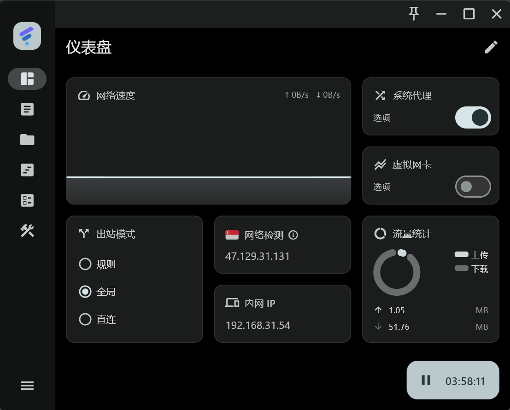
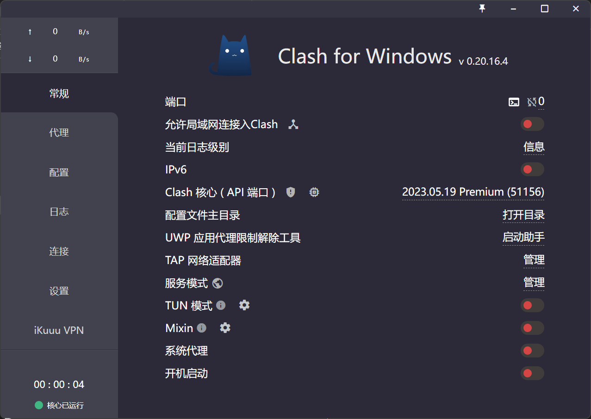
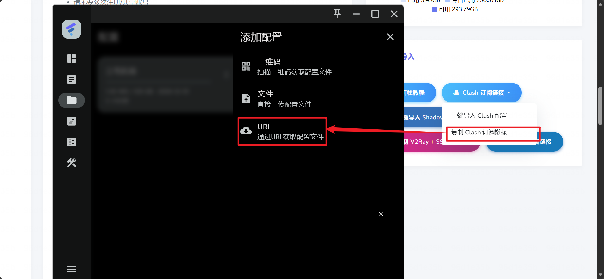
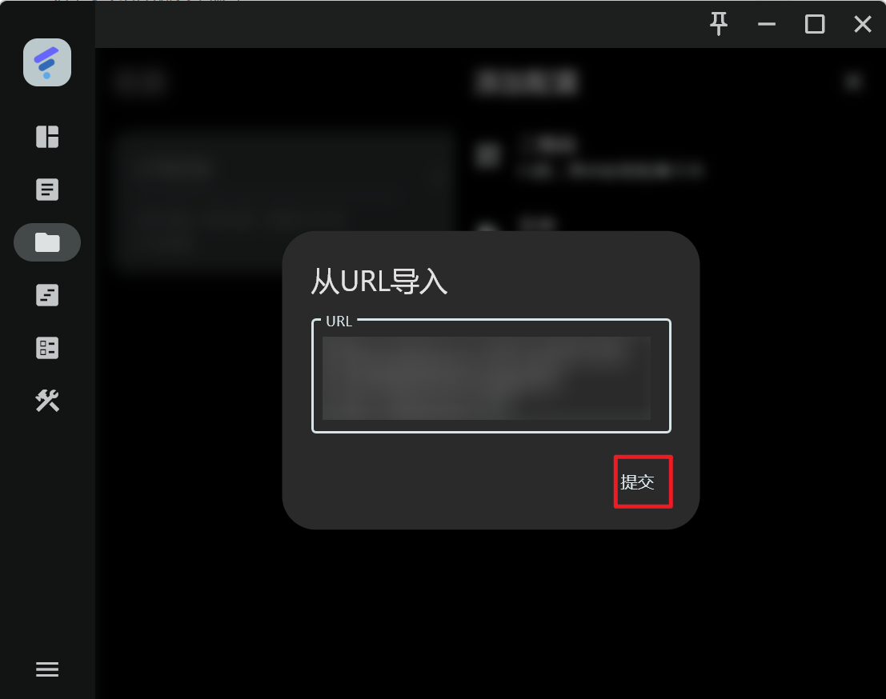
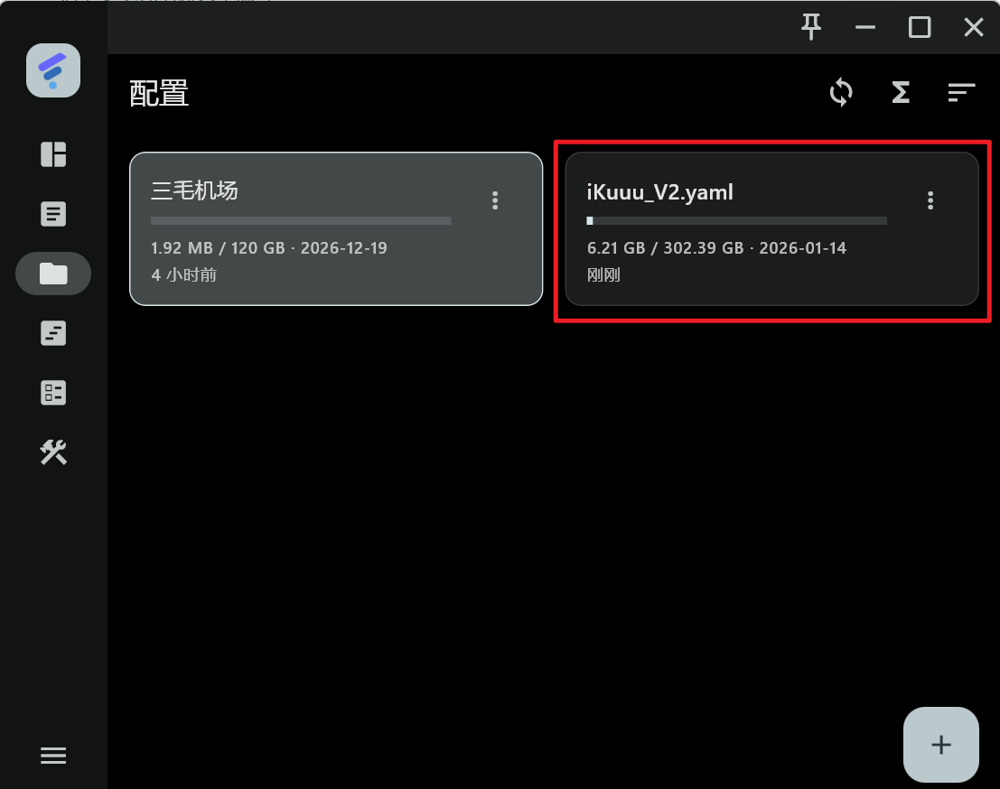
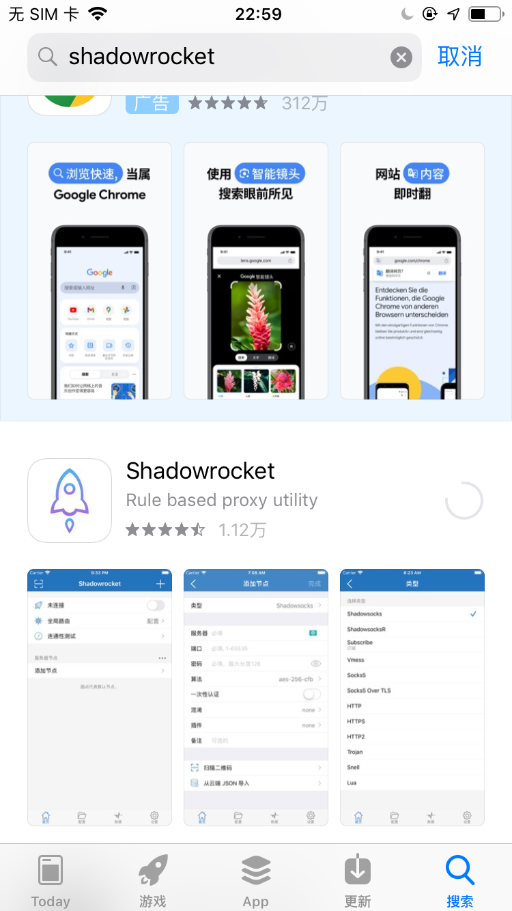
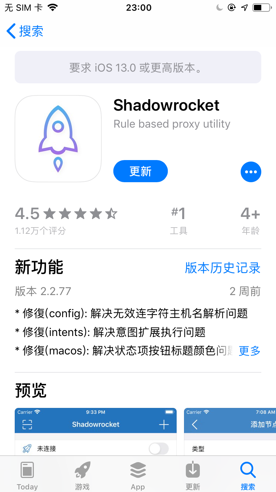
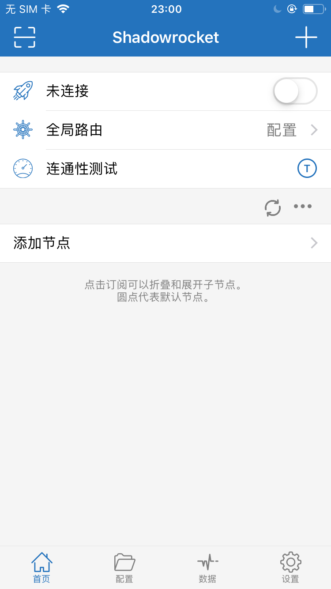
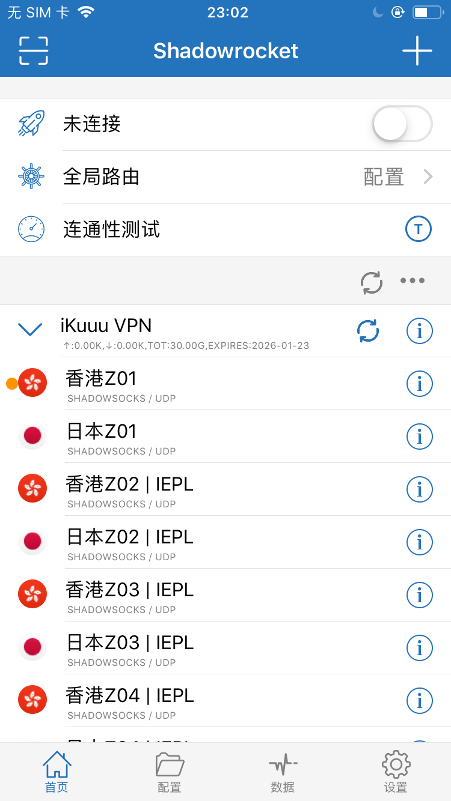
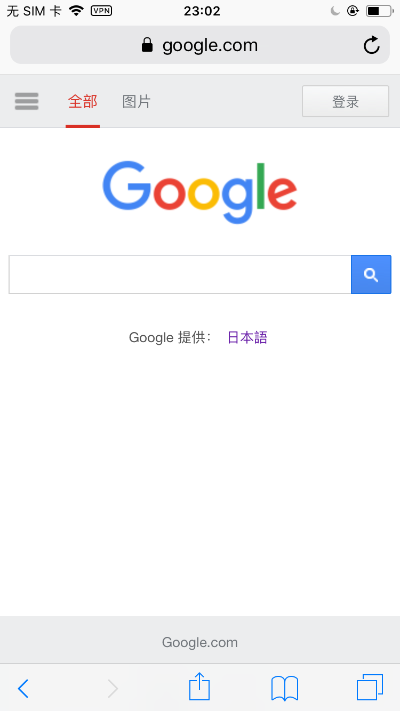

# 1.2 科学上网：打开全球知识大门的钥匙

> [!NOTE]
> **本节目的**：指导你如何建立一条稳定、高速的国际网络通道，以便直接访问全球前沿的学术、开发和 AI 资源。请在阅读和实践中遵守相关法律法规，将技术用于正当的学习与科研。

在 1.1 节中，我们了解了信息围墙的存在。本节将通过实际操作，带你打破物理上的高墙，建立你的第一条全球知识通路。

---

## 一、 为什么我们需要科学上网？

由于全球网络环境的差异，部分国际网站和网络服务在中国大陆无法直接访问。如果你要开展高质量的学术研究、进行软件开发或者与 AI 进行深度协作，以下资源是不可或缺的：

> - Google 等搜索引擎
> - YouTube、Twitch 等视频平台
> - Twitter、Facebook 等社交媒体
> - Wikipedia、Google Scholar 等学术资源
> - Netflix、Disney+ 等流媒体

因此，掌握“科学上网”不仅是开阔眼界的工具，更是现代学习者和开发者的**底层刚需**。

---

## 二、 💡 常见的科学上网方式

目前主流的网络代理技术有以下几种：

*   **VPN（虚拟专用网络）**：对整机流量进行强加密。虽然使用简单，但协议特征明显，在特定时期容易被干扰封锁。
*   **网络代理协议（如 Shadowrocks / V2Ray / Trojan）**：专为突破网络审查设计，特征混淆度高，目前是主流的梯子协议。
*   **基于规则的代理客户端（如 Clash / Mihomo / Sing-box）**：具备强大的分流规则（如国内流量直连，学术或境外流量走代理），使用方便。
*   **自建 VPS 搭建代理**：技术门槛较高，需自己租用海外服务器搭建，但完全自主可控。
*   **Tor（洋葱路由）网络**：极端强调匿名与隐私，但由于节点多次跳转，访问速度极慢，不适合作为日常学习工具。

---

## 三、 💻 PC 端科学上网指南

### 3.1 Windows 系统

在 Windows 端，目前主流的客户端是基于内核的 Clash 衍生版（如 FastClient 或 Clash Verge）：



> *FastClient — 更加现代化的 UI 界面，底层核心依然是 Clash。*



> *经典的原版 Clash 软件界面。*

#### 订阅导入与使用步骤：
1. 复制机场提供的 **Clash 订阅链接（Subscribe Link）**。
2. 打开客户端，进入 `Profiles`（配置）界面，粘贴订阅链接并点击 `Download` / `Import` 按钮下载配置文件。
3. 下载成功后，选择该配置文件，并在主页开启 `System Proxy`（系统代理）或 `TUN Mode`（虚拟网卡模式，推荐）。





> *以上为 Windows 系统的软件订阅及启动操作流程演示。*

---

### 3.2 macOS 系统

在 Mac 端，推荐使用 **Clash Verge Rev** 或 **Clash Nyanpasu**：
1. 下载对应的 `.dmg` 安装包（注意 M 系列芯片选择 `aarch64` 版，Intel 芯片选择 `x64` 版）。
2. 在 `Profiles` 中导入你的订阅链接。
3. 开启 `System Proxy`（系统代理），如果需要代理终端流量，请开启 `Enhanced Mode`（增强模式/TUN）。

---

### 3.3 Linux 系统（Mihomo / Clash 安装方法）

在 Linux 系统（如 Ubuntu / Debian / CentOS）中，由于通常运行在无 GUI 的服务器环境，推荐直接使用 **Mihomo（原 Clash Meta，目前维护最活跃的内核）** 进行后台部署：

#### 步骤 1：下载 Mihomo 二进制文件
根据你的 CPU 架构（如 `amd64`），到 Mihomo 官方 Releases 页面下载最新二进制文件：
```bash
# 下载压缩包
wget https://github.com/MetaCubeX/mihomo/releases/download/v1.18.9/mihomo-linux-amd64-v1.18.9.gz
# 解压
gunzip mihomo-linux-amd64-v1.18.9.gz
# 重命名并移动至可执行路径
sudo mv mihomo-linux-amd64-v1.18.9 /usr/local/bin/mihomo
# 赋予执行权限
sudo chmod +x /usr/local/bin/mihomo
```

#### 步骤 2：准备配置文件
创建配置目录，并将你从机场获取到的 `yaml` 配置文件重命名为 `config.yaml` 放置于该目录：
```bash
mkdir -p ~/.config/mihomo
# 将配置文件移动至此目录并命名为 config.yaml
# 例如通过 curl 下载订阅：
curl -o ~/.config/mihomo/config.yaml "你的Clash订阅链接"
```

#### 步骤 3：配置 systemd 服务后台运行
为了让 Mihomo 开机自启并在后台稳定运行，创建服务文件 `/etc/systemd/system/mihomo.service`：
```ini
[Unit]
Description=Mihomo Daemon, A rule-based tunnel in Go.
After=network.target

[Service]
Type=simple
User=root
ExecStart=/usr/local/bin/mihomo -d /root/.config/mihomo
Restart=always

[Install]
WantedBy=multi-user.target
```

启动并启用开机自启：
```bash
sudo systemctl daemon-reload
sudo systemctl start mihomo
sudo systemctl enable mihomo
```

#### 步骤 4：配置终端代理环境变量
在你的终端配置文件（如 `~/.bashrc` 或 `~/.zshrc`）末尾添加以下内容，方便随时开关终端代理：
```bash
# 代理开关快捷键
alias proxy="export http_proxy=http://127.0.0.1:7890; export https_proxy=http://127.0.0.1:7890; echo 'Terminal Proxy Enabled'"
alias unproxy="unset http_proxy; unset https_proxy; echo 'Terminal Proxy Disabled'"
```
使用时只需在终端输入 `proxy` 即可对当前会话开启代理，输入 `unproxy` 关闭。

---

## 四、 📱 手机端科学上网指南

### 4.1 Android 系统

1. **下载安装包**：下载安卓软件 `Clash Meta for Android` 或 `FastClient`（推荐 FastClient，因为原版 Clash for Android 已停止维护，部分新协议可能不受支持）。
2. **导入订阅**：打开 App -> `Profiles`（配置）-> `New Profile`（新配置）-> `URL`，粘贴订阅链接并保存下载。
3. **启动代理**：选择下载好的配置，回到首页点击 `Stopped`（已停止）按钮启动连接。
4. **分流选择**：默认推荐选择 `Rule`（规则/分流）模式，避免访问国内软件时也使用海外流量。

---

### 4.2 iOS 系统

由于 App Store 中国区限制，你需要使用境外 Apple ID 才能下载代理软件。

1. **准备境外 Apple ID**：
   在 `App Store` 中退出当前的国区账号，登录美区或港区 Apple ID（可自行注册或向机场/朋友索取共享账号）。
2. **下载 Shadowrocket**：
   在境外商店中搜索并下载 **Shadowrocket**（俗称“小火箭”，付费软件，售价约 $2.99）。
   
   
   
   
3. **导入订阅与运行**：
   * 复制机场的一键订阅链接，或者在浏览器中选择“一键导入 Shadowrocket”。
   * 也可使用扫描二维码方式，在小火箭中点击左上角扫描按钮直接录入。
   
   
   
4. **节点选择与启动**：
   选择一个低延迟节点，将 Global Routing（全局路由）设置为 `Config`（配置模式，即按规则分流），然后点击顶部的未连接开关。
   
   
   

---

## 五、 🌐 推荐的代理节点服务

> [!WARNING]
> 以下推荐仅供学习和研究用途，各平台服务的稳定性与价格随时可能发生变化，请根据个人情况谨慎选择。

*   ⭐⭐⭐⭐⭐ **[三毛机场](https://g-1.smjcdh.top/#/register?code=s4RAqQYP)** — 价格低廉（年付 3 元起），实际结算价与标价可能存在微小变动，适合作为轻量级访问或备用节点。
*   ⭐⭐⭐⭐ **[ikuuu](https://ikuuu.club/)** — 稳定度良好，提供部分免费的日本节点，但有些境外特有 App 可能会受到限制。
*   ⭐⭐⭐ **[一元机场](https://xn--4gq62f52gdss.com/#/login)** — 年付 12 元左右，流量额度充裕，但近期由于维护原因，稳定度存在小幅度波动。

---