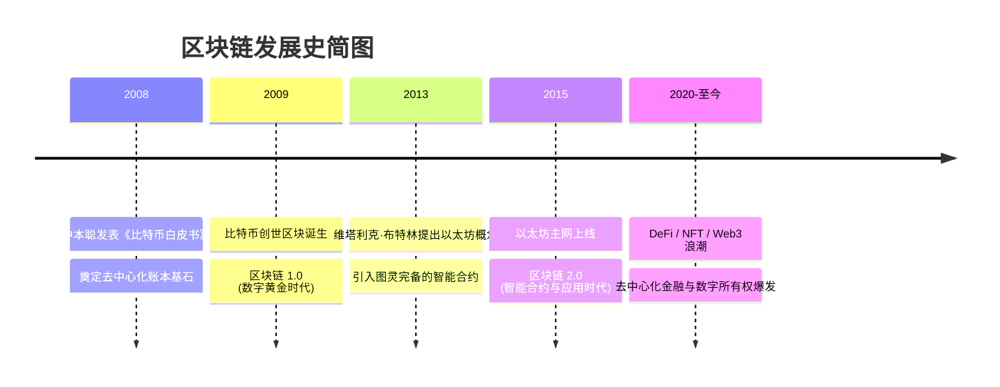
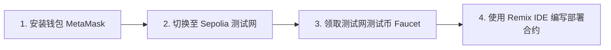
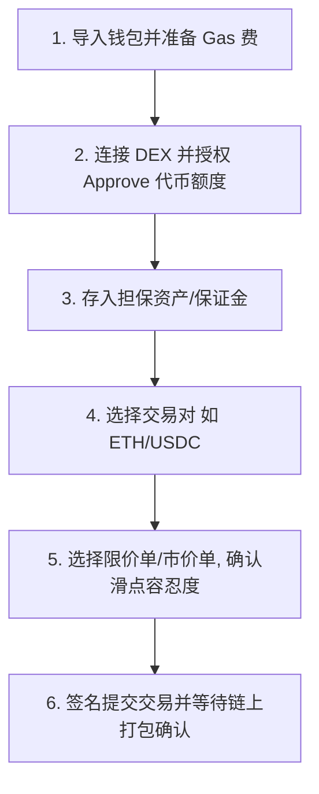
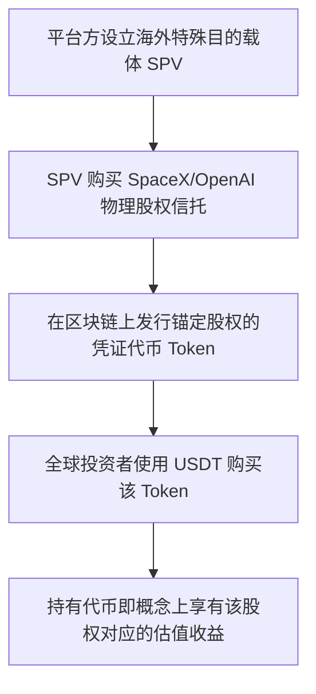

# 1.3 区块链通识：开启去中心化世界的通行证

> [!IMPORTANT]
> **本节寄语 & 免责声明**：
> 1. 区块链不仅仅是关于“加密货币”和投机，它是一场关于**“信任与资产所有权”的底层协议革命**。作为拥抱未来的青年，理解去中心化技术，将帮助你提前触达下一代互联网（Web3）的边界。
> 2. **免责与法律声明**：本章仅对区块链技术与去中心化生态进行客观的学术与技术科普介绍，**不提供任何金融交易建议、买卖代币的操作推荐或投资指引**。根据中国人民银行等部门发布的通知，虚拟货币相关业务活动属于非法金融活动。加密资产价格波动极高，且交易存在较高的法律与经济风险，请读者务必理性看待，严格遵守当地法律法规。

你好，少年。

在互联网的早期，我们实现了“信息的自由传输”（你可以给大洋彼岸的朋友瞬间发一封邮件）。但有一个问题，互联网一直无法完美解决：**如何在不依赖中介的情况下，实现“价值（资产）的自由传输”？**

比如，你想在网上给朋友转账 100 元，以前必须通过银行、支付宝、微信等“可信第三方”。如果没有这些中介，你怎么证明你真的把钱转给了他，而不是复制了一份发给他？

2008 年，一个自称“中本聪”的人，带着一份白皮书，彻底改写了这一规则。这套被称为**区块链（Blockchain）**的技术，开启了去中心化信任的大门。

---

## 一、 区块链的历史与演进

区块链并不是凭空出现的，它是密码学、分布式网络和博弈论半个多世纪发展的集大成者。



### 1. 比特币（区块链 1.0）：去中心化账本的诞生
2008 年全球金融危机爆发，中心化主权货币超发引起了社会的信任危机。中本聪提出了比特币（Bitcoin）构想：
*   **核心逻辑**：不依靠中央银行，而是依靠分布式网络中的所有计算机共同记账。
*   **特征**：每 10 分钟打包一个区块，账本对所有人公开，且不可篡改。比特币总量恒定为 2100 万枚，具有天然的抗通胀性，被称为**“数字黄金”**。
*   **局限**：它只支持简单的转账交易，不支持复杂的逻辑。

### 2. 以太坊（区块链 2.0）：世界计算机与智能合约
2013 年，19 岁的少年维塔利克·布特林（Vitalik Buterin，人称“V神”）认为比特币的脚本语言限制了其想象力。他提出了以太坊（Ethereum）计划：
*   **核心创新**：引入了 **智能合约（Smart Contract）**。它将以太坊打造成了一个运行在成千上万个节点之上的“世界计算机”。
*   **意义**：只要你想，你可以用代码直接在以太坊上写出一套游戏规则、一套金融贷款系统、或者一个组织投票系统，并且这套代码一旦部署，任何人（包括创建者自己）都无法强行修改或停止它。

### 3. Web3 与数智时代（区块链 3.0）：价值互联网的爆发
如今，区块链已经跨越了单纯金融的领域，延伸到：
*   **DeFi（去中心化金融）**：无需银行，用代码实现借贷、交易和理财。
*   **NFT（非同质化代币）**：为数字艺术品、虚拟资产提供唯一的所有权证明。
*   **DAO（去中心化自治组织）**：无中心管理者，通过智能合约投票来协作和管理公共资金。
*   **Web3（价值互联网）**：数据和资产真正归用户所有，而不是归谷歌、腾讯等科技巨头所有。

---

## 二、 技术拆解：区块链如何从 0 到 1 运作？

要理解区块链，我们需要从最底层的数据结构 and 密码学组件说起。

### 1. 结构拆解：什么是“区块”和“链”？
区块链的本质是**一个只允许追加、不可修改的分布式共享账本**。

*   **区块（Block）**：就像账本的一页纸，里面记录了交易数据（谁转给谁多少钱）。
*   **链（Chain）**：每一页账本（区块）都有一个独特的印章。这枚印章由两部分组成：本区块所有交易生成的 **当前哈希（Hash）**，以及上一页账本的 **前导哈希（Previous Hash）**。
*   **不可篡改的秘密**：正因为每个区块都包含了上一个区块的哈希，如果有人试图修改 3 号区块的数据， 3 号区块的哈希就会瞬间改变，进而导致 4 号、5 号直到最新的区块的哈希全部失效。这就好比推倒了多米诺骨牌，网络中的其他节点会瞬间发现账本被篡改，从而拒绝承认该笔数据。

### 2. 核心密码学：非对称加密与哈希函数
区块链的安全由数学和密码学支撑，而非人性的信任。

#### ① 哈希算法（SHA-256）
哈希算法是一种“单向数据指纹发生器”。它具有以下特点：
*   **单向性**：输入任意内容（一句话、一本书），它能瞬间计算出一段 64 位的十六进制字符。但通过这个字符，绝对无法逆推出输入的内容。
*   **雪崩效应**：哪怕输入的文本只改动了一个标点符号，生成的哈希值也会天差地别。

```bash
# 输入: Hello World
# 哈希: a591a6d40bf420404a011733cfb7b190d62c65bf0bcda32b57b277d9ad9f146e

# 输入: Hello world (仅仅修改了大小写)
# 哈希: 64ec88ca00b268e5ba1a35678a1b5316d212f4f366b2477232534a8aeca37f3c
```

#### ② 非对称加密（公钥与私钥）
在区块链上，你不需要使用身份证注册账号，你的账户是由一对密钥构成的：
*   **私钥（Private Key）**：相当于你的**“支付密码兼物理钥匙”**，绝对不能泄露给任何人。拥有私钥就拥有该账户下资产的绝对控制权。
*   **公钥（Public Key）**：从私钥推导而来，相当于你的**“银行卡账号”**。公钥再经过哈希运算就变成了你在区块链上的“钱包地址”（例如：`0x71C...`）。
*   **工作机制**：当你转账时，用私钥对交易进行**数字签名（Signature）**；网络上的其他节点使用你的公钥就能验证这笔交易确实是你发起的，且在这个过程中，没有人能窥探到你的私钥。

### 3. 共识机制：所有人如何达成一致？
在没有中心服务器的情况下，如何决定谁来负责打包区块（记账）？

*   **POW（工作量证明，Proof of Work）**：
    *   **原理**：所有节点（矿工）一起通过计算机计算一个极难的数学谜题（寻找特定前缀为零的哈希值），谁最先算出来，谁就获得记账权，并获得系统发放的代币奖励（挖矿）。
    *   **优缺点**：安全性极高，但消耗大量电能。比特币目前仍在使用。
*   **POS（权益证明，Proof of Stake）**：
    *   **原理**：谁抵押（Stake）的代币多，谁获得记账权的概率就大。类似于股东大会按持股比例分配投票权和分红。
    *   **优缺点**：极其节能，交易速度快。以太坊已于 2022 年成功转型为 POS 机制。

---

## 三、 从 0 到 1 学习： Solidity 智能合约起步

对于有编程基础的少年来说，学习区块链最直观的方式就是编写你自己的智能合约。

### 1. 什么是 Solidity？
Solidity 是以太坊（EVM）上最主流的面向对象、静态类型的编程语言，其语法风格类似于 JavaScript 和 C++。

### 2. 极简 ERC-20 代币合约示例
下面是一个非常经典的以太坊代币合约的实现（它定义了一个可以转账、查询余额的极简代币）：

```solidity
// SPDX-License-Identifier: MIT
pragma solidity ^0.8.20;

contract SimpleToken {
    // 状态变量：存储代币的名称、符号和总供应量
    string public name = "Horizon Token";
    string public symbol = "HRZ";
    uint256 public totalSupply = 1000000 * 10 ** 18; // 100万枚，支持18位小数

    // 映射表：存储每个钱包地址对应的余额
    mapping(address => uint256) public balanceOf;

    // 事件：当发生转账时在区块链日志中记录
    event Transfer(address indexed from, address indexed to, uint256 value);

    // 构造函数：在合约部署时运行，将所有初始代币赋予合约创建者
    constructor() {
        balanceOf[msg.sender] = totalSupply;
    }

    // 转账函数：实现资产的转移
    function transfer(address _to, uint256 _value) public returns (bool success) {
        // 确保发送者余额足够
        require(balanceOf[msg.sender] >= _value, "Insufficient balance");
        // 确保转账目标地址不是空地址
        require(_to != address(0), "Invalid address");

        // 扣除发送者余额，增加接收者余额
        balanceOf[msg.sender] -= _value;
        balanceOf[_to] += _value;

        // 触发转账事件
        emit Transfer(msg.sender, _to, _value);
        return true;
    }
}
```

> [!TIP]
> **代码逻辑解析**：
> 1. `mapping(address => uint256)` 实际上就是以太坊这个“大分布式表格”的底层逻辑：它存储了类似“地址 A 拥有 500 个币，地址 B 拥有 10 个币”的数据。
> 2. `msg.sender` 是内置全局变量，代表当前调用这个函数的钱包地址。
> 3. `require` 是条件断言，如果条件不满足，交易会立刻失败并回滚，退回除手续费外的所有代币。

---

## 四、 NFT（非同质化代币）：数字所有权的具象化

除了像比特币、以太币这种可以任意分割、互相替换的**同质化代币（Fungible Token）**，区块链上还有另一类资产：**NFT（Non-Fungible Token）**。

*   **独一无二**：每一枚 NFT 都有一个全网唯一的 `Token ID`，它们代表着数字世界的“不动产所有权证”。
*   **应用场景**：数字艺术品所有权、游戏道具、电子门票、实物产权在链上的数字映射等。
*   **技术标准**：在以太坊中，普通代币通常遵循 `ERC-20` 标准，而 NFT 则遵循 `ERC-721` 标准。

---

## 五、 🛠 探索与实践指南：0 基础如何起步？

想要真正学懂区块链，绝对不能只停留在看书上，你需要“知行合一”。请按照以下步骤，零成本开启你的 Web3 探索之旅：



### 1. 安装你的数字钱包
*   **工具**：安装 **MetaMask（小狐狸钱包）** 浏览器插件。
*   **关键安全规则**：在创建钱包时，系统会生成 **12个或24个单词的助记词（Seed Phrase）**。请用纸笔手抄下来，藏在安全的地方。
    > [!CAUTION]
    > **绝对不要**把助记词截图保存在手机相册、云盘或发送给任何人！拥有助记词就拥有你钱包里所有的钱。没有任何客服会找你要助记词，一旦泄露，资产将永远无法找回。

### 2. 免费在测试网测试
区块链上的每次写入操作都需要支付“手续费（Gas Fee）”。作为学习者，你可以使用完全免费的**测试网（Testnet，如 Sepolia）**：
*   在 MetaMask 中将网络切换为 `Sepolia`。
*   通过在线的 **测试网水龙头（Faucet，如 Sepolia Faucet）**，免费领取一些零成本的测试网以太币（Sepolia ETH）。

### 3. 在线部署你的第一份合约
*   打开浏览器，访问 [Remix IDE (remix.ethereum.org)](https://remix.ethereum.org/)。这是一个以太坊官方推荐的在线智能合约集成开发环境。
*   新建一个 `.sol` 文件，复制上面提供的 `SimpleToken` 代码。
*   在 Remix 左侧选择 `Solidity Compiler` 编译代码。
*   在 `Deploy & Run` 模块，将 `Environment` 切换为 `Injected Provider - MetaMask`。
*   点击 `Deploy`，在小狐狸钱包弹出窗口中确认（消耗你的免费测试币），几秒钟后，你就成功将你的第一个智能合约发布到全球测试网上了！
*   你可以在 [Etherscan (sepolia.etherscan.io)](https://sepolia.etherscan.io/) 输入你的钱包地址，观察到这笔部署交易。

---

## 六、 资产流通概念：什么是“买币”与背后的运作机制？

> [!WARNING]
> **再次警示**：本节内容仅作为去中心化经济学和网络资产流动机制的通识科普。**严禁将以下内容视为任何形式的交易或投资指导。**

在区块链与 Web3 生态中，代币（Tokens）不仅是智能合约的运行介质，在概念上也作为去中心化网络中的“价值载体”流通。了解法币与链上资产的流转、传统金融（TradFi）与去中心化交易的交汇，有助于更全面地认识 Web3 的价值网络体系。

### 1. 法币与加密资产的桥梁：法币通道（Fiat Gateways）
要在概念上实现法币（如人民币、美元、欧元）与链上加密资产的相互兑换，需要通过“法币通道”。
*   **C2C（Customer to Customer）交易**：目前大多数法币出入金通过点对点 C2C 模式进行。买方向卖方直接个人转账划转本国法币，卖方确认收到法币后，由平台的中介托管系统释放对应的链上加密资产给买方。
*   **⚠️ 致命风险——“冻卡”与涉案资金**：由于 C2C 交易完全基于个人对个人网银或支付工具转账，如果交易对手方的资金涉嫌电信诈骗、洗钱等非法行为（即“黑钱”），参与交易的用户的银行账户极易被司法机关冻结，即“冻卡”。这在点对点买卖中是一个极高概率的资金安全事件。

### 2. 流通场所之一：中心化交易所（CEX, Centralized Exchange）
*   **运作原理**：类似于传统证券交易所（如纳斯达克）。用户需要注册账号，通过严格的 **KYC（实名认证）**。资产在充值后，由交易所的统一冷热钱包进行托管。交易在交易所内部的“订单簿（Order Book）”中进行高速匹配撮合。
*   **代表平台**：Binance（币安）、OKX（欧易）、Coinbase 等。
*   **安全隐患**：资产托管在平台手中，若平台倒闭（如历史上知名的 FTX 破产事件），用户将损失所有资产。因此 Web3 行业有一句名言：*“Not your keys, not your coins”*（没有掌握私钥，资产就不真正属于你）。

### 3. 流通场所之二：去中心化交易所（DEX, Decentralized Exchange）
*   **运作原理**：完全部署在区块链智能合约上的交易平台。用户无需注册账号，直接连接自己的去中心化钱包，通过**自动做市商（AMM, Automated Market Maker）**机制，在“流动性池（Liquidity Pool）”中直接进行资产兑换。
*   **代表平台**：Uniswap、PancakeSwap 等。
*   **安全隐患**：DEX 完全基于代码运作，代码漏洞、闪电贷攻击（Flash Loan Attacks）频发。同时，用户在交互时如果不小心授权（Approve）了带有钓鱼代码的恶意智能合约，钱包中的资产可能会被瞬间转走。

### 4. 传统金融与加密生态的锚点：TradFi 稳定币与 RWA
为了消除加密货币价格极度波动的缺陷，区块链生态与传统金融（TradFi）进行了深度结合，最典型的产物是稳定币和 RWA（真实世界资产）：

*   **① 法币抵押型稳定币（如 USDT、USDC）**：这是最常用的交易介质。发行机构（如 Tether、Circle）宣称在传统银行信托体系中存入 1:1 的美元现金、国债或高评级商业票据作为储备。用户充值 1 美元，机构便在链上生成 1 个稳定币；反之，销毁 1 个稳定币，机构返还 1 美元。这是一种典型的去中心化法币映射形式。
*   **② 超额抵押型稳定币（如 DAI）**：不依赖中心化实体，而是通过智能合约在链上超额质押数字资产（如用价值 150 美元的 ETH 抵押借出 100 美元的 DAI）。一旦抵押品跌破安全线，会被智能合约自动清算。
*   **③ 算法稳定币（如 UST，已崩溃）**：没有任何实体资产或足额抵押，仅通过套利算法维持 1 美元锚定，在市场恐慌时极易引发“死亡螺旋”导致瞬间归零。
*   **④ 真实世界资产（RWA, Real World Assets）**：通过特殊信托实体，将传统的国债、黄金、房地产等资产进行数字化通证化，带入区块链。例如将美国国债上链，使链上持有者能够获得传统金融的美元无风险利率，这是 TradFi 与 Web3 的前沿技术交汇点。

### 5. 加密衍生品的核心：永续合约（Perpetual Swaps）与合约 DEX
与现货交易（购买实际代币）不同，衍生品交易侧重于对资产价格走势的对冲和投机。

> [!WARNING]
> **杠杆与合约交易具有极高的强平爆仓风险，极不适合新手读者。以下内容仅作原理解析。**

*   **什么是永续合约？**：传统金融中的期货合约（Futures）都有特定的“交割日期”。而加密生态独创的**永续合约**没有到期日，只要你的保证金充足，你可以永远持有该仓位。
*   **锚定机制：资金费率（Funding Rate）**：既然没有交割日，如何防止合约价格与现货价格脱节？
    - 系统通过每隔几小时（通常为 8 小时）在多头和空头之间结算一次“资金费用”来锚定价格。
    - 当合约价格 **高于** 现货价格（多头情绪亢奋），资金费率为正，**多头必须支付费用给空头**，从而平抑合约价格。
    - 当合约价格 **低于** 现货价格，资金费率为负，**空头必须支付费用给多头**，以拉升合约价格。
*   **杠杆（Leverage）与强平（Liquidation）机制**：
    - **起始保证金（Initial Margin）**：开仓所需的最小资金。例如使用 10 倍杠杆，你只需 100 USDT 就可以建立价值 1000 USDT 的多头或空头仓位。
    - **维持保证金（Maintenance Margin）与爆仓**：如果价格反向运行，导致你的账户保证金余额缩水至维持线以下，智能合约或交易所将强行接管你的仓位并进行清算，此时你的初始保证金将**全部归零**。
*   **衍生品 DEX (Perpetual DEX，如 dYdX、GMX)**：
    与去中心化现货交易所类似，衍生品 DEX 将合约仓位匹配、清算、资金管理全部写入智能合约，用户通过链上钱包直接进行杠杆博弈，无平台挪用资产的中心化风险，但需要承担预言机（Oracle）价格喂送偏差的系统风险。

### 6. 如何进行交易？基础交易理论与单据操作
不论是在 CEX 还是 DEX 中，交易的执行基本上都遵循以下底层逻辑和操作路径：

#### ① 订单簿与深度理论（Order Book & Depth）
*   **订单簿**：买卖双方挂单的列表。上面是卖单（Asks，由低到高排序），下面是买单（Bids，由高到低排序）。中间的价差称为“点差”。
*   **深度（Depth）**：指在不同价格档位上积压的挂单量。深度越深，大额交易对市场价格造成的冲击（滑点）就越小。

#### ② 限价单 vs 市价单（Limit vs Market）
*   **限价单（Limit Order）**：由你指定交易价格。只有当市场价格变动到该指定价格或更优价格时，订单才会成交。适合对价格敏感、不急于成交的场景。
*   **市价单（Market Order）**：不指定价格，以当前订单簿中能够撮合的最优惠价格立即成交。适合需要紧急进出场的场景，但在大额交易或深度不足时会产生较大“滑点”。

#### ③ 去中心化交易的通用路径流程


### 7. 常见的交易套路与陷阱
*   **虚假交易所/假 App 钓鱼**：骗子常制作高度仿冒的知名交易所 App 并通过非法短信或社群分发，用户充值后资金将直接进入骗子口袋，无法提现。
*   **土狗币与项目方跑路（Rug Pull）**：项目方发行毫无技术价值的代币，通过舆论炒作吸引资金流入，随后突然撤销流动性池，导致代币价值瞬间归零。

## 八、 前沿观察：使用 USDT 参与 OpenAI 与 SpaceX 的 Pre-IPO 股权代币交易及发展影响

> [!WARNING]
> **风险与合规双重警示**：目前国内及国际上针对未上市科技巨头的股权代币化交易处于法律的“灰色地带”，且伴随极高的假代币钓鱼与金融欺诈风险。以下内容仅作前沿趋势研究与技术原理剖析，**不构成任何买入推荐**。

### 1. 痛点：未上市独角兽（OpenAI & SpaceX）的股权投资门槛
作为目前全球瞩目的硬科技与人工智能先锋，**OpenAI（人工智能巨头）** 与 **SpaceX（民营航天巨头）** 具有极高的市场估值。但因为它们都是私有非上市公司，其股权极度稀缺：
*   **传统渠道（TradFi）局限**：在传统的金融体系中，只有顶级风投机构（VC）、极少数富豪（合格投资者）或其内部员工才能拥有其私募股权（Pre-IPO 股份）。普通散户（Retail Investors）根本没有门槛去参与其早期的估值增长红利。
*   **流动性差**：即使获得了私募股权，在正式上市（IPO）前也极难进行交易转让。

### 2. 机制：如何使用 USDT 购买 Pre-IPO 股权代币？
为了打破传统金融的高门槛，Web3 领域的真实世界资产（RWA）赛道出现了对这部分未上市股权进行“代币化包装”的探索。其概念主要通过以下两种技术机制实现：



*   **机制一：SPV（特殊目的载体）信托代币化**
    一些金融科技平台通过在海外注册一个特殊目的公司（SPV），该公司向持有 OpenAI/SpaceX 实物股权的机构或员工购买对应的“受益权信托”，随后在区块链（如以太坊）上发行 1:1 锚定这些受益权的证券型代币（Security Tokens）。
    由于这类平台往往使用 **USDT（美元稳定币）** 作为默认的清算货币，持有 USDT 的投资者可以直接在链上购买该代币（如购买 0.01 股），绕过了繁杂的传统券商跨境开户、购汇限额以及百万美元的起投门槛。
*   **机制二：合成资产（Synthetic Assets）交易**
    部分平台并不实际持有物理股票，而是通过**预言机（Oracle）**实时喂送 OpenAI 或 SpaceX 在一级市场（如二次交易市场）的估值价格，并允许用户通过超额抵押 USDT 等资产，生成跟踪其价格的虚拟衍生代币。这种方式本质上是一种指数博弈，不涉及真实的物理资产所有权。

### 3. 发展与全球资本流动影响
这一创新模式对全球资产流通和去中心化金融生态带来了深远的影响：
*   **① 投资门槛的“终极破壁”**：它让哪怕只有 100 USDT 的普通青年，也能在概念上成为全球最顶尖科技独角兽的“微型股东”，实现了真正意义上的普惠投资（Fractional Investment）。
*   **② 加速私募股权流动性**：将数年甚至数十年无法交易的私有股权转化为可在 DEX 上 24/7 交易的数字代币，极大释放了早期投资人与员工的资产流动性。
*   **③ USDT 的价值沉淀**：USDT 不仅是买卖的筹码，还逐渐充当了此类 Pre-IPO 资产认购和分红派息的清算单元，强化了稳定币作为去中心化世界“通用法币”的地位。

### 4. 潜藏的巨大风险与合规挑战 ⚠️
虽然前景诱人，但对于普通学习者而言，此类投资中充斥着几乎致命的陷阱：
*   **① 底层股票的所有权悬空（信用风险）**：由于你持有的只是链上代币，而真实的股票被托管在发行代币的 SPV 实体手中，一旦该平台破产、被政府查封或卷款跑路（Rug Pull），你在法律上极难追回这笔资产。你承担着发行方的巨大中心化风险。
*   **② 非法发行与证券监管风暴**：根据美国证券交易委员会（SEC）以及其他主要国家的金融监管法律，未注册的证券型代币发售（STO）属于非法金融活动。这类平台随时面临被关停、起诉的风险，届时你的代币可能沦为废纸。
*   **③ 估值极度不透明**：OpenAI 和 SpaceX 的财务数据均不公开披露，其估值完全取决于一级私募市场的传言与少数机构的撮合价，价格极易被庄家操控，存在严重的估值泡沫与流动性折价。

---

