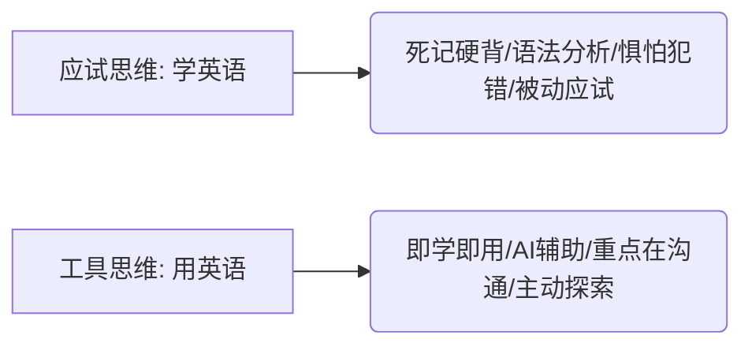

# 1.3 英语突围：打开世界的钥匙🔑


> [!IMPORTANT]
> **本节寄语**：英语不是一门“用来考试”的学科，它是你探索全球网络、与最顶级 AI 对话、以及获取一手科技与商业资讯的**底层操作系统**。打破语言结界，你才能真正推倒眼前的物理信息墙。

你好，少年。

在中国的应试教育中，你可能已经花了十年甚至更多的时间在英语上：背诵海量的单词列表、分析枯燥的语法结构、做着没完没了的阅读理解真题。但当你合上课本，面对一个英文网页或者需要给国外的开源社区写一封邮件时，你是否依然感到一阵阵窒息与无力？

**这是因为，你一直在把英语当成一门“知识”在储存，而不是把它当成一把“钥匙”在运用。**

在 Web3、AI狂潮和全球化协作的时代，英语是唯一的通用语言。本节将带你完成一次彻底的认知重构，教你如何像利用外脑一样实现英语的快速突围。

---

## 一、 为什么英语是最大的“认知结界”？

我们在 1.1 节中提到过，语言层是构成信息围墙的核心之一。我们可以用几组真实的数据来直观感受一下这堵隐形墙的高度：

| 维度 | 英文占比 | 中文占比 | 差距与现实 |
| :--- | :--- | :--- | :--- |
| **网页内容总量** | 约 **52.1%** | 约 **4.3%** | 英文互联网的信息体量是中文的 **12 倍** 以上。 |
| **学术/论文首发** | 约 **95.0%** | 极低 | 最新的人工智能（如 OpenAI 论文）、前沿生物医药成果，基本全部以英文首发。 |
| **开源社区代码与文档** | 约 **90.0%** | 极低 | GitHub、Stack Overflow 等全球开发者圣地，其核心讨论与技术文档几乎全为英文。 |

如果你只接受中文信息，那么你实际上只在一个 **不到 5% 范围的“信息浅滩”** 里游泳。更糟糕的是，国内许多自媒体的“一手翻译”往往带有严重的偏差、断章取义甚至是翻译错误。当你看到中文翻译时，可能已经比全球前沿慢了几个月，甚至在认知上已经被误导。

---

## 二、 认知转变：从“学英语”到“用英语”

要实现突破，你必须在脑海里完成这个硬核的开关切换：



1.  **容忍模糊，重点在获取信息**：
    阅读英文文档时，不要一遇到生词就停下来查词典，更不要去抠语法结构。只要你能大概明白这一段讲的是什么，你的目的就达到了。英语不是艺术品，它是信息载体。
2.  **拥抱技术，别做原始人**：
    在 2026 年的今天，你不需要等自己词汇量过万才去读英文网页。我们有极其强大的 **AI 翻译和双语对照工具**。把技术当成你的拐杖，走着走着，你就不再需要拐杖了。
3.  **创造真实的使用场景**：
    把你常用的手机系统语言、浏览器语言改为英语；尝试在遇到问题时，直接用英文向 ChatGPT 或 Claude 提问。强迫大脑在非母语环境下进行小范围的“压力测试”。

---

## 三、 极简突围工具链：如何武装你的浏览器？

工欲善其事，必先利其器。在浏览英文网页时，不要傻乎乎地去复制粘贴到翻译软件里。你应该建立以下两项神器构成的工具链：

### 1. 沉浸式翻译（Immersive Translate）
这是一款彻底改变英文阅读体验的浏览器扩展程序。
*   **功能**：它可以在保留网页原有排版的同时，**智能地在英文段落下方直接翻译出中文**，实现双语对照阅读。
*   **套路玩法**：你可以配置它使用免费的翻译引擎，或者绑定你自己的 OpenAI API 密钥，调用 GPT-3.5/GPT-4 进行超高质量的“意译”，译文非常自然，几乎没有翻译腔。

### 2. 沙拉查词（Saladict）或类似划词翻译插件
当你遇到关键的专业词汇时，直接在网页上双击划词，它就能弹出一个聚合了朗文、柯林斯、谷歌翻译等多个权威词典的小窗口。
*   **技巧**：遇到生词时，看一眼释义，然后点击收藏到生词本（可以与 Anki 或 Readwise 自动同步），利用碎片时间进行复习。

---

## 四、 🚀 AI 赋能：搭建你的“英语私教”管道

现在有了大语言模型（LLM），你拥有了人类历史上最耐心的英语私教。你可以通过巧妙的 **提示词（Prompts）** 来加速你的阅读和写作能力：

### 1. 双语深度阅读 Prompt 模版
当你遇到一篇极难的英文科技论文或长篇文章时，可以将文本发给 AI，并附上以下提示词：

```text
你是一位资深的科技翻译官和英语导师。请针对我发送的英文段落执行以下操作：
1. 提供优雅、符合中文阅读习惯的翻译（意译，非直译）。
2. 从段落中提取出 3-5 个最核心的专业词汇或高频学术词汇，给出音标、中文释义以及一个贴近上下文的例句。
3. 如果段落中含有复杂的长难句，请将其抽离出来，简单剖析其主谓宾结构，帮助我理解其核心逻辑。
---
[在此粘贴英文文本]
```

### 2. 英文邮件/文档润色 Prompt 模版
当你需要给国外的开源社区提 Issue，或者写一封英文邮件，但担心自己的英文显得“中式”或不专业时，可以使用这套模板：

```text
你是一位专业的英文学术与商业写作助手。我写了一段英文，想表达的意思是 [插入中文大意]。
请帮我将以下段落进行润色，使其符合地道的母语表达习惯（正式且礼貌）。请给出两个版本：
版本 A：简洁直接，适合日常沟通（Slack/Discord/GitHub Issue）。
版本 B：正式得体，适合商务邮件（Email）。
并在最后指出我原版表达中的主要错误或生硬之处。
---
[在此粘贴你写的初稿英文]
```

---

## 五、 知行合一：英语突围行动闭环


行动是击碎焦虑的唯一方式。请在接下来的 7 天里，强迫自己完成以下行动指标：

*   **第 1 天**：在你的主力浏览器上安装“沉浸式翻译”插件。
*   **第 2 天**：将你的手机系统语言和 Google/Bing 搜索界面的首选语言设置为 **English**。
*   **第 3 天**：注册一个 **Medium** 或 **Substack** 账号，关注 3 个你感兴趣领域（如 AI、Web3、设计或摄影）的英文专栏。
*   **第 4 天**：在 YouTube 上看一个 10 分钟的英文科普视频，尝试**只开启英文自动字幕**，而不使用中文翻译。
*   **第 5 天**：去 GitHub 上找一个你感兴趣的开源项目，阅读它的 `README.md`，并尝试用英文向 AI 提问来理解该项目的功能。
*   **第 6 天**：使用 AI 润色工具，写一段英文，在 Reddit、Twitter 或 Discord 社区中进行一次真实的英文互动（哪怕只是留言说一句 "Awesome work! Thanks for sharing."）。
*   **第 7 天**：回顾这一周，记录你的心理变化——你会发现，英文世界并没有你想象的那么可怕。

> [!TIP]
> **记住这个公式**：
> 💡 **信息输入量 = 信息广度 = 你的竞争力**。
> 别再为你的词汇量不足找借口了。今天就打开沉浸式翻译，直接去看那些你原本不敢点开的英文世界吧！

---