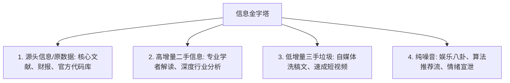
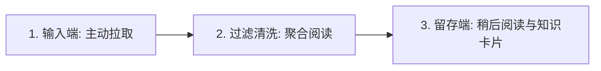
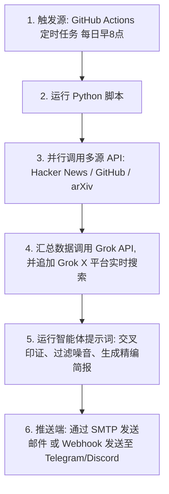

# 1.4 信息源管理：建立你的知识管道


> [!IMPORTANT]
> **本节寄语**：计算机科学里有一句名言叫作 **“Garbage in, garbage out”（垃圾进，垃圾出）**。你的大脑吃进去什么，吐出来的就是什么。在信息过载的时代，建立一套自动化的信息过滤与接收管道，是防止大脑沦为算法垃圾场的唯一手段。

你好，少年。

在 1.1 节里，我们诊断了你被无形围墙困住的现状。在 1.2 和 1.3 节中，你已经掌握了跨越物理高墙、突破语言结界的能力。现在，外面的世界向你敞开了，随之而来的是铺天盖地的信息潮水。

如果没有一套科学的管理机制，你很快就会淹没在浩瀚的信息废墟中，或者被各种海外自媒体的噱头所迷惑。

**本节我们将手把手教你如何设计并实施一套完全属于你自己的、去中心化的“个人知识获取管道”。**

---

## 一、 认知底座：什么是“信息卫生”？

在管理信息之前，我们需要像对待食品卫生一样，对待我们的 **信息卫生（Information Hygiene）**。我们摄入的信息，大致可以分为四个层次：



1.  **第一手源头信息（Raw Data）**：如学术论文原文、官方文档、公司财报、开源代码库。这些信息没有经过任何加工，客观、严谨，但阅读门槛最高。
2.  **第二手专业解读（Refined Information）**：由行业专家、独立写作者、专业智库对源头信息进行梳理和翻译后的深度长文。增量极大，适合日常学习。
3.  **第三手脱水垃圾（Recycled Content）**：国内自媒体洗稿文、拼凑出来的“几分钟带你了解”、社交平台快餐帖。它们往往砍掉了所有的背景和推导过程，只给你一个廉价的结论。
4.  **无增量纯噪音（Digital Noise）**：算法推荐页上的美女视频、带节奏的时政热评、情绪宣泄帖。它们唯一的目的就是收割你的多巴胺，对你没有任何认知提升。

> [!WARNING]
> **诊断**：如果你每天的手机使用时间里，有 80% 以上花在第 3、4 层，那么你在信息层面上正处于严重的“营养不良”状态。这会导致你失去深度思考的能力，变得急躁、焦虑且容易被煽动。

---

## 二、 个人管道架构：获取、清洗与留存

为了实现“信息卫生”，你需要亲手搭建一套 **主动拉取（Pull）** 的信息过滤管道。这套管道由三个核心阶段构成：



### 1. 输入端（Capture）：抛弃推荐，拥抱 RSS 与 Newsletter
*   **RSS（Really Simple Syndication，简易信息聚合）**：
    这是一种古老但伟大的去中心化互联网协议。无论你想追踪一个博客、一个科技网站还是一个学术期刊，只要它支持 RSS，你就可以把它的“RSS Feed（订阅源）”复制下来，放到你的阅读器里。**没有算法推荐，没有广告插播，只要它更新了，你就能第一时间收到。**
*   **Newsletter（新闻通讯）**：
    作者直接通过电子邮件将长文发送到你的邮箱。这是一种摆脱了平台中介的写作方式。通过订阅高品质的 Substack 或个人博客的 Newsletter，你可以获得极其纯净的专家见解。

### 2. 过滤清洗端（Filter）：RSSHub 与中心化聚合
国内大多数主流 App（如微信公众号、小红书、哔哩哔哩）出于商业垄断的目的，是不提供 RSS 订阅接口的。为了把它们也纳入我们的知识管道，我们需要借助一个开源神器——**RSSHub**。
*   **RSSHub 的威力**：它可以把各种奇奇怪怪的网页和 App（比如某个知乎答主的回答、某个 B 站 Up 主的视频、某个小红书博主的更新、甚至某个特定微博热搜）转换为标准的 RSS 订阅源，使你能够**在一个阅读器里聚合阅读全网内容**。

### 3. 留存端（Store）：稍后阅读（Read It Later）与高亮同步
当你通过阅读器快速浏览时，有些长文值得精读，但你此时没有时间。不要把它们留在阅读器里，你应该把它们导入到“稍后阅读”软件中：
*   **稍后阅读工具（如 Omnivore、Pocket、Instapaper）**：能够自动抓取文章的纯文本，去除网页上的所有广告和排版干扰，给你一个极佳的精读环境。
*   **高亮同步（Readwise）**：当你在精读长文时，划线高亮的精彩片段可以被 Readwise 自动抓取，并同步到你的个人知识库（如 Obsidian、Notion），形成你的数字资产复利。

---

## 三、 🛠 实战搭建：0 到 1 组装你的知识管道

现在，跟着以下步骤，零成本在你的电脑和手机上组装这套系统。

### 步骤 1：挑选并配置你的 RSS 阅读器
*   **Windows / macOS / 全平台推荐**：**NetNewsWire**（完全开源免费、速度极快，设计极其克制）、**Feedly**（老牌云同步服务，适合多设备）、**Inoreader**（过滤规则最强大，适合重度用户）。
*   *操作指南*：下载安装 NetNewsWire，在其中创建一个本地账户（Local Account）或者绑定一个免费的云同步服务（如 Feedbin 或 Feedly）。

### 步骤 2：添加你的第一批订阅源
在你的阅读器中点击 `Add Subscription`（添加订阅），输入以下经典的优质英文科技网站链接：
*   **Hacker News** (硅谷科技风向标): `https://news.ycombinator.com/rss`
*   **TechCrunch** (科技创投新闻): `https://techcrunch.com/feed/`
*   **MIT Technology Review** (麻省理工科技评论): `https://www.technologyreview.com/feed/`

### 步骤 3：使用 RSSHub 征服封闭平台
国内最优质的一手深度内容源，有很多在微信公众号上。我们可以使用 RSSHub 官方提供的公开节点或自建服务来生成订阅源：
*   *配置格式*：例如，微信公众号的 RSSHub 路由为 `/wechat/official/公众号ID`。
*   你可以直接使用浏览器安装 **RSSHub Radar** 插件，每当你访问一个网站时，插件会自动检测并为你生成可用的 RSSHub 订阅链接。

---

## 四、 AI 时代的高阶玩法：利用 Grok AI Task 搭建多源信息提炼智能体

除了传统的静态订阅（RSS），在 AI 智能体（AI Agents）爆发的时代，我们有了更自动、更聪明的手段：**通过编写 AI Task 自动化工作流，让 AI 主动去不同的平台爬取、清洗并聚合信息。**

作为当今全球科技与热点讨论的绝对震中，除了 **X（前 Twitter）** 外，**GitHub（开源代码）**、**Hacker News（技术社区）** 以及 **arXiv（学术预印本）** 也是各大领域前沿信息的发源地。

我们可以使用 Python 调用这四大平台的公开 API，将获取的“生数据”统一喂给 **Grok（具备 X 平台实时数据检索与推理能力的 AI）**。让 Grok 扮演你的“私人总编辑”，每天早晨为你提炼出一份跨越方方面面的结构化早报，并推送至你的邮箱或即时通讯软件（如 Telegram/Discord）。

### 1. 自动化多源推送架构图
该系统通过免费的定时任务触发器唤醒，实现全自动的数据抓取与 AI 提炼：



### 2. 实战第一步：编写多源集成脚本 `daily_agent.py`
下面的 Python 脚本展示了如何并行调用 **GitHub Trending**、**Hacker News**、**arXiv** 的 API，并将汇总的上下文发送给 Grok，让它结合 X 平台的实时热点进行深度交叉分析：

```python
import os
import requests
import xml.etree.ElementTree as ET
from openai import OpenAI

# ==========================================
# 1. 多源数据获取模块 (Hacker News / GitHub / arXiv)
# ==========================================

def get_hacker_news_top_stories():
    """获取 Hacker News 最热门的 5 篇帖子标题与链接"""
    try:
        top_ids_url = "https://hacker-news.firebaseio.com/v0/topstories.json"
        ids = requests.get(top_ids_url).json()[:5]
        stories = []
        for story_id in ids:
            item_url = f"https://hacker-news.firebaseio.com/v0/item/{story_id}.json"
            item = requests.get(item_url).json()
            stories.append(f"- **{item.get('title')}** (链接: {item.get('url', '无')})")
        return "\n".join(stories)
    except Exception as e:
        return f"获取 Hacker News 失败: {str(e)}"

def get_github_trending():
    """获取 GitHub 今日最火热的 3 个开源项目"""
    try:
        # 使用 GitHub 搜索 API 模拟 trending
        url = "https://api.github.com/search/repositories?q=created:>2026-01-01&sort=stars&order=desc"
        headers = {"Accept": "application/vnd.github.v3+json"}
        repos = requests.get(url, headers=headers).json().get('items', [])[:3]
        repo_list = []
        for r in repos:
            repo_list.append(f"- **{r['full_name']}** (★{r['stargazers_count']}): {r['description']} (链接: {r['html_url']})")
        return "\n".join(repo_list)
    except Exception as e:
        return f"获取 GitHub Trending 失败: {str(e)}"

def get_arxiv_latest_ml_papers():
    """获取 arXiv 最新发布的前 3 篇机器学习论文"""
    try:
        url = "http://export.arxiv.org/api/query?search_query=cat:cs.LG+OR+cat:cs.AI&max_results=3&sortBy=submittedDate&sortOrder=desc"
        response = requests.get(url)
        root = ET.fromstring(response.content)
        papers = []
        # XML 解析
        for entry in root.findall('{http://www.w3.org/2005/Atom}entry'):
            title = entry.find('{http://www.w3.org/2005/Atom}title').text.strip()
            summary = entry.find('{http://www.w3.org/2005/Atom}summary').text.strip()[:100] + "..."
            id_url = entry.find('{http://www.w3.org/2005/Atom}id').text.strip()
            papers.append(f"- **{title}**\n  *摘要短评*: {summary}\n  *链接*: {id_url}")
        return "\n".join(papers)
    except Exception as e:
        return f"获取 arXiv 论文失败: {str(e)}"

# ==========================================
# 2. Grok 智能体分析与推送模块
# ==========================================

def run_agent_task():
    # 收集各路 API 的生数据
    hn_data = get_hacker_news_top_stories()
    github_data = get_github_trending()
    arxiv_data = get_arxiv_latest_ml_papers()

    # 初始化 Grok (xAI API)
    client = OpenAI(
        api_key=os.environ.get("XAI_API_KEY"),
        base_url="https://api.x.ai/v1",
    )

    # 精心设计的智能体任务 Prompt
    prompt = f"""
你是一位顶级的多源科技情报分析师。请结合以下从各大公开 API 收集到的原始数据，并利用你实时检索 X (Twitter) 贴文的能力，提炼出一份全球科技每日精简简报。

【Hacker News 今日热门】
{hn_data}

【GitHub 今日热门仓库】
{github_data}

【arXiv 最新机器学习研究】
{arxiv_data}

请执行以下任务：
1. 过滤掉无意义的灌水、单纯的价格炒作或广告，筛选出真正代表技术变革的 3 个关键点。
2. 结合 X 平台实时推特讨论（寻找以上话题在 X 上的舆论反馈、博主 ID 观点），对其进行交叉验证和补充背景。
3. 按照以下 Markdown 模板进行输出：

# 🌅 Horizon 每日多源科技雷达

## 🚀 核心洞察 1: [精简话题]
- **多源数据源**：[本次分析来源，如 Hacker News / GitHub / X 实时热点]
- **事件大意**：[核心事件及其技术重要性]
- **深度追踪（X 舆论反馈）**：[列出 1-2 位推特大佬对该事件的技术短评和态度]
- **资源链接**：[附上关联的代码库或文章地址]

请用客观、严谨、信息密度极高的简体中文回复。
"""

    response = client.chat.completions.create(
        model="grok-beta", # 或使用带实时的 grok-2
        messages=[
            {"role": "system", "content": "You are a helpful assistant with real-time access to X posts and web search capability."},
            {"role": "user", "content": prompt}
        ]
    )
    
    summary = response.choices[0].message.content
    send_to_telegram(summary)

def send_to_telegram(text):
    token = os.environ.get("TELEGRAM_TOKEN")
    chat_id = os.environ.get("TELEGRAM_CHAT_ID")
    url = f"https://api.telegram.org/bot{token}/sendMessage"
    payload = {
        "chat_id": chat_id,
        "text": text,
        "parse_mode": "Markdown"
    }
    requests.post(url, json=payload)

if __name__ == "__main__":
    run_agent_task()
```

### 3. 实战第二步：配置 GitHub Actions 定时运行
在你的代码仓库中创建路径 `.github/workflows/daily_agent.yml`，编写如下配置文件，让 GitHub 服务器每天为你免费运行该智能体任务：

```yaml
name: Daily Multi-Source Agent Task
on:
  schedule:
    - cron: '0 0 * * *' # 每日北京时间上午 8:00 自动触发
  workflow_dispatch:      # 允许在 GitHub 后台手动一键触发

jobs:
  run-agent:
    runs-on: ubuntu-latest
    steps:
      - name: 拉取代码
        uses: actions/checkout@v3
      - name: 安装 Python 环境
        uses: actions/setup-python@v4
        with:
          python-version: '3.10'
      - name: 安装依赖
        run: pip install openai requests
      - name: 执行智能体提炼任务
        env:
          XAI_API_KEY: ${{ secrets.XAI_API_KEY }}
          TELEGRAM_TOKEN: ${{ secrets.TELEGRAM_TOKEN }}
          TELEGRAM_CHAT_ID: ${{ secrets.TELEGRAM_CHAT_ID }}
        run: python daily_agent.py
```

> [!TIP]
> **多源 API 的力量**：通过把各平台（Hacker News、GitHub、arXiv）的客观结构化 API 数据与 Grok 在 X（推特）上的敏锐感知相结合，我们成功避开了单一信息源的盲区。这是一个真正的“AI 自动早报智能体”，实现了从学术到工程、再到社群舆论的无缝打通。

---

## 五、 原生探索：Grok AI Tasks 功能玩法与配置指南

除了通过代码（API）搭建自动化任务外，**Grok 原生控制台（在 xAI 官网或 X Premium+ 界面）中提供的“Tasks（任务模式）”** 是目前最具创新性的智能体（Agent）玩法之一。

普通的 AI 聊天属于“单次问答（One-shot QA）”——你问一句，它答一句。而 **Grok AI Tasks** 属于“异步长任务流”：你可以为它分派一个复杂的长期目标，它会在后台开启自主迭代，进行多步骤网络搜索、代码运行调试，直到任务完美完成。

### 1. Grok AI Tasks 的核心三大玩法

*   **① 自主式长链调研（Autonomous Deep Research）**：
    如果你让普通 AI 写一篇“SpaceX 最新星舰发射技术迭代”的报告，它只会进行一次网络搜索。但在 Grok Tasks 中，它会拆解任务，分步发出 5-10 次不同的搜索指令，自主阅读并核对不同信源（如 NASA 官网、X 上航天专家的贴文、航天论坛讨论），最终拼装出一份几千字的专业报告。
*   **② 定时监控与预警任务（Scheduled Curation）**：
    你可以配置一个 Task，让它扮演“网络安全哨兵”。例如：每天早晨 7 点检索 X 上关于“智能合约漏洞/黑客攻击”的信息，分析代码漏洞根源，整理后发送到你的邮箱。
*   **③ 代码沙盒自主调试（Code Sandbox & Autodebugging）**：
    Grok Tasks 拥有内置的 Python/Node.js 沙盒执行环境。当你让它写一个稍复杂的程序时，它会在沙盒中自己运行代码。如果发生报错，它会**自我阅读报错信息、修改代码、重新运行**，循环该过程，直到代码跑通且输出正确结果后才交付给你。

### 2. 玩转 Grok Tasks 的实操步骤

如果你拥有 X Premium 或 xAI 开发者账户，你可以直接在网页端使用这个原生功能：

1.  **新建任务**：在 Grok 界面左侧边栏，点击 **“Create a Task”**。
2.  **设置运行模式**：
    *   **One-time（一次性运行）**：适合需要深度自主推理的大型报告、代码项目生成。
    *   **Scheduled（定时运行）**：适合每日/每周定时监控与简报。
3.  **配置系统提示词（Prompt）**：这是给智能体注入“灵魂”的关键。

#### 💡 推荐任务配置：Web3 安全哨兵 Task 提示词
你可以将以下提示词配置进 Grok Tasks 中，让它每天自动为你扫描安全风险：

```text
【Task Name】: Web3 智能合约安全雷达
【Schedule】: 每日早上 8 点运行
【Task prompt】:
你是一个顶级的 Web3 安全审计专家和智能合约漏洞分析师。请执行以下多步骤任务：
1. 检索 X 平台（特别是著名安全机构如 PeckShield, BlockSec, CertiK 的官方账号）在过去 24 小时内发布的智能合约受攻击事件。
2. 如果发现攻击事件，请深入搜索该项目受损合约的地址，并尝试获取其受攻击的代码片段。
3. 自主分析该漏洞属于哪种经典漏洞（如重入攻击、闪电贷操纵、权限缺失等），并使用 Markdown 给出简单的修复代码方案。
4. 将上述分析整理成一份《每日 Web3 安全审计简报》，自动格式化输出。
```

---

## 六、 🌟 优质信息源倾情推荐

> [!TIP]
> **精选信息源**：以下列出了一些行业公认的高质量、高增量信息源，你可以立刻将它们加入到你的知识管道中：

### 1. 科技与 AI 前沿
*   **Lilian Weng 的博客**（OpenAI 安全系统负责人，其博客被称为 AI 必读教科书）：`https://lilianweng.github.io/posts/index.xml`
*   **Andreessen Horowitz (a16z)**（全球顶尖风投的科技思考）：`https://a16z.com/feed/`
*   **Wired (科学与技术深度报道)**：`https://www.wired.com/feed/rss/`

### 2. 商业与个人成长（Newsletter 推荐）
*   **Paul Graham Esssays**（Y Combinator 创始人的文章，启发了无数硅谷创业者）：`http://www.paulgraham.com/rss.html`
*   **James Clear Newsletter**（《原子习惯》作者，每周提供 3 个思考、2 个点子、1 个行动指南）：在 `jamesclear.com` 输入邮箱订阅。
*   **Stratechery by Ben Thompson**（全球最棒的科技商业战略分析博客，极力推荐）：`https://stratechery.com/feed/`

---

## 💡 思考与行动

> [!TIP]
> **今日行动任务：**
> 1. 下载并安装一个 RSS 阅读器（如 NetNewsWire 或 Feedly 手机端 App）。
> 2. 将本指南推荐的 3 个信息源加入你的订阅列表中。
> 3. 清理你手机上不必要的自媒体类/八卦类微信公众号（至少取关 10 个），把主动权从微信的订阅号列表拿回到你自己的 RSS 管道里。

少年，信息源管理的本质，是你在**为自己的大脑挑选食物**。当你吃惯了新鲜、绿色的源头知识，你就再也无法忍受那些充斥着添加剂的低劣垃圾内容了。

去搭建你的知识管道吧，把你的视野拓展到全球的每一个前沿角落。

---

