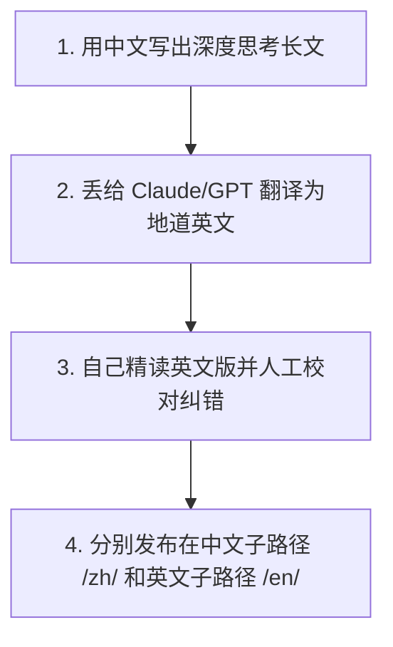

# 1.4 搭建第一个自己的博客站：建立你的数字根据地


> [!IMPORTANT]
> **本节寄语**：在中心化社交媒体平台（如微博、知乎、微信）上发表文章，你的内容永远属于平台。一旦遭遇封号或算法调整，你的数字资产将瞬间清零。**搭建一个独立自主的个人博客站，是你在互联网上圈占并拥有“数字根据地”的开始。**

你好，少年。

在前面的章节中，你已经学会了如何获取和过滤信息。但如果只输入不输出，你只是一个“信息储藏室”。**写作是重构大脑回路的终极手段**。只有当你尝试把学到的东西用自己的语言写成文章，甚至是用中英双语发表时，你才真正消化了这些知识。

本节我们将为你介绍几种主流的**开源博客建站方案**，并教你如何实现**中英文双语站**，以及如何利用主流专业平台放大你的声音，与全球优秀的人对话。

---

## 一、 主流开源博客建站方案对比

根据你的技术基础和个性化需求，目前最主流的个人博客搭建路线有以下四种：

| 方案 | 运行模式 | 技术门槛 | 托管成本 | 核心特点与适用场景 |
| :--- | :--- | :--- | :--- | :--- |
| 🛡️ **WordPress** | 动态（PHP + MySQL） | 中等（需配置服务器/数据库） | 需购买云服务器与域名 | 全球使用最广的建站引擎，插件极度丰富，可扩展性极强，适合长期运营的综合站点。 |
| ⚡ **Hexo** | 静态（Node.js 生成 HTML） | 较低（需了解 Git 与 Markdown） | 免费（可托管在 GitHub Pages） | 访问速度极快，安全性极高。文章用 Markdown 编写，通过本地编译生成静态文件一键推送到 GitHub。 |
| 🕊️ **Typecho** | 动态（轻量级 PHP） | 中等 | 需购买云服务器与域名 | 相当于“瘦身版”的 WordPress，专注于写作本身，内核极其轻量，运行速度飞快。 |
| 🚀 **Archyx-Blog** | 现代化全栈系统 | 较高（需熟悉 Node.js / Docker 部署） | 需购买云服务器 | 现代化的全栈开源博客系统，具备美观的交互式后台、API 驱动、支持现代前端框架接入。 |

---

## 二、 🛠 零基础搭建实战教程

### 1. WordPress 经典建站方案
WordPress 是最稳妥、最强大的方案，支持可视化安装与海量精美主题（如 Astra, OceanWP）。

#### 步骤流程：
1. **租用服务器与域名**：在腾讯云、阿里云或海外平台（如 Hostinger）租用一台轻量应用服务器（推荐选择 Linux Ubuntu 系统），并购买一个个人域名（如 `.com` 或 `.me`）。
2. **环境搭建（推荐使用 Docker 或 LNMP 脚本）**：
   在服务器终端运行 Docker 快速启动 WordPress 容器：
   ```bash
   docker run --name wp-db -e MYSQL_ROOT_PASSWORD=your_password -e MYSQL_DATABASE=wordpress -d mysql:5.7
   docker run --name my-wordpress --link wp-db:mysql -p 80:80 -d wordpress
   ```
3. **初始化配置**：在浏览器输入你的服务器 IP 即可进入 WordPress 引导安装界面。设置后台管理员账号、密码。
4. **绑定域名与 SSL 证书**：在域名商处将域名 A 记录解析到服务器 IP，使用 Let's Encrypt 免费申请 SSL 证书以开启安全访问（HTTPS）。

---

### 2. Hexo 静态建站方案（GitHub Pages 零成本托管）
如果你是技术爱好者，推荐使用 Hexo。它不需要租用服务器，完全托管在 GitHub 上。

#### 步骤流程：
1. **安装 Node.js 与 Git**：在本地电脑安装这两款底层工具。
2. **安装 Hexo 命令行工具**：
   ```bash
   npm install -g hexo-cli
   ```
3. **初始化博客项目**：
   ```bash
   hexo init my-blog
   cd my-blog
   npm install
   ```
4. **本地预览**：运行下述命令，在浏览器打开 `http://localhost:4000` 即可看到你的本地博客：
   ```bash
   hexo server
   ```
5. **部署至 GitHub Pages**：
   - 在 GitHub 创建一个名为 `你的用户名.github.io` 的公开仓库。
   - 修改本地 Hexo 项目根目录下的 `_config.yml` 配置文件中的 `deploy` 选项：
     ```yaml
     deploy:
       type: git
       repository: git@github.com:你的用户名/你的用户名.github.io.git
       branch: main
     ```
   - 运行一键编译部署：`hexo clean && hexo g -d`。此时，全球用户就可以通过 `https://你的用户名.github.io` 访问你的博客了！

---

### 3. Typecho 轻量级建站方案
如果想要动态博客的便利（在线写文、留言互动），又嫌 WordPress 太重，Typecho 是极佳选择。
*   **部署**：在服务器上安装 Nginx、PHP 和 SQLite/MySQL。下载 Typecho 压缩包解压到网站根目录，访问域名即可完成“5分钟快速安装”。

---

### 4. Archyx-Blog-System 开源系统建站
对于追求极致现代感、熟悉现代前端生态的少年，可以尝试部署 **Archyx-Blog-System**：
*   **特性**：采用 Node.js 作为后端，原生支持前端 API 渲染，界面极具现代设计美感，交互流畅。
*   **部署步骤**：
   1. 克隆官方代码库：`git clone https://github.com/Archyx-Dev/Archyx-Blog-System.git`
   2. 进入目录并安装依赖：`npm install`
   3. 配置项目根目录下的环境变量配置文件 `.env`（设置你的数据库链接与端口）。
   4. 运行编译并启动项目：`npm run build && npm start`。你可以使用 PM2 管理守护进程，或者使用 Dockerfile 进行容器化一键部署。

---

## 三、 🌍 进阶玩法：如何构建“中英文双语”博客？

为了真正发挥你在 1.3 节学到的“英语突围”能力，强烈建议将你的博客打造成**中英文双语站**。这不仅能极大地锻炼你的地道英语写作，还能让你直接触达全球读者。



### 1. Hexo 双语站实现方案
使用插件 `hexo-generator-i18n` 或利用 Hexo 目录结构：
*   **推荐方案**：直接在 `source/_posts/` 目录下分设文件夹，例如：
    - `source/_posts/zh/` 放中文 Markdown 文章。
    - `source/_posts/en/` 放对应的英文 Markdown 文章。
*   在配置文件中将对应语言的路径映射至不同语言的模板。

### 2. WordPress 双语站实现方案
安装免费的多语言插件（如 **Polylang** 或付费的 **WPML**）：
*   在后台撰写文章时，Polylang 会在侧边栏提供一个“添加翻译”的按钮，点击即可创建一篇互相关联的英文版文章。
*   插件会自动在网站前台生成语言切换按钮（中文 🇨🇳 / English 🇺🇸），并智能重定向子路径（如 `/en/about/`）。

---

## 四、 📣 放大声音：多平台矩阵同步与全球讨论

有了自己的博客（数字根据地）之后，你不能只关起门来写，你还需要**走出去，与更优秀的人产生碰撞**。你应该把自己的独立博客作为“内容大本营（Source of Truth）”，并向以下专业平台进行分发：

### 1. 全球战场：Medium 🇺🇸
*   **定位**：全球质量最高的综合写作与阅读平台。
*   **玩法**：在 Medium 注册账号，将你的英文版长文发表在上面。通过给热门的 Publication（如 Towards Data Science, Better Programming）投搞，你可以获得极大的全球曝光，在评论区直接与硅谷的工程师、各国的独立开发者进行深入探讨。

### 2. 技术主阵地：稀土掘金 & CSDN 🇨🇳
*   **定位**：国内最火热的开发者与技术人员集聚地。
*   **玩法**：将你的技术踩坑记录、代码教程发表在掘金和 CSDN。稀土掘金目前社区氛围偏向现代前端与 AI 协作，适合发布前沿的开发总结；CSDN 则适合发布基础的系统安装与代码排错文章。

### 3. 社交私域：微信公众号 🇨🇳
*   **定位**：国内闭环生态内最强大的个人品牌沉淀阵地。
*   **玩法**：注册一个个人订阅号，将你的观点性长文排版发布。公众号的读者粘性极强，适合沉淀你的第一批忠实支持者（Seed Readers）。

---

## 💡 思考与行动

> [!TIP]
> **今日行动任务：**
> 1. 选择你心仪的方案（建议技术基础好的选择 **Hexo + GitHub**，省心且完全免费；想要拥有完整控制权的选择 **WordPress**）。
> 2. 尝试完成博客的初始化，写下并发表你的第一篇欢迎文章《Hello World：我的破壁宣言》。
> 3. 在 **Medium** 和 **稀土掘金** 平台分别注册一个你的常用英文 ID 账号，为未来的多平台分发做足准备。

少年，搭建博客就像在数字世界里买了一块地，盖了一间属于你自己的房子。

房子里的每一行字，都是你认知成长的刻度。祝你早日拥有自己的数字根据地，去跟世界对话。

---

