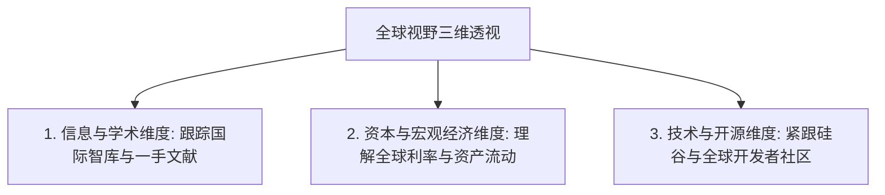

# 1.5 全球视野：看见更大的世界

> [!IMPORTANT]
> **本节寄语**：全球视野（Global Perspective）不是去过多少个国家旅游，也不是能说一口流利的英文，而是一种**多维度的认知习惯**——能够在复杂的局部迷雾中抽身，站在全球博弈、技术演进与资本流动的宏观尺度上，重新审视你当下的选择。

你好，少年。

在第一章前面的小节中，我们一起冲破了防火墙（1.2），突围了英语结界（1.3），建立了去中心化的信息源管理系统（1.4）。至此，你已经完成了“物理和工具层面”的破壁。

但如果你的思维依然局限在本地的狭隘视角，你看到的依然只是墙内的投影。

**本节将探讨如何进行“思维破壁”：如何构建全球视野，摆脱同质化叙事，用更大的格局指导你的个人成长与职业规划。**

---

## 一、 警惕局限性思维的三大陷阱

缺乏全球视野的少年，极易掉进以下三个隐形的认知泥潭中：

### 1. “单一叙事”陷阱（Single Narrative Trap）
只消费单一文化背景或单一媒体来源的信息。这会导致你将某种地方性的、暂时的现象误认为是绝对的客观真理，一旦遇到不符合你固有认知的信息，本能反应是愤怒和否定，失去客观分析的能力。

### 2. “信息时间差”钝感（Time-Lag Insensitivity）
很多全球性的技术和商业范式变革（例如 LLM 智能体技术、去中心化协议、一人公司浪潮），往往先在全球顶级开发者和前沿极客群落中萌芽。等到它被汉化、精简、包装成国内自媒体热词时，已经过去了数月甚至数年。对时间差的不敏感，会让你永远做“跟风者”，而非“领跑者”。

### 3. 局部的“存量博弈”思维（Zero-Sum Mindset）
由于视野狭隘，你可能会觉得唯一的上升通道就是考公、考研、在内卷的本土职场中抢夺有限的生存空间。你无法想象，利用互联网和跨国工具，你完全可以面向全球提供你的技能（如远程自由职业、向海外发行数字产品），把竞争空间从存量肉搏扩展到全球增量。

---

## 二、 全球视野的三大透视维度

一个拥有全球视野的少年，在观察世界时，大脑中会有三个动态的透视滤镜：

### 1. 信息与学术维度
*   **做法**：主动阅读全球性智库（如 Pew Research、McKinsey Global Institute、Gartner）的趋势报告，直接查看世界主要媒体的多角度报道。不盲信单一信源，习惯在多方印证中提炼真相。

### 2. 资本与宏观经济维度
*   **原理**：你所在城市的就业机会、你做独立开发者的收入，其实深受全球宏观经济（例如美联储利率、全球供应链重组、地缘政治）的传导影响。
*   **做法**：学会看懂基础的宏观经济指标。例如：美债收益率的变动如何影响科技行业的风险投资？稳定币的跨境流通如何重构跨国小额清算？

### 3. 技术与开源维度
*   **原理**：互联网和开源社区（如 GitHub、Hugging Face）是没有国界的。最顶尖的代码、最新发布的预印本论文，都在第一时间对全球开放。
*   **做法**：把你的技术雷达对准 GitHub Trending、arXiv 以及国外顶级极客社区（如 Hacker News、Reddit）。当别人还在等待翻译时，你已经在尝试运行最新的开源模型。

---

## 三、 训练全球视野的思维模型与工具

要想拥有广阔的视野，你需要主动将以下两套思维模型安装进你的大脑：

### 1. 时间差套利思维（Arbitrage Model）
*   **原理**：世界的发展是不均衡的。在美国硅谷已经普及的某种 AI 工作流，在国内可能刚刚被少数人知晓；在发达地区已经成熟的商业模式，在发展中地区可能还是一片蓝海。
*   **应用**：通过全球管道获取前沿科技与趋势，快速将其“平移”或“本地化配置”到你所在的生态中，你就天然拥有了信息差优势。

### 2. 第一性原理（First Principles Thinking）
*   **原理**：剥离掉地缘、文化和政治叙事所附加的各种情绪泡沫，直接回归到事物的物理学和经济学本质来推导逻辑。
*   **应用**：当面对一件引发全球热议的事件时，问自己：它的物理成本是多少？它的底层经济利益流向哪里？它的技术演进路径是否符合效率最大化原则？

### 🔧 实用全球雷达工具箱：
*   **Pew Research Center** (全球社会与民意调查研究): `https://www.pewresearch.org/`
*   **Polymarket / 预测市场** (利用全球真金白银博弈出来的事件预测概率，往往比媒体更接近真相): `https://polymarket.com/`
*   **CoinMarketCap & CoinGecko** (全球去中心化资产流动性雷达): 实时观察全球资本在链上的流向。

---

## 💡 思考与行动

> [!TIP]
> **今日行动任务：**
> 1. 打开 [Polymarket](https://polymarket.com/)，观察当前全球用户正在用真金白银押注的 3 个最火热话题是什么（如全球选举、科技发布、地缘走向）。这能帮你瞬间摆脱娱乐八卦的局限。
> 2. 从 [arXiv.org](https://arxiv.org/) 上检索一篇关于你所处专业/兴趣领域的最新英文文献，尝试用 AI 翻译阅读其摘要，了解全球科研最前沿正在探索什么。
> 3. 写下你目前正面临的一个核心困惑（如大学选什么专业、未来如何找工作），尝试站在“全球化资源与市场”的视角，重新写出 2 个全新的破局思路。

少年，不要做温水里那只幸福但盲目的青蛙。

当你把视线从眼前的三寸屏幕移开，投向星辰大海与全球网络时，你会发现，那些原本让你极度焦虑的局部竞争，在广袤的全球版图上，根本不值一提。

---

