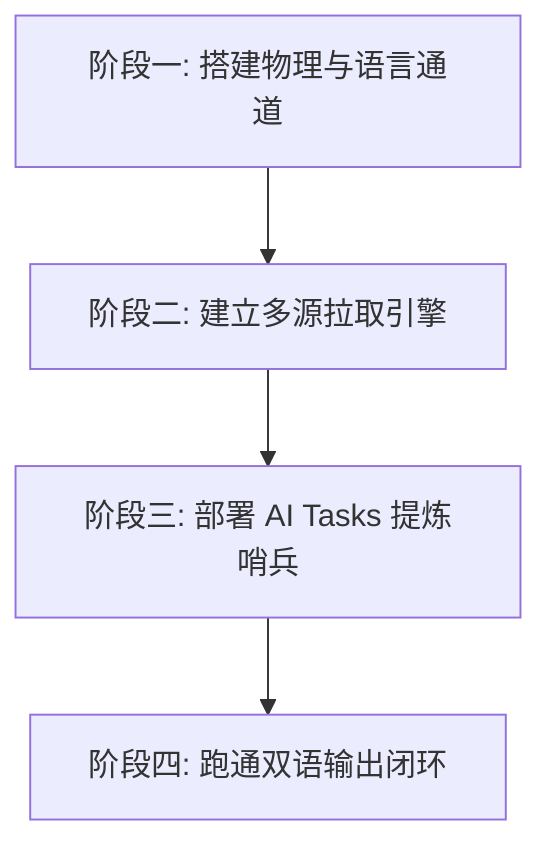

# 1.6 实战演练：从零搭建个人全球信息获取与输出系统

> [!IMPORTANT]
> **本节目标**：将第一章（破壁篇）学到的所有工具、协议与思维模型彻底打通，在你的电脑上建立一条**“全球获取 -> 智能清洗 -> 双语精读 -> 价值输出”**的高效信息闭环系统。

你好，少年。

光说不练是假把式。如果看完前五节你只是心潮澎湃，却没有任何实际行动，那么这几万字对你来说不过是一剂精神止痛药。

本节是第一章的**终极期末考试**。你需要花 2-3 个小时，跟着下述步骤，手把手在本地跑通这套系统。完成后，你将拥有超越绝大多数同龄人的数字信息掌控力。

---

## 🛠 实战任务大纲

我们将整个系统拆解为四大核心阶段：

---

## 阶段一：建立全球物理与语言通道 🌐

### 任务步骤：
1.  **启动你的科学上网客户端**：
    在 Windows/Mac 上启动 Clash/FastClient，确保能够流畅访问 `google.com` 与 `wikipedia.org`。
    *(如果是 Linux 用户，确保你的 `systemd` 中的 `mihomo.service` 处于 `active (running)` 状态，且在终端输入 `proxy` 能成功获取全球 IP。)*
2.  **武装你的浏览器**：
    *   在 Chrome 或 Edge 浏览器上安装扩展程序 **“沉浸式翻译（Immersive Translate）”**。
    *   注册或绑定一个免费的翻译翻译接口（或在沉浸式翻译中填入你自己的 OpenAI API 密钥，以便使用 GPT-3.5 级别的意译翻译）。
    *   安装 **沙拉查词（Saladict）** 划词插件。

---

## 阶段二：建立多源去中心化拉取引擎 🚰

我们需要将日常的信息获取，从“被动刷手机”彻底重构为“主动在阅读器中接收”。

### 任务步骤：
1.  **安装 RSS 客户端**：
    *   下载并启动 **NetNewsWire**（或注册并登录网页端/手机端的 **Feedly**）。
2.  **订阅经典全球源（各取所需，至少添加 5 个）**：
    *   在客户端中点击 `Add Subscription`，订阅：
        - Hacker News: `https://news.ycombinator.com/rss`
        - GitHub 热门: `https://github.com/trending.atom`
        - a16z 博客: `https://a16z.com/feed/`
3.  **征服封闭局域网（使用 RSSHub）**：
    *   在浏览器安装 **RSSHub Radar** 插件。
    *   打开一个你日常关注的微信公众号（通过第三方提供的微信号 RSS 路由）或 B 站 Up 主主页。
    *   点击 RSSHub Radar 插件图标，复制生成的 RSS 订阅链接，粘贴导入你的 NetNewsWire。

---

## 阶段三：部署你的 AI 哨兵 Tasks 🤖

利用我们 1.4 节介绍的多源 Python 脚本与 GitHub Actions，搭建一个每日早晨自动运行的“AI 主动早报智能体”。

### 任务步骤：
1.  **在 GitHub 上创建一个私有代码仓库**（命名为 `personal-info-agent`）。
2.  **配置依赖与脚本**：
    *   将 1.4 节中的 `daily_agent.py` 代码放入仓库中。
    *   按照 1.4 节说明，在 `.github/workflows/` 下创建 `daily_agent.yml` 定时任务配置文件。
3.  **配置 GitHub Secrets（密钥托管）**：
    *   进入该 GitHub 仓库的 `Settings` -> `Secrets and variables` -> `Actions`。
    *   新建以下 Repository secrets：
        - `XAI_API_KEY`：填入你的 xAI (Grok) 开发者密钥。
        - `TELEGRAM_TOKEN` 和 `TELEGRAM_CHAT_ID`（或者你选择的邮箱 SMTP 配置密钥）。
4.  **手动运行测试**：
    *   在 GitHub 仓库的 `Actions` 栏目下，找到 `Daily Multi-Source Agent Task` 任务，手动点击 `Run workflow` 按钮。
    *   检查你的手机端（Telegram 频道或邮箱）是否成功接收到 Grok 为你精心整理的 Markdown 格式《Horizon 每日多源科技雷达》早报。

---

## 阶段四：跑通双语输出闭环 📝

有了输入，必须有输出，才算完成闭环。

### 任务步骤：
1.  **选择建站方案并完成初始化**：
    *   *极简免费方案*：在本地安装 **Hexo**，将其初始化并部署至 `你的用户名.github.io` 静态仓库。
    *   *动态方案*：在你的云服务器上通过 Docker 运行 **WordPress** 并绑定域名。
2.  **撰写你的第一篇深度长文**：
    *   结合你这两天利用科学上网、RSS 和 Grok 获取的信息，写一篇关于“我所关注的某一前沿技术（如 AI Agent 商业化 / Web3 安全审计等）的最新进展”的深度思考，字数不低于 1500 字。
3.  **翻译与人工校对**：
    *   使用 1.3 节提供的“英文润色提示词”，调用 ChatGPT/Claude 将你的中文原文翻译为地道、流利的英文版。
    *   利用沉浸式翻译和你的英语底子，通读英文版，纠正 AI 在翻译专有名词时的生硬之处。
4.  **全网分发发布**：
    *   将中文版和英文版分别部署在你的独立博客中（如 `/zh/` 目录下与 `/en/` 目录下）。
    *   在全球写作社区 **Medium** 上发表你的英文版，并向相关专题投稿。
    *   在国内开发者社区 **稀土掘金** 或 **微信公众号** 上发表你的中文版，并积极在评论区与读者的留言互动。

---

## 🚀 系统的日常运转核对表（Daily Routine）

一旦你跑通了上述四大阶段，恭喜你，你的“个人信息根据地”已经拔地而起。为了维持它的健康运转，建议你每天花 **15 分钟** 进行如下“巡检”：

*   **上午 8:05**：阅读手机里由 AI 哨兵自动发给你的《Horizon 每日多源科技雷达》早报，快速过滤出今天最值得深入跟踪的 1-2 个技术热点。
*   **中午 12:30**：打开你的 RSS 阅读器（NetNewsWire），花 5 分钟扫一遍你订阅的源头博客、学术期刊的更新，遇到好文章直接点击“稍后阅读”保存。
*   **晚上 21:00**：精读你白天保存的 1 篇英文长文（开启沉浸式双语对照），遇到精彩的段落用高亮划线，自动同步到你的个人知识库（Obsidian）。
*   **每周六上午**：整理这一周在知识库里沉淀的卡片，将它们连点成线，写成周记发布在你的双语博客上。

---

> [!TIP]
> **交卷时间**：
> 少年，你的第一期“数字根据地”盖好了吗？
> 
> 请在完成上述所有实战演练后，在你的独立博客上留下你的《破壁宣告》。这是你走出信息茧房、重构个人竞争力的第一步。

---

