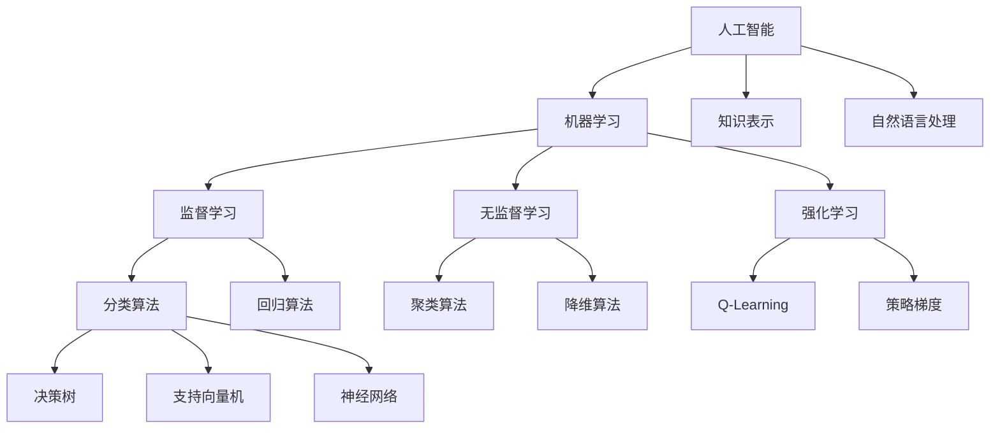

# 

> 人工智能核心知识汇总 - 从基础概念到前沿应用
## 📚 知识库导航

欢迎来到AI知识库！这里汇集了人工智能领域的基础知识和核心概念。

### 🎯 学习目标

通过本知识库，你将系统掌握：

- ✅ AI基础概念和原理

- ✅ 机器学习核心算法  

- ✅ 深度学习网络结构

- ✅ AI实际应用案例

- ✅ 前沿技术发展趋势

---

  
## 🧠 核心知识模块
### 1️⃣ 基础概念篇

- [什么是人工智能](基础概念篇/什么是人工智能.md)

- [AI发展历史](基础概念篇/AI发展历史.md)

- [AI vs 机器学习 vs 深度学习](基础概念篇/AI%20vs%20机器学习%20vs%20深度学习.md)

- [AI应用领域](基础概念篇/AI应用领域.md)

### 2️⃣ 机器学习篇

- [机器学习概述](machine-learning/ml-overview.md)

- [监督学习算法](machine-learning/supervised-learning.md)

- [无监督学习](machine-learning/unsupervised-learning.md)

- [强化学习基础](machine-learning/reinforcement-learning.md)

### 3️⃣ 深度学习篇

- [神经网络基础](deep-learning/neural-networks.md)

- [卷积神经网络](deep-learning/cnn.md)

- [循环神经网络](deep-learning/rnn.md)

- [Transformer架构](deep-learning/transformer.md)

### 4️⃣ 实践应用篇

- [Python编程基础](practical/python-basics.md)

- [AI常用库介绍](practical/ai-libraries.md)

- [项目实战案例](practical/projects.md)

- [模型部署应用](practical/deployment.md)

  
### 5️⃣ 前沿技术篇

- [计算机视觉](advanced/cv.md)

- [自然语言处理](advanced/nlp.md)

- [生成式AI](advanced/generative-ai.md)

- [多模态AI](advanced/multimodal-ai.md)

  
---

  
## 🛠️ 实用工具

  
### AI工具推荐

- **ChatGPT**: 智能对话助手

- **GitHub Copilot**: AI编程助手  

- **Midjourney**: AI绘画工具

- **Canva AI**: AI设计工具

### 学习平台

- Kaggle: 数据科学竞赛平台

- Google Colab: 免费GPU环境

- Coursera: 在线课程平台

- Bilibili: 中文AI教程

  
---

  
## 📊 知识图谱

  

  

---

  

## 🎯 学习建议

  

### 初学者路径

1. **第1周**: 了解AI基础概念

2. **第2-3周**: 学习机器学习基础

3. **第4-5周**: 掌握Python编程

4. **第6-8周**: 实践简单项目

5. **第9周+**: 深入特定领域

  

### 进阶学习

- 📖 阅读经典教材

- 💻 参与开源项目

- 🏆 参加AI竞赛

- 📝 撰写技术博客

  

---

  

## 🔗 快速链接

  

- [🏠 返回首页](../index.html)

  

---

  

*💡 提示：点击上方链接开始学习，或使用搜索功能查找特定内容*