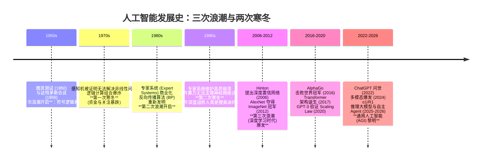
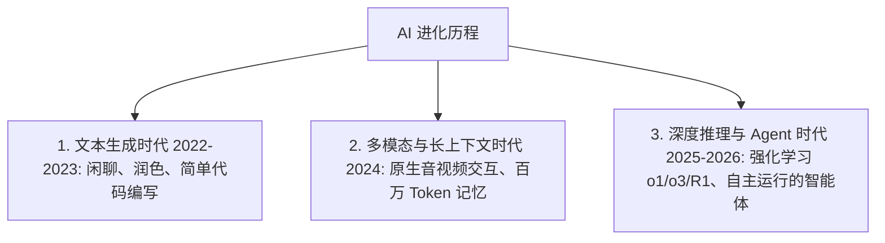
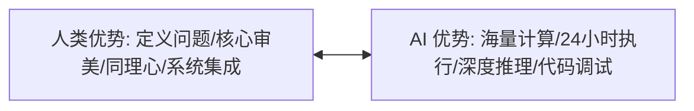

# 2.1 AI 时代已来：不是选择题


> [!IMPORTANT]
> **本章寄语**：AI 革命不是像 3D 打印或元宇宙那样的一个“新行业”，它是像**“电力”和“互联网”一样的底层通用技术（General Purpose Technology）**。它将重构所有行业、所有职业、所有学习方式。在今天，拥抱 AI 不是一个兴趣选择，而是每一个想要在未来生存的少年的生存必答题。

你好，少年。

在第一章“破壁”中，我们一起打破了信息和语言的壁垒，建立了自己的全球信息管道。当你能够流畅地触达全球最新的知识流时，你一定会迎面撞上这股席卷全球的洪流——**人工智能（AI）革命**。

面对 AI，许多人表现出两极分化的态度：要么陷入“AI 将替代人类、一切学习皆无用”的极度虚无与恐惧；要么不屑一顾，认为它只是一套高级的“自动回复模板”。

要真正看清未来的走向，我们不能只盯着当下热闹的聊天框，而是必须理解它是如何一步步走到今天的。了解历史，才能看清趋势。

---

## 一、 AI 的前世今生：三次浪潮、两次寒冬与三大流派

AI 并不是一夜之间从石头缝里蹦出来的。从 1950 年阿兰·图灵提出“机器能思考吗”至今，人工智能经历了解密、狂热、失望、复苏的螺旋式上升过程。在这条道路上，科学家们分化出了三个完全不同的思考流派。

### 1. 探索智能的三大思想流派

在人工智能的发展史中，科学家们为了“让机器像人一样思考”，提出了三种截然不同的实现路径：

*   **符号主义（Symbolism / 逻辑主义）**：
    *   **核心观点**：智能的本质是符号运算和逻辑推理。人脑的思考就是一套极其复杂的“IF-THEN”规则系统。
    *   **实现方法**：由人类专家把现实世界的运行规律提炼成逻辑规则和知识图谱，输入给电脑，让电脑通过严密的逻辑推导得出结论。
    *   **优点**：过程可解释、逻辑严密。
    *   **局限**：在面对现实世界中的模糊性（如“如何在一张照片里认出一只猫”）时，规则的数量会呈指数级爆炸，人类根本无法写完所有的规则。
*   **联结主义（Connectionism / 仿生学派）**：
    *   **核心观点**：智能不需要精密的符号逻辑，而是起源于人脑中数以千亿计的**神经元联结**。
    *   **实现方法**：设计一个由“虚拟神经元”组成的网络，不需要人类强行灌输逻辑规则，而是给网络喂入海量数据，让它通过计算误差、自我修正来逐渐学会规律。这就是今天“深度学习”的前身。
    *   **优点**：擅长处理图像、声音等模糊、非结构化数据。
    *   **局限**：早期对算力和数据要求极高，且模型内部是“黑盒”，人类难以理解其内部运算逻辑。
*   **行为主义（Actionism / 控制论学派）**：
    *   **核心观点**：智能是生物在与环境交互的过程中，通过“动作-反馈”不断调整行为以适应环境的产物。
    *   **实现方法**：给系统设定一个目标和奖励机制，让它在虚拟环境里不断试错。如果做对了就奖励（增加权重），做错了就惩罚（减少权重），最终进化出最优行为策略。这就是今天大模型训练中“强化学习（RL）”的起源。

### 2. 三次浪潮与两次寒冬的历史演进



*   **第一次浪潮（1956-1970s）**：
    1956 年的达特茅斯会议上，“人工智能”概念正式诞生。早期科学家们用符号推理解决了数学定理证明、简单的跳棋游戏等，举世震惊。科学家们盲目乐观，宣称“二十年内机器将能做人能做的一切工作”。
*   **第一次寒冬（1970s 中叶）**：
    当科学家试图用符号逻辑解决现实世界的“自然语言翻译”或“街景识别”时，遇到了无法克服的“组合爆炸”。同时，联结主义先驱 Rosenblatt 的“感知机（Perceptron）”模型被证明无法解决最简单的非线性逻辑问题（如异或逻辑 XOR）。美国和英国政府随即撤出了几乎所有资金，AI 跌入第一个冰冷谷底。
*   **第二次浪潮（1980s-1990s）**：
    “专家系统（Expert Systems）”风靡工业界。它们将特定领域的专业知识（如医疗诊断、地质勘探）录入电脑，为企业解决实际问题，带来了巨大的商用价值。同时，Hinton 等学者重新发明并推广了**反向传播算法（Backpropagation）**，解决了多层神经网络无法有效训练的问题，联结主义死而复生。
*   **第二次寒冬（1990s 中叶）**：
    专家系统维护成本极其高昂，稍微超出既定规则便会死机，且完全不具备通用性，工业界纷纷放弃。与此同时，当时的硬件算力根本无法支撑多层神经网络的庞大计算。AI 再次进入长达十年的寒冬。在寒冬的尾声，1997年 IBM 的“深蓝”超级电脑通过强大的暴力搜索算法击败了人类国际象棋大师卡斯帕罗夫，这成为了符号/搜索主义在历史上的最后一次高光。
*   **第三次浪潮与深度学习大爆发（2006-至今）**：
    2006 年，Hinton 提出了深度神经网络的有效初始化方法，拉开了“深度学习”的序幕。2012 年，由 GPU 算力驱动的 **AlexNet** 在 ImageNet 图像识别大赛中以压倒性优势击败传统算法，向世界宣告：**联结主义彻底翻盘**。
    
    此后，AI 的发展势如破竹：2016 年 AlphaGo 击败李世石；2017 年 Google 发布的论文《Attention Is All You Need》提出了 **Transformer 架构**，彻底统一了自然语言、图像和音视频的特征提取方式；2020 年 GPT-3 验证了 **Scaling Law（尺度定律）**——只要数据量、算力和参数量足够庞大，模型就会自然“涌现”出原本不具备的智能。

### 3. 为什么联结主义最终取得了统治地位？

要理解今天的大模型，你必须明白为什么联结主义（神经网络）成为了最后的赢家。

在符号主义看来，计算机是“逻辑计算器”；但在联结主义看来，计算机是“高维函数逼近器”。

```
【符号主义的思路】
 输入（猫的照片） ──> 人工编写的规则（有三角形耳朵、有胡须、圆眼睛...） ──> 输出（这是猫吗？）
 （缺点：如果照片里的猫被挡住了半边脸，规则就失效了，必须重新写规则）

【联结主义的思路】
 输入（猫的照片） ──> [ 输入层 ──权重W₁──> 隐藏层 ──权重W₂──> 输出层 ] ──> 输出（这是猫！）
                          ▲                                  │
                          └────────── 计算误差，反向传播 ──────┘
```

神经网络的基本原理非常直觉：
1.  **前馈传播（Feed-forward）**：输入一张猫的照片，照片像素被转化为一堆数字，数字在神经网络的层与层之间向前流动。每一个神经元连接处都有一个数字，叫**权重（Weights）**。输入数据乘以这些权重，最后在输出端得出一个概率（比如“有 60% 概率是猫，40% 概率是狗”）。
2.  **计算误差与反向传播（Backpropagation）**：如果输出结果错了（明明是猫，AI 却说是狗），算法会计算这个输出与真实答案之间的误差，然后**倒回去（从后往前）**，在每一层微调这些“权重”，让下一次输出更准。
3.  **大参数与大海量数据**：当神经网络层数变深（Deep Learning），参数（权重）达到几千亿个，吞入整个互联网的所有人类文本后，这个高维函数就能精准拟合出人类语言的内在逻辑。

联结主义胜出，是因为它顺应了物理世界的客观规律：**“以简驭繁”**。人类不需要雕刻规则，只需要提供足够的“燃料”（海量数据与强大的 GPU 算力），网络就会自己生长出规则。

---

## 二、 AI 的断代式进化：从“聊天盒子”到“推理智能体”

如果你对 AI 的印象还停留在 2023 年 ChatGPT 刚出来时的“陪聊”或“写公文”，那么你已经落后了两个时代。目前的 AI 已经完成了两次质的跨越：



### 1. 从“快思考”到“慢思考”：推理模型（Reasoning Models）的崛起

心理学家丹尼尔·卡尼曼在《思考，快与慢》中提出，人脑有两套决策系统：
*   **系统 1（快思考）**：直觉、无意识、瞬间做出反应（比如迎面飞来一个球，你本能躲开）。
*   **系统 2（慢思考）**：逻辑、需要专注、自我审视和推导（比如做一道复杂的微积分题目）。

在 2024 年之前，所有的大语言模型本质上都是 **系统 1**。它们根据概率逐字输出（Next Token Prediction），速度极快，但“不假思索”。这也是为什么它们在写诗、润色文案时得心应手，但在面对复杂编程、高等数学和严密逻辑推理时，极易出现胡言乱语的“幻觉”。

*   **最新突破**：以 **OpenAI o1/o3** 和开源的 **DeepSeek-R1** 为代表的**推理模型（Reasoning Models）**，为 AI 装备了 **系统 2**。
*   **技术原理**：这些模型在回答用户之前，会在后台运行一个巨大的“思考链（Chain of Thought）”。它们使用强化学习，在自己脑海里进行无数次模拟推理、自我质问、寻找逻辑漏洞并自我纠错。当它最终把答案呈现给你时，可能已经在后台“思考”了数十秒。这种慢思考机制使 AI 的数学、编程与科学推理能力达到了顶尖人类专家的水平。

### 2. 走向自主运行：AI 智能体（AI Agents）与 Computer Use

*   **变化**：AI 不再只是等待你提问的“被动文本框”，而是变为了可以自主使用电脑、编写代码、操作浏览器并最终交付成果的 **智能体（Agents）**。
*   **核心特性**：
    *   **自主规划（Planning）**：拆解复杂目标。
    *   **记忆能力（Memory）**：存储上下文和执行历史。
    *   **工具使用（Tool Use）**：调用 API、运行计算器、操作浏览器。
    *   **行动（Action / Computer Use）**：像人一样移动鼠标、点击键盘、操作真实的操作系统桌面。
*   **现实**：你可以给它下达一个宏观指令（如“帮我写一个爬虫，把最新美债收益率爬下来并画出折线图自动发到我的邮箱”），AI 会自己在沙盒中新建文件、安装第三方依赖包、测试运行、捕获报错、自我修改调试，直至程序跑通并自动发送。

### 3. 百万级长上下文（Long Context Window）

*   **威力**：现在的 AI 能够一次性吞下超过 200 万字的信息（相当于把几十本教科书或者你整个项目的全部源代码直接丢进它的对话框）。
*   **影响**：这意味着“信息检索”和“熟记定义”的门槛被拉低到了近乎为零的程度。你不需要再去死记硬背枯燥的 API 用法或课本公式，AI 可以在瞬间对它们进行全局关联和分析。

---

## 三、 生存法则的突变：被重构的教育与职场

在这个技术断代式进化的背景下，传统的“优秀学生”和“职场新手”定义正在面临毁灭性的打击。

### 1. 淘汰：初级技能的“大洪水”

过去，一个大学生毕业后，靠着帮老板写写简单的周报、翻译外语合同、做基础的数据统计表格、绘制模板化插画、或者写写简单的网页前端代码（增删改查），就能获得一份不错的起步薪水。

**现在，这些全部被 AI 在秒级以内以近乎零的成本搞定。**

> [!WARNING]
> 如果你在学校期间的学习仅仅是为了掌握这些“初级、机械、可重复的执行类技能”，你将在毕业的一瞬间面临“出道即失业”的窘境。大洪水的边缘已经漫过传统外语翻译、初级程序员、初级设计美工的脚面。

### 2. 崛起：一人公司（OPC）与“超级个体”的黄金时代

但这绝不意味着普通少年没有机会了。相反，**这是属于有想法、有行动力的少年最好的时代。**

以前，你想开发一个 App 或者创办一个商业网站，你需要组建团队：前端、后端、UI设计、文案策划。你需要在沟通、管理和筹集资金上耗费巨大的精力。

*   **现在**：AI 扮演了你所有的团队成员。你只需要做好**“产品经理”**和**“系统架构师”**。
*   **模式**：用你第一章搭建的信息管道获取灵感，用英语和推理大模型对话，你一个人就能像一家成熟的软件公司一样，在几天内开发、上线并推广你的产品。这就是 **OPC（One Person Company，一人公司）** 时代的到来。

---

## 四、 拥抱“共生”：如何在 AI 时代重构自己？

面对这场海啸，你唯一的出路是与 AI 达成**“共生协作”**关系。你需要将自己的核心竞争力转向 AI 无法触及的维度：



1.  **从“寻找答案”转为“定义问题”与“编排系统”**：
    AI 拥有几乎无限的答案，但它没有动机。**提出好问题、定义痛点、看清商业与真实需求的能力**，成为了人机协作中人类唯一的特权。你要学会如何去“编排”多个 AI 协同工作。
2.  **培养第一性原理与批判性思维（主审法官力）**：
    哪怕是深度推理模型，也会在极为复杂的计算链条中跑偏。如果你自己没有底层逻辑（比如懂不懂基本的物理原理、算法本质或经济规律），你就会被 AI 生成的虚假信息或逻辑漏洞牵着鼻子走。你必须有能力做 AI 的“主审法官”。
3.  **系统级集成能力（System Integration）与动手能力**：
    不要试图在单点执行技能上超越 AI（例如跟 AI 比背单词、比手写简单的快速排序算法）。你要学习的是如何像拼积木一样，把 AI 生成的代码、AI 绘制的草图、AI 撰写的文案，快速整合进一个能解决现实世界真实痛点的**系统**中，并推向市场。

---

## 💡 思考与行动

> [!TIP]
> **今日行动任务：**
> 1.  **自我质问**：回想一下你目前正在学习的一门课程或技能，问自己：如果我现在将这门课的整本教科书丢给拥有 200 万上下文的 AI，它能在 10 秒内比我理解得更透彻、回答得更专业吗？如果是，这门课里有什么是 AI 带不走的（比如实践经验、人际链接）？
> 2.  **体验“慢思考”**：今天在遇到任何开发或学习难题时，不再使用传统的“百度/Google”搜索，而是使用支持深度推理的 AI 模型（如 DeepSeek-R1 或 OpenAI o1），观察并体验它们展示“思考 chain”并自我纠错的过程。
> 3.  **小试身手**：写下你目前学习或生活中最烦人、最枯燥的一个流程（比如每天整理课程笔记、或者某种格式转换）。尝试花一小时时间，用 AI 帮你写一段 Python 脚本，彻底将这个流程自动化。体验一次做“系统集成者”的感觉。

少年，AI 的大潮已经漫过膝盖。

你不能假装水不存在，更不能指望潮水会退去。退回安全区是不可能的，唯一的生路是学会游泳，借着浪潮的托力，游向原本你一生都无法触及的深海。

---

