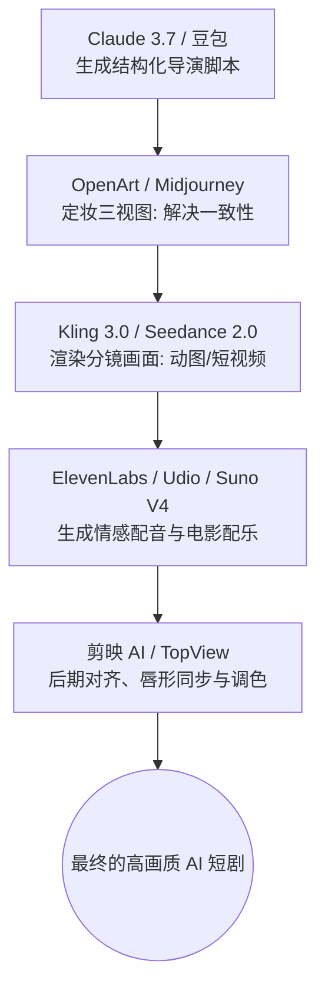

# 2.10 AI 短剧制作：一个人就是电影制片厂

> [!IMPORTANT]
> **本章寄语**：在 AI 时代之前，拍摄一部拥有精美画面的科幻或古装短剧是不可想象的，它需要数以百万计的投资、庞大的剧组和漫长的后期。但今天，**你一个人，就是一家完整的电影制片厂**。本章将为你梳理 2026 年影视多模型协作的工业化 SOP，带你跨越角色一致性的死穴，用 AI 拼装出你的第一部院线质感短剧。

如果你曾经在短视频平台上刷到过画面华丽、构图精美的“AI 科幻短剧”或“AI 古风电影”，你可能会跃跃欲试。但当你自己打开某个视频模型，输入“一个宇航员在火星奔跑”，然后生成了一段“动作扭曲、宇航员面部融化”的 4 秒视频时，你可能会大失所望，觉得 AI 视频不过是“抽卡游戏”。

这种挫败感的根源在于：你试图用**单点工具的盲盒提问**，去解决需要**系统性协作的工业化流水线**。

在 2026 年，专业的 AI 导演从不依赖某一个模型的单次输出。他们使用一套高度解耦、流程可控的多 AI 协作工作流（Workflow）。

---

## 一、 AI 短剧制作的工业化流程（SOP）

一部合格的 AI 短剧，其制作必须遵循“编剧 $\to$ 导演分镜 $\to$ 演员定妆 $\to$ 摄影渲染 $\to$ 配音配乐 $\to$ 后期剪辑”的严密逻辑：

---

## 二、 核心攻坚：如何跨越“角色一致性”死穴？

AI 视频创作中最大的“劝退点”就是：同一个角色，在镜头 A 里是瓜子脸，在镜头 B 里变成了国字脸。
在 2026 年，我们主要通过以下两步来完美解决**角色一致性（Character Consistency）**：

### 步骤 1：制作角色标准卡（Character Sheet）
不要直接生成视频！先在 `OpenArt` 或 `Midjourney` 中为你的主角定妆。
1.  **关键词模板**：使用带有角度要求的词汇。例如：
    > “*一个 18 岁的亚洲少年，身着银色未来感机甲，短碎发，眼神坚毅。角色设计三视图：正面、侧面、斜侧面，干净的纯色背景，电影感质感，高度细节。*”
2.  **定稿保存**：选出一张质感最好的图作为“角色标准卡”，并记下它的 **Seed 种子值**。

### 步骤 2：利用角色参考（Character Reference）进行渲染
在使用视频模型（如 `Kling 3.0` 或 `Seedance 2.0`）时：
1.  **图片转视频（Image to Video）**：将刚才生成的标准卡正面照上传为“引导图”。
2.  **动作描述**：在 Prompt 框里只写角色的动作，不要再重复描述角色长相。例如：“*这个少年正缓缓戴上头盔，背景是火星基地内部，镜头推近。*”
3.  **面部锁定（Face Lock）**：在 OpenArt 或 Seedance 的高级设置中，将面部控制强度（Face Weight）拉到 0.8 以上。这样，模型在让画面动起来的同时，会强制锁定主角的面部轮廓。

---

## 三、 摄影与听觉：渲染写实画面与史诗配乐

完成了定妆，接下来就是“摄影师”与“配音师”入场的时刻：

### 1. 摄影渲染（画面的连贯性）
*   **Seedance 2.0**：目前短剧领域的首选渲染器。它针对 24 帧电影格式进行了深度优化，光影表现柔和，非常适合处理人物特写与戏剧冲突。
*   **Kling AI 3.0**：写实度天花板。如果你的镜头涉及复杂的物理交互（如“茶杯摔碎在地上”、“主角在雨中奔跑”），可灵的物理引擎表现最为逼真。
*   **运镜技巧**：在 Prompt 中明确加入运镜代码，如 `Zoom in`（慢推近景）、`Pan left`（镜头向左横移）、`Dolly shot`（轨道推拉）。这会让你的 AI 视频瞬间拥有电影般的“呼吸感”，而不是呆板的静态图变动画。

### 2. 听觉重构（声音的情感与张力）
*   **配音（ElevenLabs / IndexTTS）**：利用 ElevenLabs，你可以克隆你自己的声音，或者使用其内置的“旁白库”。它的声音具有极强的情感起伏，能够完美模拟叹气、抽泣和愤怒的语气。
*   **配乐（Suno V4 / Udio）**：画面不够，音乐来凑。在 Suno 输入框输入：“*好莱坞科幻电影预告片配乐，宏大的管弦乐，史诗般的渐强，带有一丝孤独的电子合成器冷色调*”，生成 2 分钟的背景音乐（BGM），这会让你的画面感染力翻倍。

---

## 四、 后期总装：在剪映 AI 中完成音视同步

当你的电脑里存满了 15 段 4 秒的 AI 视频片段、3 段配音音频和 1 段 BGM 之后，真正的“大戏”在剪辑软件里上演：

1.  **时间轴对齐**：将视频片段按照剧本顺序拖入轨道。
2.  **转场艺术**：AI 视频片段之间的衔接容易有突兀感。**多用“叠化”、“淡入淡出”或者光效转场**，可以极好地掩盖 AI 生成时的微小畸变。
3.  **唇形同步（Lip-Sync）**：如果镜头里主角在说话，使用剪映的“AI 智能对口型”或 TopView Drama Studio，上传配音音频，AI 会自动微调主角的嘴部动作，使其与发音完全对齐。
4.  **画面调色**：统一应用一个“电影感色调滤镜”，这能瞬间把不同模型生成的画面色差抹平，融为一体。

> [!TIP]
> **终极创作心法：故事永远是王道**
> 技术会以惊人的速度迭代（今天的 Kling 3.0，明年就会被更强的模型取代），但**讲故事的能力（Storytelling）**永远不会贬值。观众能被一部短剧吸引，绝不是因为“这个宇航员生成的机甲很逼真”，而是因为“这个宇航员在面临生死抉择时的内心挣扎”。
> 
> 在动手生成画面之前，请花 80% 的精力，在 Claude 3.7 里把你的剧本打磨出最扣人心弦的转折。

去创造你的第一个镜头吧，导演。灯光，摄像，AI，Action！

---

