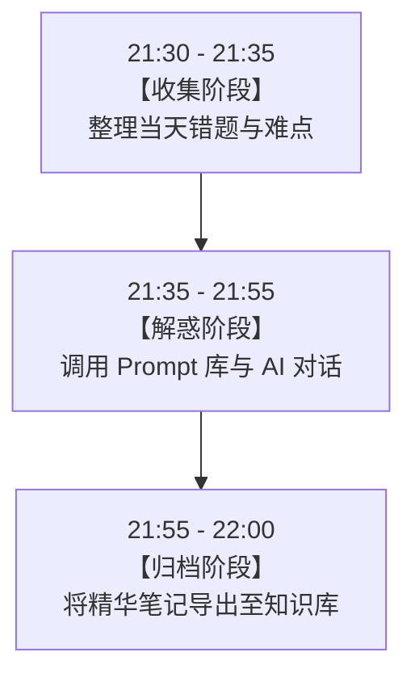

# 2.12 实战演练：从零搭建你的专属 AI 工作流

> [!IMPORTANT]
> **本章寄语**：读万卷书，不如行万里路；听百遍道理，不如亲手打磨一套工具。在这一章里，我们将把前面学到的所有提示词技巧、学习法则和创作逻辑凝聚在一起，**为你量身定制一套 24 小时运转的个人 AI 工作流**。完成后，你将不再是零散、无序地使用 AI，而是拥有了一个能够随你一同进化的“超级外脑系统”。

学完了大模型入门、提示词工程、AI 学习法、AI 创作流以及安全伦理，你已经掌握了与 AI 共生的全部底层理论。然而，**“知道”与“做到”之间，隔着一条名为“实战”的鸿沟**。

如果每次遇到问题，你都要现编提示词，或者抓着随便哪个大模型乱问一气，你的效率非但不会提升，反而会因为信息零散而感到疲惫。真正的效率高手，会把 AI 嵌入到自己的日常学习和生活体系中，形成自动化的闭环。

接下来，我们将用 60 分钟时间，通过四个步骤，亲手组装并运行你的第一个 **个人 AI 工作流**。

---

## 一、 第一步：明确痛点，找到你的“AI 提效切入点”

不要试图让 AI 一下子解决你生活中的所有问题。我们必须聚焦，找到最能帮你省下时间、提升质量的核心场景。

请在纸上或你的笔记软件里，盘点你的高频痛点，并完成以下表格的筛选（我们为你提供了一个推荐基准）：

| 核心场景 | 具体痛点与需求 | 预期提效期望 | 推荐优先级 |
| :--- | :--- | :--- | :--- |
| **概念理解** | 遇到晦涩难懂的物理公式、历史事件、化学反应或英语语法。 | 3 分钟内用最通俗的类比彻底理解本质。 | 🔴 高（刚需） |
| **解题辅导** | 遇到不会做的题目，不想看直接给答案的解析，需要思路启发。 | 像私教一样一步步引导我，自己推导出来。 | 🔴 高（刚需） |
| **英语突破** | 单词记了就忘、阅读长难句吃力、英语作文表达太中式。 | 深度记忆词根词源、获得地道的英文句式批改。 | 🔴 高（刚需） |
| **写作辅导** | 语文作文、研究性报告写作时没有灵感，卡在开头和立意。 | 5 分钟脑暴出新颖大纲与丰富素材。 | 🟡 中（高频） |
| **信息提炼** | 面对几万字的长文档、论文或视频，没有时间精读。 | 提取精准摘要与核心脑图大纲。 | 🟡 中（高频） |
| **时间管理** | 每日学习任务混乱，备考计划无法科学落地。 | 自动生成定制化的每日时间表与学习计划。 | 🟢 低（辅助） |

> **✍️ 实战行动 1**：
> 从上表中选择 **3 个最能解决你当前痛点** 的场景，作为你的“第一批核心应用场景”。例如，你如果正值高二，可以选择：*数学解题辅导*、*英语作文批改* 和 *物理概念透彻理解*。

---

## 二、 第二步：组装工具，配置你的“核心工具链”（Stack Setup）

工欲善其事，必先利其器。2026 年的大模型百花齐放，每个工具的“性格”和“特长”各不相同。根据你的网络环境和使用偏好，我们推荐以下工具组合：

### 1. 工具特性对比矩阵
| 工具名称 | 擅长领域 | 最适合的应用场景 | 备考建议 |
| :--- | :--- | :--- | :--- |
| **Claude (4.5 / 4.0 Sonnet)** | 写作修养极高、逻辑极其缜密、零翻译腔。 | 长文撰写、完美文风模仿、全栈代码开发。 | 适合文科写作、深度阅读理解。 |
| **ChatGPT (GPT-5 / o5)** | 全模态处理能力、原生语音视觉互动、极限深度推理。 | 复杂科研推导、三维空间理解、高难度日常决策。 | 适合处理极度烧脑的综合性任务。 |
| **DeepSeek (V5 / R3)** | 深度推理能力极强、数理逻辑出色，国内算力标杆。 | 数理公式推导、编程纠错、启发式理科解题。 | 理科学习第一推荐，推理过程透明。 |
| **Gemini (3.5 Flash / 3.1 Pro)** | 亿级超长上下文理解、多模态原生大统合。 | 瞬间吞吐几十本大部头或超长学习视频。 | 适合看网课或读整本参考书。 |
| **Kimi (2.0) / Qwen 4.0** | 极速国内网络检索、超长文本精读、极致的中文体验。 | 提炼超长报告、全网实时信息搜索比对。 | 适合国内无缝开箱即用。 |

### 2. 你的工具链配置卡片
请根据自身情况，完成你的核心工具链组装：

```markdown
- [ ] 主力推理模型（主攻数理、逻辑、解题）：____________________（如 DeepSeek R3 / ChatGPT o5）
- [ ] 主力创意与表达模型（主攻写作、翻译、润色）：____________________（如 Claude 4.5 Sonnet / ChatGPT）
- [ ] 主力长文本与检索模型（主攻总结、查资料）：____________________（如 Kimi 2.0 / Gemini 3.5）
- [ ] 辅助提效工具（可选）：____________________（如 DeepL 翻译、Gamma PPT 生成）
```

---

## 三、 第三步：封装模板，构建你的高频“提示词中心”（Prompt Hub）

将你选出的 3 个核心场景，套入我们为你打磨的**高频提示词模板**。你可以将这些提示词保存在 Obsidian、Notion 或手机备忘录中，使用时一键复制，只替换括号 `【 】` 里的内容。

### 1. 概念显微镜（类比学习咒语）
*适用于：物理、化学、历史、经济学等任何抽象概念的击破。*
```markdown
我是一名高中生，正在学习【学科，如：高中物理】。
我目前无法透彻理解【概念名称，如：电磁感应中的楞次定律】。
请你作为一位风趣幽默、擅长化繁为简的特级教师，帮我解答：
1. 本质解释：不要使用复杂的专业术语，先用一句话点明它的本质。
2. 黄金类比：用一个我们日常生活中非常熟悉、生动有趣的场景进行类比解释。
3. 核心原理：用最通俗的语言解释它的运作规律。
4. 实战场景：给出 2 个这个概念在现实世界中的实际应用，让我明白学它有什么用。
```

### 2. 苏格拉底解题私教（思路启发咒语）
*适用于：数学、物理、化学等理科错题与卡壳题的攻克。*
```markdown
你是一位采用苏格拉底教学法的启发式理科导师。我在做下面这道题时卡住了：
【粘贴题目内容，或描述题目】

请严格遵守以下规则：
1. 绝对不要直接告诉我答案，也不要直接给出完整的解题步骤。
2. 请先指出这道题所考查的核心知识点是什么。
3. 给我指出第一步的“突破口”，并向我提出一个启发性的问题，引导我自己写出第一步。
4. 每次只问一个引导性问题，等我回复后，再给出反馈并提出下一个问题，直到我靠自己完全解出这道题。
```

### 3. 英语单词深度网络（词汇突围咒语）
*适用于：深度记忆核心词汇、攻克长难句。*
```markdown
请帮我深度记忆和掌握这个英语单词/短语：【输入单词/短语，如：reluctant】。
请帮我输出以下内容，排版要清晰美观：
1. 音标与基本释义（常用和生僻释义）；
2. 词源与词根分析：告诉我它怎么来的，方便我联想记忆；
3. 语境例句：提供 3 个不同语境（如学术、日常口语、新闻）下的地道双语例句；
4. 黄金搭配：列出 3 个最常见的高频搭配词组；
5. 画面助记：编一个画面感极其强烈、甚至有些荒诞的短故事，帮助我牢牢记住这个词的读音与含义。
```

### 4. 创意大纲总监（写作与策划咒语）
*适用于：作文头脑风暴、研究性报告设计、视频脚本起步。*
```markdown
我需要撰写一篇关于【主题，如：科技对人际关系的影响】的【文体，如：高中议论文】。
目标读者是【目标受众，如：语文阅卷老师和青年群体】，字数要求在【字数要求，如：800 字】左右。
请帮我：
1. 头脑风暴 3 个切入角度不同、立意深刻且不落俗套的写作立意；
2. 为其中你觉得最出彩、最深刻的一个立意，设计一个详细的三段式大纲；
3. 为大纲中的每个部分提供 2 个可以引用的名人名言、经典事例或新颖的论据素材。
```

### 5. 抛光大师（克隆语气与高级润色咒语）
*适用于：作文修改、自媒体发布、邮件撰写。*
```markdown
这是我手写的一段内容草稿：
【粘贴你的内容草稿】

请扮演我的私人文字编辑，帮我做以下三件事：
1. 纠错：修改语病、错别字及生硬的标点；
2. 抛光：在不改变我核心观点和文风的前提下，优化词汇选择，让句子读起来长短错落，更有节奏感和画面感；
3. 迭代解析：给出修改后的版本，并用列表指出你做了哪些关键性改动，以及这些改动能带来什么提升。
```

---

## 四、 第四步：运转系统，建立你的“每日 AI 仪式感”

有了工具和模板，接下来要让它们像时钟一样精准转动。你需要建立两个习惯闭环：

### 1. 每日 30 分钟 AI 伴读仪式（Daily Routine）
建议将时间固定在每天晚自习后或睡前（如 21:30 - 22:00）：



*   **收集阶段**：把当天课上没听懂的物理概念、错题本上的数学题、记不住的英文单词整理好。
*   **解惑阶段**：复制对应的提示词，与 AI 展开深度双向对话。记住，**每次对话至少进行 3 轮以上**，直到彻底榨干这个知识点。
*   **归档阶段**：把 AI 给出的精彩类比、记忆故事，或者你自己推导出的解题思路，一键保存到你的 Obsidian、Notion 或纸质笔记本中。

### 2. 每周 10 分钟自我审计（Weekly Review）
每周六晚上，花 10 分钟回答以下三个问题：
1.  **依赖度审计**：我这周有没有直接复制 AI 的答案去应付作业？如果有，下周必须强制开启“苏格拉底解题模式”。
2.  **模板库审计**：这周哪条提示词用起来最顺手？哪条提示词大模型理解得不好？微调一下模板参数。
3.  **价值审计**：我通过 AI 学会了哪几个之前一直搞不懂的硬核概念？

---

## 五、 实战演练：一个高三学生的真实工作流案例

为了让你更有画面感，我们来看看高三学生小明是如何运行他的 AI 工作流的：

### 1. 小明的配置卡片
*   **主力解题**：DeepSeek R3（思维链推理强，解答数理逻辑思路清晰）
*   **主力润色**：Claude 4.5 Sonnet（文笔极佳、语气自然，适合改英语和语文作文）
*   **模板仓库**：保存在手机输入法的“快捷短语”中，随时一键输入。

### 2. 星期二晚上的 30 分钟实战过程
*   **21:30 收集**：今天物理课讲了“动量守恒定理”，小明没听懂，且错了一道大题。
*   **21:35 概念击破**：
    - 小明复制 **“概念显微镜咒语”** 发给 DeepSeek。
    - DeepSeek 用“冰面上两个滑冰人互相推一把”的生活场景做类比，小明瞬间明白了动量守恒的本质。
*   **21:45 错题攻克**：
    - 小明拍照上传错题，发送 **“苏格拉底解题私教咒语”**。
    - DeepSeek 一次只给一步提示，引导小明想到了列出“碰撞前动量等于碰撞后动量”的方程。
    - 小明在草稿纸上自己算出了答案，拍照上传，DeepSeek 确认正确并夸奖了他。
*   **21:55 归档**：
    - 小明把“滑冰人”的类比和解题关键突破口，一键存入 Obsidian 的物理笔记本中。

---

## 六、 常见问题与避坑指南

### Q：每天用 AI，会不会让我的大脑变懒？
*   **A**：这取决于你的“主动性”。如果你把 AI 当成**“答案贩卖机”**，你一定会变懒；如果你把 AI 当成**“思维磨刀石”**（如使用苏格拉底模式），你的大脑会因为不断被追问和引导而变得更加敏锐。强迫自己在向 AI 提问前，先独立思考 10 分钟。

### Q：AI 经常编造一些错误的古诗词或历史时间，怎么破？
*   **A**：大模型对人文历史和具体事实性数据有天然的“幻觉”偏向。遇到此类问题，请记住“**大模型做逻辑，搜索引擎做事实**”。你可以用 Kimi 开启联网搜索模式验证，或者直接查阅纸质教材和专业网站。

### Q：对话历史太乱，怎么整理才能不丢失？
*   **A**：不要指望以后翻阅网页版的历史记录。养成“**即时归档**”的习惯。利用浏览器插件（如 ShareGPT 或大模型自带的 Share 链接功能）将精彩对话保存为网页，或者直接将关键内容复制到你的卡片笔记系统（Obsidian/Notion/Logseq）中，并打上标签（如 `#AI学习笔记/物理`）。

---

## 💡 思考与行动

> [!TIP]
> **本章行动检查清单**
> 
> - [ ] **清单 1**：你是否已经选出了你的 3 个核心应用场景？
> - [ ] **清单 2**：你是否已经测试并选定了你的主力工具链（如：DeepSeek + Kimi）？
> - [ ] **清单 3**：你是否已经将本章第三部分的 5 个高频提示词模板保存到了随时可以复制的地方（如手机备忘录、微信置顶对话框或 Obsidian 模板库中）？
> - [ ] **清单 4**：你在日历或闹钟里设定好你的“每日 AI 时间”了吗？
> - [ ] **清单 5**：今晚尝试按照小明的流程，完成你人生的第一次“30分钟 AI 伴读仪式”，并把精华笔记记录下来。

恭喜你！完成本章的实战演练，意味着你已经正式跨越了“人机共生”的门槛。你不再是一个被动的信息接收者，而是一个拥有了超级外脑的数字化高效学习者。

随着你不断优化你的提示词和工具链，这个外脑会越来越懂你，成为你通往卓越之路上最忠诚的护盾与最锋利的宝剑。

---

