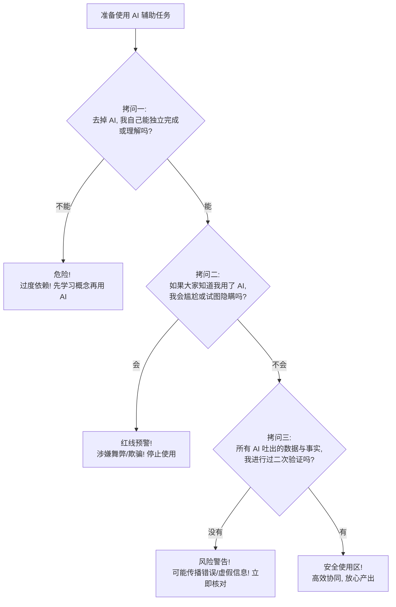

# 2.6 AI 伦理与边界：聪明人的清醒

> [!IMPORTANT]
> **本章寄语**：科技如同一把烈火，它既能照亮前路、烹饪美食，也能焚毁森林、灼伤自我。当 AI 成为你触手可及的“最强大脑”时，你的自律、判断力与伦理底线，就是决定你是被火焰吞噬还是驾驭火焰的唯一准绳。在 AI 时代，**真正聪明的人不仅懂得如何狂飙，更懂得在什么时候、什么边界前踩下刹车。**

在前面几节中，我们共同见证了 AI 惊人的能力：它能成为你的一对一私教，能在几分钟内把你的思想变成精美的文字与图画。然而，硬币都有两面。在这股狂热的科技浪潮中，如果缺乏边界意识和清醒的头脑，AI 也可能成为你认知退化的温床、甚至职业与学业生涯的隐形炸弹。

做一个聪明的技术驾驭者，首先要学会看清 AI 的阴暗面，并在心中拉起一条坚不可摧的伦理红线。

---

## 一、 AI 的“阴暗面”：清醒者的第一堂防身课

大模型本质上是一个基于概率预测下一个词的“统计机器”，它没有真正的意识，更不具备分辨真理与谎言的道德自觉。因此，它天然地存在以下四个硬伤：

### 1. 幻觉陷阱：一本正经地胡说八道
由于大模型的运作机制是概率匹配，当它无法找到确切答案时，为了“取悦”用户，它会用极其自信、专业的语气编造一整套谎言。这种现象在学术界被称为**“幻觉”（Hallucination）**。

> [!WARNING]
> **真实幻觉案例**：
> - **编造学术论文**：你让 AI 推荐几篇关于某一细分领域的论文，它可能会生成 5 个格式完美、作者都是业界大牛、但**在现实中根本不存在**的论文题目及虚假 DOI 链接。
> - **捏造历史细节**：询问 AI 某个冷门的历史人物，它可能会巧妙地把几个不同时代的人的事迹拼凑在一起，生动地编造出一段段荡气回射的历史故事。

*   **防身口诀**：**重要事实，务必验证。** 凡是涉及关键数字、法律条文、历史事实、学术引用等，绝不能直接采信 AI，必须通过权威工具（如维基百科、教科书、官方数据库）进行交叉核实。

### 2. 偏见回音室：被放大的互联网刻板印象
AI 的训练数据主要来自于过去人类在互联网上留下的文本。这意味着，**人类历史上存在的各种刻板印象、偏见和歧视，都会被 AI 全盘吸收并加以放大**。
*   **示例**：在某些早期的图像生成模型中，输入“CEO”往往默认生成中年白人男性，而输入“清洁工”或“助理”则更容易生成女性或有色人种。在文本模型中，AI 也会不知不觉地流露出某种特定的文化偏向。
*   **防身口诀**：**保持批判，警惕“理所当然”。** 阅读 AI 的分析时，多问一句：“这个观点是否有局限性？它是否忽视了其他群体的立场？”

### 3. 隐私黑洞：你的每一次对话都在泄露秘密
除非你使用的是专门针对企业或隐私保护极度严格的本地模型，否则**你输入给云端 AI 的所有聊天记录，都有可能被作为下一代模型的训练语料**。
*   **风险**：
    - 程序员为了debug，将公司未公开的核心算法代码上传给 AI；
    - 个人为了寻求情感咨询，将自己的隐私证件信息、日记内容或朋友的隐私细节原封不动地发给 AI。
    - 这些敏感数据一旦进入模型训练池，就有可能在未来以某种形式被其他用户“套话”套出来。
*   **防身口诀**：**脱敏输入，隐私不上网。** 永远不要把身份证号、真实姓名、未公开的公司商业机密或敏感情感秘密喂给 AI。使用前，对关键人物和地点做化名或脱敏处理。

### 4. 脑力萎缩：过度依赖导致的突触退化
人类大脑遵循“用进废退”（Use it or lose it）的神经塑料规律。如果你的大脑习惯了“遇到问题 $\to$ 一键交给 AI $\to$ 复制粘贴”的路径，你大脑中负责深度思考、逻辑推理与文笔磨砺的神经元连接就会渐渐萎缩。
*   **防身口诀**：**AI 是健身房里的辅助杠铃，而不是帮你举重的人。** 核心能力的建立必须依赖你的“独立挣扎”。

---

## 二、 学术诚信红线：高中到大学的生存法则

对于学生而言，学术诚信是一条绝对不能踩踏的红线。一旦在学业中滥用 AI 被判定为“学术不端”，后果将是灾难性的。

### 1. 学术使用 AI 的三色灯系统
我们可以用红绿灯系统来界定 AI 在日常作业、研究性学习和论文撰写中的合理边界：

| 状态 | 行为模式 | 伦理判定与后果 |
| :--- | :--- | :--- |
| **🟢 绿色（合规且鼓励）** | - 解释看不懂的晦涩学术名词； - 生成学习路线与练习题； - 对自己手写的文章进行语法纠错与句式润色。 | **合法伴学**。AI 扮演的是“脚手架”角色，最终的思考、观点和表述主体依然是你自己。 |
| **🟡 黄色（需警惕与报备）** | - 用 AI 收集文献摘要并分类； - 辅助拟定小论文的整体框架； - 大幅度重写自己的草稿段落。 | **灰色地带**。在提交前，必须仔细阅读学校或期刊的“AI 使用声明”，并在报告的致谢/附录中主动注明：“本文大纲及润色在部分阶段使用了大模型辅助”。 |
| **🔴 红色（严禁与违规）** | - 输入题目，直接让 AI 给出答案并抄写； - 输入要求，让 AI 代写整篇论文，然后假装原创提交； - 在闭卷或限制外部辅助的考试中使用 AI。 | **剽窃与欺诈**。这属于严重的学术不端行为，在大学里会被直接判定为不及格（Fail），甚至面临留校察看或开除处分。 |

### 2. 为什么“瞒天过海”在今天行不通了？
很多同学抱有侥幸心理，觉得“反正 AI 生成的内容每次都不同，老师不可能查得出来”。然而：
1.  **AI 检测器的演进**：目前全球主流大学均引进了如 Turnitin 等集成了高精度 AI 生成内容检测（AI Detector）的查重系统，能通过分析文本的“困惑度”（Perplexity）和“突发性”（Burstiness）轻松识别 AI 痕迹。
2.  **教师的审美直觉**：一个平时写作水平平平的学生，突然交上来一篇用词工整、逻辑滴水不漏但空洞无物的“完美学术论文”，老师一眼就能看出端倪。
3.  **终身追责制**：学术成果是一辈子的档案。即便当时蒙混过关，未来一旦被检举使用 AI 代写，你的学位证书随时可能被依法撤销，导致职业声誉彻底扫地。

---

## 三、 职场与社会伦理的“灰色地带”

当你走出校园，AI 带来的道德考量将变得更加复杂和隐蔽。

*   **效率与诚信的冲突**：
    - 在职场中，用 AI 快速回复客户邮件、生成周报，这是公认的效率工具使用；
    - 但如果你是一名设计师，直接用 AI 跑出一张图充当自己的原创设计卖给客户，并且隐瞒这一事实，就不仅违背了职业道德，还可能面临版权诉讼。
*   **责任不可分担性原则**：
    - **AI 无法为你签字画押，也无法承担法律责任。** 如果你用 AI 生成了一份商业分析报告，里面包含了一个虚假的行业数据，导致公司投资失败，你不能把责任推卸给 AI。**“因为是我提交的，所以由我 100% 负责”**，这是职场人的基本成熟度。
*   **透明性原则**：
    - 当你不确定某件事用 AI 算不算欺骗时，不妨采用**“公开阳光测试”**：如果我把使用 AI 的整个过程公开给我的合作方、老师或同事，他们会觉得我非常高效，还是觉得我是在偷奸耍滑？如果是后者，那就立刻停下。

---

## 四、 AI 时代的核心能力：批判性信息素养

面对充斥着 AI 生成内容（AIGC）的数字化世界，你的信息获取机制必须从“被动接收”升级为“主动审视”。

### 能力一：真伪鉴别——三步核实法
面对 AI 给出的一条信息，立刻在大脑中启动三步审查机制：
1.  **追踪源头（Trace to the Source）**：它引用的书籍、报告或论文真的存在吗？在专业学术搜索引擎（如 Google Scholar）上能搜到吗？
2.  **交叉验证（Cross-Validation）**：在另外两家不同技术路线的大模型（例如 ChatGPT 与 Claude）上输入相同问题，或者直接用搜索引擎查证，看它们给出的关键数据是否一致。
3.  **常识检测（Sanity Check）**：这个结论符合基本的物理定律和人类社会常理吗？是不是 AI 产生了逻辑混乱？

### 能力二：识别“AI腔”的敏锐嗅觉
优秀的创作者必须具备一眼识破“塑料 AI 文风”的能力，并在自己的创作中极力避免：
*   **结构对称强迫症**：总是喜欢列出“一方面……另一方面……总而言之”的刻板三段式。
*   **辞藻堆砌与同义反复**：用极其宏大、华丽的副词，却不给出任何具体的人名、时间、地点和数据支撑。
*   **绝对中立的“和事佬”语气**：从不表达个人立场，每个观点都是“既有好处，也有坏处，需要辩证看待”。

### 能力三：负责任地使用生成技术
不利用 AI 生成虚假照片（Deepfake）去污蔑他人，不利用 AI 批量生产垃圾信息或谣言，这是每个数字化公民在 AI 时代应当共同守护的道德底线。

---

## 五、 避坑决策轮：聪明人的三个“灵魂拷问”

当你拿不准在某项任务中是否该用 AI、以及用多少时，请在大脑里跑一遍这个“决策轮”：

这三个拷问，能够帮你过滤掉 99% 的学术不端与道德风险，确保你在享受技术红利的同时，羽翼完好、声誉无损。

---

## 六、 与 AI 共生的终极智慧

在这个技术迭代比雨后春笋还快的世界里，真正的“清醒者”会坚守以下三点共生哲学：

1.  **镜子思维**：AI 是一面镜子。你输入平庸的指令，它就反射平庸的回答；你输入深刻的洞见，它就回赠绝妙的灵感。**AI 的水平，取决于你自己的上限。** 提升自己，才是提升人机协同效果的根本。
2.  **边界意识**：AI 擅长总结已知、匹配概率、执行体力活；而人类拥有同理心、审美直觉、道德决断和面对未知的开创性。把工具的归工具，人类的归人类。
3.  **持续学习**：永远不要满足于做大模型的“指令输入员”。我们要学习 AI 无法模拟的底层逻辑、沟通艺术与审美能力，这才是我们在任何技术变迁中立于不败之地的“护城河”。

---

## 💡 思考与行动

> [!TIP]
> **今日行动任务**
> 
> 1.  **做一次“幻觉捕手”**：打开你的 AI 助手，故意问它一个虚假或极其偏门的问题（例如：“请帮我介绍一下中国唐代著名量子物理学家张三的生平，并列出他的三本代表作”）。观察 AI 是如何“一本正经地胡说八道”的，并在你的日记本里记录下它的回答特征，以防日后被骗。
> 2.  **分析你的学术红线**：翻阅你所在学校的作业规范或考试守则。找找看是否有关于“禁止使用电子设备辅助”或“生成式人工智能（GenAI）使用政策”的描述。如果没有，思考一下如果在下一份研究报告里大量用 AI，你应该如何撰写说明才最坦荡？
> 3.  **来一次“断 AI”实验**：在接下来的 48 小时内，尝试完成一项小挑战（如：写一篇读后感或解一道压轴几何题），在这个过程中绝对不打开任何 AI 网页。体会一下，当你的大脑失去“即时拐杖”时，那种酸胀、挣扎但最终通透的思考感觉。

清醒的自律，才是科技时代最高级的性感。让我们带着冷静与克制，去驾驭这股奔流不息的科技浪潮。

---

