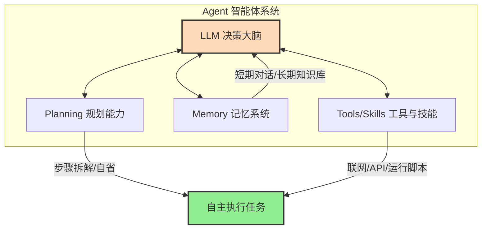

# 2.7 认知跃迁：从“聊天框”到 Agent 与 Skill

> [!IMPORTANT]
> **本章寄语**：如果你和 AI 的交互仅限于“我问，它答”，那你仍停留在工业时代的“打字机式”协同中。在这一章里，我们将揭开大模型从“对话工具”向“数字分身”演进的奥秘——**认识 Agent（智能体）与 Skill（技能）**。当你学会以“管理者”而非“打字员”的眼光审视 AI 时，你的个人效率将迎来指数级的跨越。

在前面的章节中，我们学习了精妙的提示词工程，探讨了费曼学习法，甚至开始生成画作与文字。你可能已经觉得 AI 足够神奇——每次敲下回车，它就能在几秒钟内给你返回洋洋洒洒的内容。

但用久了之后，你一定会遇到以下**“认知疲劳点”**：
*   **重复繁琐**：每次想让 AI 润色一篇英语作文，都要重新把那段上百字的提示词模板复制一遍。
*   **首尾难顾**：如果你想写一篇长篇的研究性报告，你得先让 AI 脑暴大纲，再手动把大纲第一节复制发给它写正文，接着写第二节，最后自己把段落拼起来。你成了那个不停在 AI 之间搬运文本的“人形胶水”。
*   **能力受限**：大模型没有办法直接去操作你的浏览器、读取你电脑本地的错题 PDF，或者在每天早晨八点自动把当天的时政新闻总结发到你的微信上。

这些瓶颈的根源在于：**聊天框（Chat Box）本身，是一堵将大模型困在云端的虚拟围墙。**

要打破这堵墙，我们需要一次认知跃迁——从**“单次对话”**跃迁到**“智能体自动化运行”**。

---

## 一、 核心概念：什么是 Agent（智能体）？

在大模型和人工智能的语境中，**Agent（智能体）** 指的是：**以大语言模型为核心决策引擎，具备自主感知、思考、规划和执行能力的系统。**

如果说基础的大语言模型（LLM）是一个“饱读诗书但与世隔绝”的超级大脑，那么 **Agent 就是给这个大脑装上了眼睛、耳朵、四肢，并赋予它行动的目标。**

我们可以用一个极其经典的公式来拆解它：

$$\text{Agent (智能体)} = \text{LLM (决策大脑)} + \text{Memory (记忆系统)} + \text{Tools/Skills (动作与工具)} + \text{Planning (自主规划能力)}$$

### 1. LLM（决策大脑）
大模型充当了 Agent 的控制中枢。它负责理解我们的复杂意图、解析接收到的信息，并在每一个步骤中决定“下一步该做什么”。

### 2. Memory（记忆系统）
*   **短期记忆（Short-term Memory）**：就是我们在聊天窗口里的上下文历史。AI 能记住你上一句说了什么。
*   **长期记忆（Long-term Memory）**：通过挂载外部的“知识库”（如你的个人 Obsidian 笔记、整理好的错题 PDF、或本地数据库），Agent 可以在海量信息中瞬间检索到需要的部分，使回答不脱离特定事实。

### 3. Tools / Skills（工具与技能包）
大模型本身不会做 100 位数的乘法（它只会概率预测），也不会真正去百度搜索。但我们可以给它提供工具：
*   **计算器工具**：遇到数字计算时，大模型自动把公式输入给 Python 计算器，拿到 100% 正确的结果后再回复你。
*   **联网检索工具**：大模型遇到不确定的实时新闻，自动调用浏览器去搜寻最新网页。
*   **邮箱操作工具**：允许 Agent 登录你的备用邮箱，读取或发送邮件。

### 4. Planning（规划与自省能力）
面对复杂任务，Agent 会像人类一样，先在大脑中进行**思维链推理（CoT）**。它会把一个大目标（“帮我写一份关于量子计算的科普小册子”）拆解为：
1.  *“先搜索量子计算的 3 个核心概念”*；
2.  *“分别为每个概念写一个通俗类比”*；
3.  *“检查这几个类比是否存在逻辑漏洞（自省机制）”*；
4.  *“整理格式输出”*。
在整个执行过程中，你不需要说一句话，它自己会在后台一步步推进，直到完成目标。

---

## 二、 什么是 Skill（技能包）？

如果说 Agent 是那个有决策力的人，那么 **Skill（技能包）就是他手中的精密武器库，或是他脑海中固化的 SOP（标准作业程序）。**

在技术实现上，一个 **Skill** 通常是一份被高度结构化、封装好的**提示词规则配置文件**，或者是带有一组 API 接口的**功能插件**。

### 聊天 vs. 技能封装 的对比：

| 维度 | 传统的“聊天框提问” | 封装后的“Skill 使用” |
| :--- | :--- | :--- |
| **重用性** | 每次使用都得手动复制、拼凑长长的提示词。 | 固化为一键启动的按钮或指令，随时调用。 |
| **精度** | 容易受到聊天上下文噪音的干扰，AI 容易“跑偏”。 | 带有严格的约束红线和边界，输出质量高度稳定。 |
| **协同性** | 只能由人类一步步喂数据，无法与其他 AI 自动化配合。 | 可以作为工作流的一个节点，由其他 AI 自动触发运行。 |

> [!TIP]
> **举个生动的例子**
> 你设计了一个名为“小雷的物理学习助手”的 **Agent**。
> 你往他的武器库里放了三个 **Skills**：
> 1.  `物理概念降维类比.md`（Skill A：擅长把抽象概念讲成通俗故事）
> 2.  `理科苏格拉底解法.md`（Skill B：只提问、不给答案的启发式解题套路）
> 3.  `LaTeX 公式美化器`（Skill C：自动将手写公式整理成标准排版代码）
> 
> 当你上传一张错题照片时，这个 Agent 脑海里的决策中枢（LLM）会先研判你的需求，然后**主动调用 Skill B** 来引导你做题；当你做完题表示看不懂概念时，它又会**自动切换调用 Skill A** 来给你讲故事。

---

## 三、 从“下达指令”到“委托代理”的思维重构

理解了 Agent 和 Skill 之后，你在数字世界中的身份，就从一个**“流水线操作工”**，跃升为了一个**“团队管理者”**。

在接下来的几章中，你将学到如何将这种思维落地：
*   在 **2.8 自动化工作流** 中，你将学会用可视化界面（扣子、n8n）编排这些 Agent，让他们在后台像流水线一样协同工作。
*   在 **2.9 AI 编程** 中，你将直接调度 AI 智能体（Cursor、Trae）替你写出整套软件代码。
*   在 **2.11 自主智能体** 中，你将亲手在自己电脑上安装一个可以操控鼠标和浏览器的“数字雇员”——**龙虾（OpenClaw）**，并把我们蒸馏的 Skill 注入给它。

准备好了吗？让我们推开这扇从“聊天”走向“控制”的效率大门，进入下一章——动手配置你的第一个可视化工作流引擎。

---

