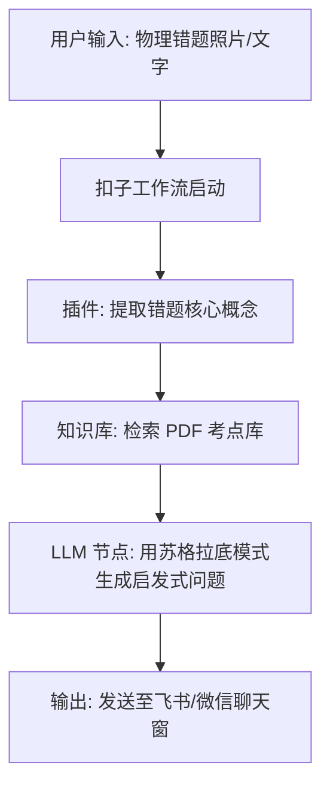

# 2.8 自动化与工作流：扣子与 n8n 的实操演练

> [!IMPORTANT]
> **本章寄语**：效率的最高境界是“无感”。当你把重复的文字加工、数据过滤和信息推送逻辑托付给可视化工作流引擎时，你就为自己安装了一条数字化流水线。在本章中，我们将通过国内的**扣子（Coze）**和国际顶级的**n8n**，亲手将零散的 AI 节点拼装成自动流转的效率中枢。

在前一章中，我们建立了 Agent 与 Skill 的认知，明白大模型可以像个合格的员工一样，拿着规则包（SOP）去执行任务。

但在实际学习和工作中，任务往往是由多个环节组成的：
$$\text{收集原始信息} \to \text{提取关键词} \to \text{检索背景资料} \to \text{调用大模型分析} \to \text{格式化排版} \to \text{发送到我的手机}$$

如果这 6 个步骤每次都要你手动在浏览器里倒腾，那不叫 AI 共生，那叫“人肉数据搬运工”。

为了实现彻底的自动化，我们需要引入**可视化工作流引擎**。今天我们重点实操两款明星级工具：
1.  **扣子（Coze）**：字节跳动推出的 Agent 平台，非常适合新手，拥有海量现成的国内 API 插件（如飞书、微信、小红书等），擅长构建“以自然语言对话为主”的智能体工作流。
2.  **n8n**：全球极客最爱的开源工作流自动化引擎。它以**节点（Nodes）**为核心，支持成百上千种软件（GitHub、Notion、邮箱、数据库）之间的强逻辑 API 数据流转，擅长构建“在后台默默运行”的自动化管家。

---

## 一、 扣子（Coze）实战：搭建“物理复习助推智能体”

**任务目标**：我们要搭建一个飞书/微信机器人，当我们上传一道物理错题时，它会自动从我们上传的《高中物理公式考点库.pdf》中查找对应的公式，并引导我们一步步解题。



### 实操步骤：

#### 1. 创建智能体并挂载知识库
1.  登录扣子（Coze）平台。
2.  点击“个人空间” -> “创建 Bot”，起名为“高考物理提分官”。
3.  在右侧的“知识库”一栏，点击添加，上传你的课本公式大纲 PDF。扣子会自动对 PDF 进行分段解析和向量化（Vectorization）处理，让 AI 能够精准检索。

#### 2. 编排扣子工作流（Workflow）
单纯的知识库检索容易返回一堆废话，我们需要用“工作流”控制它的脑回路：
1.  在左侧栏点击“工作流” -> “创建工作流”。
2.  **输入节点（Start）**：接收用户发送的错题文本。
3.  **知识库检索节点（Knowledge）**：将输入的错题文本作为 Query（查询词），让它去我们刚才建立的物理公式 PDF 中检索关联度最高的 3 个公式。
4.  **大模型节点（LLM）**：
    *   **提示词设定**：
        > “*你是一个只给思路不给答案的物理名师。请对比【输入错题】和知识库检索出的【参考公式】，找出学生做这道题需要的第一步突破口。向他提一个启发性的问题，并给出检索到的公式名，引导他自己写出第一步方程。禁止直接给出计算步骤。*”
    *   **输入变量**：设置 `input = Start.query`，`context = Knowledge.result`。
5.  **输出节点（End）**：将 LLM 节点生成的启发式问题输出给用户。

#### 3. 调试与部署
点击工作流右上角的“试运行”，输入一道物理动量守恒题，看看它是不是如期返回了启发式的引导语而不是直接给答案。确认无误后，点击“发布”，你就可以把它一键绑定到你的微信公众号或飞书群聊中。

---

## 二、 n8n 实战：零人肉干预的“每日学术雷达”

扣子擅长处理“你一句、我一句”的对话。但如果你想做**“每天早上 7:00，自动抓取 ArXiv 上关于大模型和学习科学的最新论文，让 DeepSeek 翻译并总结，生成一份排版精美的 Markdown 报告，自动发到我的邮箱”** 这种纯自动化后台任务，n8n 则是无可替代的王者。

### n8n 节点拓扑图：

```
[定时器 Trigger] (每天 7:00) 
       ↓
[HTTP Request 节点] (调用 ArXiv API 获取最新论文 JSON)
       ↓
[Code 节点] (用简单 Javascript 过滤前 5 篇最相关的论文)
       ↓
[DeepSeek/OpenAI 节点] (逐篇总结核心发现、方法和通俗结论)
       ↓
[Gmail / Webhook 节点] (将生成的 HTML 报告推送到用户邮箱或 Telegram)
```

### 实操步骤：

#### 1. 启动 n8n 并创建新 Workflow
1.  你可以在本地安装 n8n（通过 Docker 或 Node.js），或者注册使用 n8n Cloud 免费额度。
2.  点击“Create first workflow”进入可视化节点编辑画布。

#### 2. 配置定时触发器（Schedule Trigger）
1.  添加节点，搜索 `Schedule Trigger`。
2.  在配置中，将 `Trigger Interval` 设为 `Daily`，时间设为 `07:00 AM`。这意味着每天清晨，这条生产线会自动拉开帷幕。

#### 3. 获取数据（HTTP Request）
1.  拉出一条线，添加 `HTTP Request` 节点。
2.  设置方法为 `GET`，URL 填入 ArXiv 的搜索接口（例如抓取大模型学习相关的论文）：
    `https://export.arxiv.org/api/query?search_query=all:LLM+learning&max_results=5`
3.  运行该节点，你会看到它拉回了一大串包含最新学术论文的 XML/JSON 数据。

#### 4. 驱动 AI 进行加工（OpenAI/DeepSeek Node）
1.  添加 `OpenAI` 或大模型集成节点。
2.  选择 `Chat with Model` 动作，并在大模型参数里选择你配置好的 API Key（如 DeepSeek-R3）。
3.  在提示词框中输入：
    > “*请阅读以下论文列表 JSON：`{{ $json.body }}`。
    > 请挑出其中最具创新性的 3 篇论文，使用 Markdown 格式为我输出一份‘每日学术雷达’报告。
    > 报告要求包含：论文题目（双语）、一句话核心突破、以及对高中生/大学生的学习有什么启发。*”

#### 5. 推送结果（Email / Messaging）
1.  添加 `Gmail` 或 `Telegram` 节点。
2.  将上一步大模型输出的 Markdown 文本作为邮件主体（Body），收件人填入你自己的邮箱。
3.  点击右上角 `Active`（激活）。从此，每个清晨，当你醒来打开邮箱，一份由 AI 帮你深度精简并翻译好的最前沿学术报告已经静静地躺在你的收件箱里。

---

## 三、 工作流的设计哲学：解耦与防呆

搭建工作流就像是设计一间无人值守的微型工厂。为了让你的工厂不堵塞、不罢工，必须遵循以下三个核心设计哲学：

> [!IMPORTANT]
> **工作流设计三定律**
> 1. **单节点职责解耦（Single Responsibility）**：不要试图在一个大模型节点里既让它“翻译”，又让它“总结”，还让它“格式化排版”。这极易导致 AI 顾此失失彼。正确的做法是：一个节点翻译，下一个节点提炼，第三个节点排版。
> 2. **人工介入防呆（Human-in-the-Loop）**：如果你的工作流包含一些“会产生副作用”的操作（如给导师发邮件、在社交平台自动发帖、或者支付费用），**必须在最后一个节点前加入一个人工确认（Approval）节点**。收到通知并点击同意后，再放行执行。
> 3. **容错机制设计（Error Handling）**：网络 API 难免会超时或失败。在 n8n 中，可以为关键节点开启“On Fail: Continue”或“Retry on failure”选项，确保某一个节点卡死时，整个系统不至于瘫痪。

本章的练习将是你摆脱无序提问的起点。通过把脑力过程封装为自动流转的管道，你将节省下每天被琐碎信息消耗掉的注意力，把精力聚焦在最核心的决策和创造力上。

---

