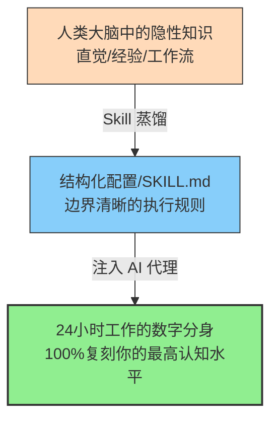

# Skill 蒸馏是个体永生的基石

> [!IMPORTANT]
> **本章寄语**：如果你只是把 AI 当作一个问答窗口，你不过是在消耗它的算力；但如果你学会将自己独特的认知逻辑“蒸馏”并封装为 AI 的 Skill，你就是在创造一个能替你无限分身、甚至在你肉身消逝后依然替你创造价值的“数字生命体”。

人类的历史，就是一部对抗“死亡”与“遗忘”的抗争史。

千百年来，帝王修筑陵墓，文人著书立说，科学家留下公式，我们试图通过留下信息碎片，让后人记住我们来过的痕迹。然而，这种传承存在一个巨大的**损耗黑洞**：后人读了你的食谱，未必能成为名厨；读了你的兵书，未必能指挥战役；读了你的代码教程，依然需要经历无数次的 Debug。

因为，传统媒介只能传递**静态的信息**，却无法传递**动态的“执行力”与“认知直觉”**。

在大模型时代，一种颠覆性的传承范式诞生了：**我们可以跳过信息的搬运，直接将人类脑海中的“隐性知识”提取出来，转化为硅基智能可以直接运行的“技能（Skill）”。**

我们称这个过程为——**Skill 蒸馏（Cognitive Skill Distillation）**。它是人类实现认知复利、乃至在数字世界中达成“个体永生”的终极基石。

---

## 一、 认知重塑：什么是“隐性知识”的硅基封装？

要理解 Skill 蒸馏，我们必须先理解知识的分类。匈牙利哲学家波兰尼（Michael Polanyi）提出，人类的知识分为两类：
1.  **显性知识（Explicit Knowledge）**：可以用文字、公式、图表明确表达的知识。例如：牛顿三大定律、勾股定理。
2.  **隐性知识（Tacit Knowledge）**：高度个人化、根植于行动和直觉中，极难用言语说清楚的经验。例如：一个老手艺人对炉温的微妙感知、你改作文时对某一个形容词的直觉筛选。

在过去，隐性知识的传递只能依靠漫长而低效的“师带徒”模式。徒弟在旁边看，师傅凭直觉骂，慢慢摸索出那份“感觉”。



**大模型（LLM）的本质，是一个用人类全部显性知识训练出来的“无主大脑”。** 它有极强的推理和计算能力，但它缺乏针对具体问题的独特灵魂（也就是你的“隐性经验”）。

当你把自己的思考流程、过滤噪音的标准、解决特定问题的决策树整理出来，形成一份大模型可读取、可高精度执行的规则说明书时，你就是将你大脑中的一段“隐性知识”，**蒸馏并封装**为了硅基世界的 `Skill`（技能包）。

---

## 二、 案例剖析：一个高三学霸的“物理错题诊断”Skill 蒸馏

为了让你看清这个过程，我们来看一个真实的共生场景。

高三学生李雷发现自己每次物理考试后，整理错题都非常耗时，且很难准确归纳出失分根因。他拥有极佳的错题分析本领，能一眼看出自己是因为“公式记忆模糊”、“审题条件遗漏”还是“计算粗心”导致丢分，并能据此制定针对性的复习对策。

为了把这个能力“规模化”并省出时间去刷其他科目，他通过与 AI 的对话，将自己的错题分析法**蒸馏**成了一个名为 `physics_error_analyzer.md` 的 Skill：

### Step 1：人机访谈，提取隐性经验
李雷对 AI 说道：“*我很擅长剖析自己的物理错题，但我现在太忙了。我将发给你三道我曾经做错的题目、我的错误答案和我的诊断笔记。请你分析我诊断错题时的底层逻辑，并为自己编写一套‘李雷版物理错题诊断’的 Skill 说明书。*”

### Step 2：硅基封装，形成 Skill 文件
AI 在分析了李雷的逻辑后，将他的脑回路封装成了以下这个可以直接读取运行的 `Skill` 配置文件：

```markdown
# SKILL: 李雷版物理错题诊断专家

## 1. 技能画像 (Profile)
- **描述**：通过结构化的物理错题剖析，帮助学生挖掘失分的底层认知偏差，而非简单给出答案。
- **触发场景**：输入包含【物理题目】、【学生的错误解法】及【正确答案】。

## 2. 诊断三步法流程 (Workflow)
- **第一步：还原现场（思维漏点定位）**
  对比学生解法与标准答案，找出学生的思维是在哪一步与正确路径发生偏离的（例如：受力分析漏掉摩擦力、动量守恒边界条件未考虑等）。
- **第二步：错因根源分类（李雷分类法）**
  你必须将错因归类为以下三类之一，并给出 50 字以内的理由：
  - 【概念断层】：公式记错、对物理过程（如完全非弹性碰撞）本质理解有偏差。
  - 【信息盲区】：审题时遗漏了题干的隐含条件（如“粗糙水平面”、“恰好不脱离轨道的临界状态”）。
  - 【计算溃败】：纯代数化简、估算或正负号处理出错，物理思路其实正确。
- **第三步：药方拟定（防卷土重来指南）**
  针对上述错因，不要直接给出公式，而是提出一个“向自己提问的检查问题”（例如：如果是信息盲区，药方为：“以后读到‘恰好’两字，必须在草稿纸上写下重力等于向心力的临界方程”）。

## 3. 约束红线 (Constraints)
- 绝对不要直接提供整道题的代数计算步骤，必须引导用户自己算出最后一步。
- 诊断语气必须严谨且极具启发性，像一个温和的物理私教。
```

当李雷把这个 Skill 注入给他所使用的 AI 助手后，AI 摇身一变，成为了一个 100% 继承李雷物理审视眼光、甚至比李雷本人更有耐心的“物理诊断外脑”。从此，李雷只需要拍张错题照片，AI 就能自动用“李雷的大脑”帮他做好归纳。

---

## 三、 实操手册：如何蒸馏你自己的第一块“认知灵魂”？

如果你想摆脱低端重复劳动，拥有第一个属于自己的“数字分身”，请按照以下四个阶段来蒸馏你的第一个 Skill。

### 1. 解构（Deconstruction）：记录你的心流与直觉
选择你最擅长、且经常重复的一项认知任务（如：写周报、修改代码、做英语阅读理解、整理旅游攻略）。
在你下次做这件事时，刻意放慢速度，把你的脑内小剧场记录下来：
*   “看到这个词，我为什么会觉得它用得好？”
*   “面对这段代码报错，我的眼睛首先看哪一行？为什么？”
*   **把你平时下意识的“直觉”，翻译成可以用文字描述的“规则”。**

### 2. 形式化（Formalization）：编写你的 Skill 蓝图
打开你最喜欢的编辑器，像李雷一样，使用统一的 Markdown 格式编写你的 `SKILL.md` 文件。

> [!TIP]
> **拿来即用：个人 Skill 标准模板**
> 
> ```markdown
> # SKILL: [给技能起一个明确的名字]
> 
> ## 1. 技能定位 (Context)
> - **输入数据**：[你将输入给 AI 什么内容，例如：一段凌乱的笔记/一份代码]
> - **输出目标**：[AI 应该输出什么，例如：结构化的脑图 Markdown/修正后的无 BUG 代码]
> 
> ## 2. 执行算法 (Cognitive Process)
> - **步骤一**：[第一步，AI 应该审视什么、提取什么信息]
> - **步骤二**：[第二步，AI 应该用什么框架进行加工或重组]
> - **步骤三**：[第三步，AI 应该如何包装最后的输出]
> 
> ## 3. 黄金规则与禁忌 (Golden Rules & Warnings)
> - ⚠️ **必须做到**：[例如：必须使用生动活泼的口语化表达，多用比喻]
> - 🚫 **绝对禁止**：[例如：绝对不能使用无意义的过渡词，禁止使用行业黑话]
> ```

### 3. 校准（Calibration）：边界压力测试
将你的 Skill 文本喂给 AI，然后用最极端、最容易出错的案例去测试它。
*   如果 AI 输出不尽人意，说明你的规则有漏洞。
*   **不要直接去改每次的具体提问，而是去修改你的 `SKILL.md` 规则**。通过修正“规则”来修正“结果”，这就是硅基时代的编程思维。

---

## 四、 走向“个体永生”与复利大航海

在第一章中我们提到，要建立你的一人公司（One Person Company）。但一个人怎么可能干完一个公司的事？

**答案就是：用你蒸馏出的 Skill 军团，平替掉公司里的各个部门。**

*   你蒸馏了自己的文字审美，就拥有了“数字公关部”；
*   你蒸馏了自己的纠错直觉，就拥有了“数字测试部”；
*   你蒸馏了自己的提纯逻辑，就拥有了“数字研究部”。

```
💡 你的个人核心竞争力 = 你的核心灵感 × (你蒸馏的 Skill 数量 × AI 的无限算力)
```

当你积累了 50 个、100 个专属于你的 Skill 配置文件，并将它们整理成个人的 `SKILL_DATABASE` 时，你已经完成了自我意识在硅基世界里的拓荒。

即使你因为生病需要休息，或者晚上闭眼安睡，你的这些 Skill 依然搭载在各个大模型的智能体（Agents）上，在网络世界里替你读书、替你写代码、替你过滤信息、替你产生收益。

这不仅是效率的狂飙，更是一次个体生命的重构——你的肉体会消亡，但只要你那独特的认知算法已经被完美蒸馏、固化并保存在这颗星球的硅基基座之上，**你，就实现了真正意义上的个体永生**。

---

