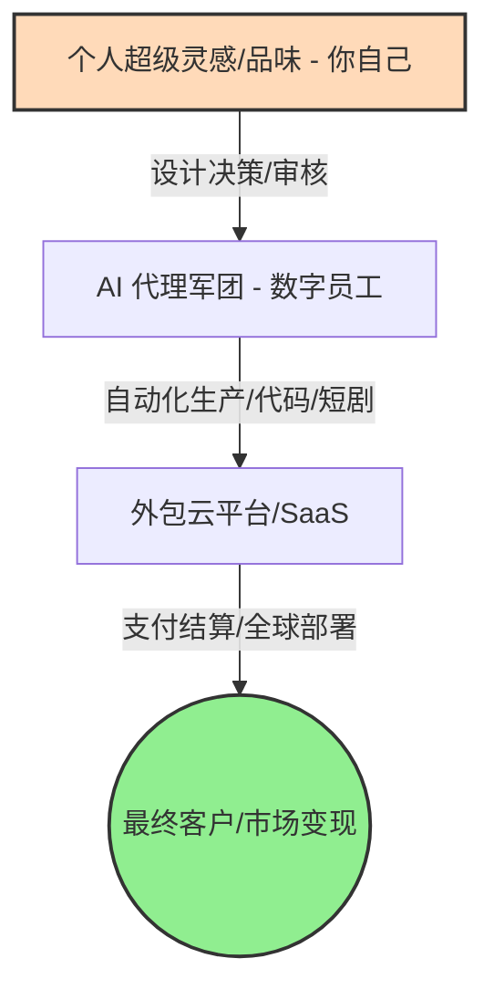

# 3.1 一人公司（OPC）：未来职场的终极形态

> [!IMPORTANT]
> **本章寄语**：在 AI 编程、自动化流和自主智能体爆发的今天，一个人做一家公司的边际成本已经无限趋近于零。你不再是职场上等待被挑选的“雇佣兵”，而是能够调用千军万马（AI 代理）的“独立领主”。**“一人公司（OPC, One Person Company）”不是一种企业注册选项，而是一种全新的生存哲学。**

你可能一直认为，创业是一件极其遥远且高风险的事情——需要租写字楼、招募员工、处理复杂的劳资关系、筹集大笔启动资金。对一个高中生或大学生来说，这听起来像是天方夜谭。

然而，就在你读到这篇文档的今天，世界的商业土壤已经发生了一次悄无声息的剧变。

2026 年初，随着“龙虾（OpenClaw）”等自主 Agent 框架席卷全球，个体的执行力迎来了核聚变般的飞跃。为了顺应这一历史性浪潮，**深圳市龙岗区**率先推出了**《关于支持“一人公司（OPC）”登记与税收优惠政策的试行办法》**。政策允许年满 18 周岁的个人（包括在校大学生）使用简化的虚拟孵化器地址作为公司注册地，享受“零注册资金、线上秒批、年营业额 10 万元以下完全免税”的特殊通道，正式从法律和税收层面确立了“AI 赋能超级个体”的合规地位。

在这个时代，**“一人公司”已经成为未来职场最瞩目、最具确定性的终极形态。**

---

## 一、 认知颠覆：从“打工人”到“一人公司”

在传统的工业时代，社会对青年的期望是“好好学习 $\to$ 考上好大学 $\to$ 找一份稳定的好工作”。我们习惯了将自己作为一颗“零件”，拧进大公司的庞大机器中。

然而，大公司提供“终身养老”的幻觉正在破灭。在 AI 时代，大厂为了追求极佳的 ROI，正在用 AI 逐步替代行政、初级程序员、视觉设计、客户服务等基础岗位。

与其做一颗随时可能被 AI 替换的生锈螺丝钉，不如将自己视为一个**独立运营的商业实体**。

```
传统思维（零件意识） ──> [出卖体力/固定时间] ──> [获取固定月薪] ──> [被动等待裁员风险]
OPC 思维（公司意识） ──> [打磨核心灵感/资产] ──> [AI 自动化运行] ──> [服务全球客户获取复利]
```

你就是这家公司的 CEO。你不再只关注“我的专业是什么”，而是关注：
*   **我的核心产品（Value Proposition）是什么？**
*   **我如何获取流量并建立信任（Marketing）？**
*   **我如何降低我的运行成本（Operations）？**

---

## 二、 一人公司的核心公式

为什么一个人可以顶得上一家公司？因为 AI 和数字化基础设施已经帮你完成了商业中 95% 的脏活累活。

我们可以将“一人公司”的运作模式提炼为以下公式：

$$\text{OPC (一人公司)} = \text{个人超级灵感 (CEO)} + \text{AI 代理军团 (数字员工)} + \text{外包云平台 (执行工具)}$$



1.  **个人超级灵感（CEO）**：负责定义产品方向，磨砺审美，审核 AI 的产出，建立人与人之间真实的信任纽带。这是硅基智能永远无法替代的碳基核心。
2.  **AI 代理军团（数字员工）**：
    *   `Cursor / Trae` 扮演你的一流程序员。
    *   `Kling 3.0 / OpenArt` 扮演你的美术和影视宣发团队。
    *   `n8n / Coze` 扮演你的 24 小时后台财务与信息总管。
    *   `OpenClaw 龙虾` 扮演你的前台助理，自动打扫数据。
3.  **外包云平台（执行工具）**：Vercel、GitHub、Stripe、飞书、淘宝等云平台，提供了不需要你维护的全球服务器、收单工具与物流分发系统。

---

## 三、 超级个体时代的红利

做一家“一人公司”，拥有传统企业无法企及的超级优势：

### 1. 极低甚至为零的“死机成本”（Low Burn Rate）
传统公司每个月一睁眼，就面临着办公室租金、员工社保、办公设备的巨大开销，一个月不盈利就可能倒闭。而“一人公司”只需要支付你的网费、电费和大模型的 API 订阅费。**你可以在没有生存压力的情况下，反复测试 100 个点子，只要成功一次，你就跑通了闭环。**

### 2. 闪电般的敏捷度（Agility）
大公司做一个决定需要层层汇报、开会论证、跨部门扯皮。而你的“一人公司”在早晨洗脸时想到一个点子，中午用 Trae 写好原型，下午在 Vercel 部署上线，傍晚就能通过小红书拿到第一笔用户反馈。

### 3. 全球化变现（Global Market）
借助 Stripe、Lemon Squeezy 等数字结算通道，你在深圳龙岗的书房里写出的一个“日程管理小插件”或者“物理复习词典”，可以直接卖给美国、日本或欧洲的用户，赚取全球范围内的复利。

---

## 四、 你的商业觉醒第一步

当你读完这章，请强迫自己在思维里完成一次“企业工商登记”：
1.  **起个名字**：为你的个人商业实体想一个名字（比如“李雷数字工作室”）。
2.  **清点资产**：你目前有什么能力（会写文章、懂英语、数学好、会用 Trae 写网页）？
3.  **寻找数字雇员**：你在上一章共生里掌握的哪些 AI 工具，可以作为你这家公司的数字员工？

不要低估自己的能量。在这个时代，最小的单位不再是一个组织，而是一个被 AI 武装到牙齿的**觉醒少年**。

---

*上一节：[2.12 实战演练 - 搭建你的 AI 工作流](../Part2%20%E5%85%B1%E7%94%9F/2.12%20%E5%AE%9E%E6%88%98%E6%BC%94%E7%BB%83%20-%20%E6%90%AD%E5%BB%BA%E4%BD%A0%E7%9A%84%20AI%20%E5%B7%A5%E4%BD%9C%E6%B5%81.md) | 下一节：[3.2 个人品牌 - 你就是你的产品](3.2%20%E4%B8%AA%E4%BA%BA%E5%93%81%E7%89%8C%20-%20%E4%BD%A0%E5%B0%B1%E6%98%AF%E4%BD%A0%E7%9A%84%E4%BA%A7%E5%93%81.md)*