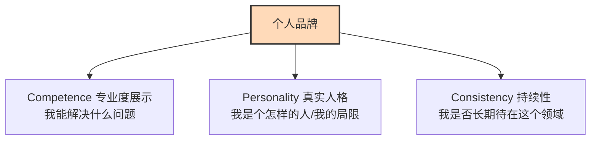

# 3.2 个人品牌：你就是你的产品

> [!IMPORTANT]
> **本章寄语**：在人人都可以一键调用 AI 的时代，信息的生成已经不再稀缺，**“信任”才是最贵、最稀缺的硬通货**。你的简历只是一张废纸，但你在互联网上沉淀的真实足迹、你的开源代码和你的思考过程，会为你构筑起一道坚不可摧的信用防线。记住，**你不用等成为专家后才去打造品牌，打造品牌的过程会让你成为专家**。

想象两个大三的学生去一家领先的 AI 软件公司应聘：

*   **学生 A**：递交了一份精美的 PDF 简历，上面写着“精通 Python，熟练使用大模型，学习能力强，英语四级”。
*   **学生 B**：没有投简历，而是发了一个链接。链接里是他的个人独立博客（记录了他从大一开始如何用 Trae 写了 5 个小工具的全部 Debug 过程）、他的 GitHub 账号（有 3 个正在运行的开源自动化脚本）、以及他的小红书账号（持续更新“高中生如何用 AI 学物理”的系列教程，吸引了 3000 个真实粉丝）。

如果你是主考官，你会把高薪职位给谁？

答案是不言而喻的。**学生 A 只有“自封的描述”，而学生 B 拥有“公开的证明（Proof of Work）”。**

在“一人公司”的时代，你的名字就是你的公司商标，你的个人声誉就是你最核心的产品。

---

## 一、 认知重构：简历在失效，数字足迹在生效

传统的职场链路是“隐藏实力 $\to$ 制造简历 $\to$ 投递大厂 $\to$ 被动面试”。在这个链路里，信息是极度不对称的，HR 只能通过几百字来猜测你的能力。

而在数字化大航海时代，雇主和客户寻找合作者的方式变成了**“全网检索与社交推荐”**。他们会通过搜索引擎、开源社区和垂直自媒体，去寻找那个“已经在持续解决这个问题的人”。

你的每一次公开写作、每一次在 GitHub 提交代码、每一次分享你用 AI 调试 BUG 的经历，都在互联网的数据库里留下了你个人信用的**“突触连接”**。

这些数字足迹（Digital Footprint）组合在一起，就形成了你的**个人品牌（Personal Brand）**。它是一个**信任聚合器**，能把陌生人对你的怀疑，在接触前就消磨殆尽。

---

## 二、 终极武器：在公开中学习（Learn in Public）

很多同学最大的误区是：“*我现在只是个学生，什么都不会，怎么建立品牌？等我以后成了大牛再说吧。*”

这是典型的线性思维。事实上，**“在公开中学习（Learn in Public）”**才是最强大、最能引发共鸣的个人品牌建设法。

```
传统路线（闭门造车）: 学习 ──> 考试 ──> 毕业 ──> 寻找工作 (无声无息)
公开学习（复利路线）: 学习 ──> 输出笔记/Bug记录 ──> 解决他人痛点 ──> 吸引粉丝/建立信任 (顺理成章)
```

它的核心逻辑非常简单：**不要隐藏你的无知，而是把你的“挣扎过程”公开展示出来。**

*   今天学了一个高难度的 Python 爬虫，报错了 5 次才跑通？写篇博客，把这 5 个报错和你的解决方法贴出来。相信我，全球一定有成百上千的人正卡在同一个坑里，你的文章就是他们的救命稻草。
*   今天用 Kling 生成 AI 短剧，发现主角总是变脸？把你的“角色一致性测试报告”发到小红书上，分析哪个参数最有用。你会吸引一帮志同道合的创作者，甚至引来商业订单。

人们不会因为你“完美无缺”而信任你，他们会因为看到你**“一步一步跨越困难的真实过程”**而对你产生极深的信任感。

---

## 三、 个人品牌的内容输出三重螺旋

要让你的个人品牌健康成长，你的输出必须围绕三个核心支柱展开：



1.  **专业度展示（Competence）**：用事实说话。展示你写出的代码、制作的短剧、或者总结出的物理公式记忆卡片。告诉世界：**我有交付成果的能力。**
2.  **真实人格（Personality）**：不要做冷冰冰的学术机器。写出你的焦虑、你的喜悦、你对某个科技政策的看法。**人只会和人产生情感连接，人不会和说明书产生连接。**
3.  **持续性（Consistency）**：不需要每天发，但必须有规律（如每周更新一次）。在互联网上，**“持续存在”本身就是一种极高门槛的信用背书**。一个坚持写了两年技术博客的大学生，其靠谱程度远超一个只在求职季活跃的应聘者。

---

## 四、 行动指南：搭建你的第一块数字根据地

从今天起，开始经营你的“个人品牌公司”，完成以下三步资产沉淀：

### 1. 整理你的 GitHub 主页（面向逻辑与技术圈）
如果你写代码，GitHub 就是你的数字化面容。把你在 2.9 章里写的倒计时小工具上传，写一份精美的 `README.md` 介绍它是干什么的，怎么运行。让别人一进来就能看到你干净的“工作台”。

### 2. 运营一个垂直自媒体账号（面向大众与客户）
选择小红书、知乎、Bilibili 或个人独立博客。不要发生活流水账，**只发你用 AI 提效、学习的硬核笔记**。你的定位是：“*一个正在用 AI 重构自己学业的少年实践者*”。

### 3. 主动链接同频者
去关注那些你崇拜的技术大牛或商业个体户，在他们的文章下写下你深度思考后的评论，而不是简单的“赞”。你的每一次高质量发言，都是在将对方的信任资产向自己引流。

让你的大脑走在思考的前线，让你的名字走在肉身的前面。你，就是你这一生最伟大的产品。

---

*上一节：[3.1 一人公司（OPC） - 未来职场的终极形态](3.1%20%E4%B8%80%E4%BA%BA%E5%85%AC%E5%8F%B8%EF%BC%88OPC%EF%BC%89%20-%20%E6%9C%AA%E6%9D%A5%E8%81%8C%E5%9C%B8%E7%9A%84%E7%BB%88%E6%9E%85%E5%BD%A2%E6%80%81.md) | 下一节：[3.3 技能变现 - 你的第一桶金](3.3%20%E6%8A%80%E8%83%BD%E5%8F%98%E7%8E%B0%20-%20%E4%BD%A0%E7%9A%84%E7%AC%AC%E4%B8%80%E6%A1%B6%E9%87%91.md)*
