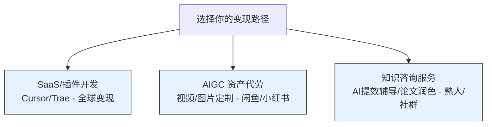

# 3.3 技能变现：你的第一桶金

> [!IMPORTANT]
> **本章寄语**：世界上最远的距离，是从“我觉得我的点子超棒”到“别人愿意为它掏出一块钱”。不要试图做改变人类命运的宏大软件，先去寻找身边具体的人的具体痛点。**当你挣到人生的第一笔“非工资/非零花钱”收入时，你大脑中的财富神经通路才算真正接通。**

很多同学在掌握了提示词、工作流和 AI 编程后，会陷入一种**“学术自嗨”**或**“技术自傲”**中：
*   花了两天时间写了一个自认为精妙绝伦的提示词，能生成各种玄幻小说大纲，但发到网上无人问津；
*   用 Trae 写了一个功能复杂的“班级作业打分系统”，兴冲冲推荐给班主任，却被对方以“太复杂、不会用”为由冷冷拒绝。

这种现象被称为**“自嗨陷阱”（The Self-Satisfaction Trap）**：**你做出了一个你自己觉得酷炫，但市场根本不需要的“玩具”。**

要实现技能变现，拿到属于你的第一桶金，你必须将思维从“我能做出什么”彻底扭转为——**“别人有什么痛苦，我能如何帮他解决并降低成本”**。

---

## 一、 核心法则：商业的本质是“痛苦溢价”

为什么别人会心甘情愿地付钱给你？
因为你的服务帮他**省了时间（Time-saving）**、**省了钱（Cost-saving）**、或者**赚了钱（Money-making）**。

在商业世界里，痛苦就是商机。**客户的痛苦有多深，他们愿意为之付出的溢价就有多高。**

对于一个没有资本、只有技术和时间的青年超级个体来说，我们应该锁定那些**“启动资金为零、边际成本极低”**的轻量变现路径。

---

## 二、 三大适合青年的低门槛变现路径

结合你在第二章学到的 AI 原生技能，你可以直接在以下三个方向上寻找突破口：

### 1. 微型 SaaS 与 Chrome 插件出海（软件微创业）
利用 `Trae / Cursor` 的强大代码生成能力，你可以零基础开发一些垂直的轻量软件：
*   **示例**：
    *   一个帮助外贸商家一键将中文商品描述转化为符合欧美本地语感文案的 Chrome 插件；
    *   一个专门把手写公式照片转化为标准 Markdown 排版的网页工具。
*   **变现方式**：利用 **Lemon Squeezy** 或 **Stripe** 配置极简的订阅制或单次买断制（如 3 美元/次），直接放到 Chrome 插件商店或全球独立开发者网站上变现。

### 2. AIGC 资产包与定制代劳（数字资产服务）
在今天，很多传统行业的老板、自媒体博主知道大模型有用，但他们**完全没有精力和耐心去写复杂的 SOP 提示词，更别提部署本地龙虾（OpenClaw）了**。
*   **示例**：
    *   帮当地的餐饮店老板，用 Midjourney 生成一整套质感极佳的菜单食物插画，并利用抠图排版成宣传折页；
    *   帮某个自媒体团队，利用 Kling 3.0 / Seedance 2.0 批量生成视频背景，或者代为制作他们的第一支 AI 概念短剧。
*   **变现方式**：直接在闲鱼、小红书或者淘宝提供定制服务，收取数百元不等的代劳费。

### 3. 认知与学习咨询（知识服务）
如果你是一个高二或大二的学生，你拥有对“刚经历过的考试/学业”最敏锐的直觉，配合 AI 私教，你能提供降维打击的辅导：
*   **示例**：
    *   **AI 提效伴学私教**：教初中生如何使用大模型作为他们的物理/英语私教，并帮他们搭建本地错题归纳流。
    *   **论文格式抛光服务**：利用你自己封装的 `抛光大师.md` 提示词，帮大学生或考研党批量润色学术报告的英文摘要。
*   **变现方式**：按小时收费（咨询费）或按篇收费。

---

## 三、 实战：如何拿到你的第一笔付费？

赚到 1 块钱的难度，往往比赚到 10000 块钱还要大。因为这代表着**“信任闭环”**的首次跑通。以下是零资源起跑的“三步夺金法”：

### 第一步：免费提供超值体验（获取信任背书）
不要一上来就跟人收钱。
如果你想提供“英语作文 AI 高级润色”服务，先去相关的学习社群或论坛发帖：“*由于我自己封装了一套顶级 AI 润色工作流，今晚免费帮前 10 位同学修改英语作文摘要。我会提供‘改前 vs 改后对照表’以及改动逻辑分析。*”

### 第二步：收集好评并产品化（Proof of Trust）
当你为这 10 位同学提供完服务后，请他们写下真实的评价：“*改得太地道了！比我找的学姐改得还要好，而且只要 5 分钟！*”
将这些对话截图和修改案例，做成一个精美的 PDF 或小红书卡片。**这就是你的“信用资产”。**

### 第三步：小步快跑，开启微额付费
当第 11 个人找来时，你可以温和地告诉他：“*免费名额已满。现在我的 AI 润色服务正式上线，由于调用大模型 API 需要算力成本，每篇收取 9.9 元（一杯奶茶钱）。这是我之前的修改案例和大家的评价。*”

不要不好意思谈钱。**付费，是客户对你的价值最真实、最严肃的反馈。** 

只有当资金真正流进你的账户时，你才算正式摆脱了课本上的纸上谈兵，迈出了你作为“一人公司”CEO 坚实的第一步。

---

