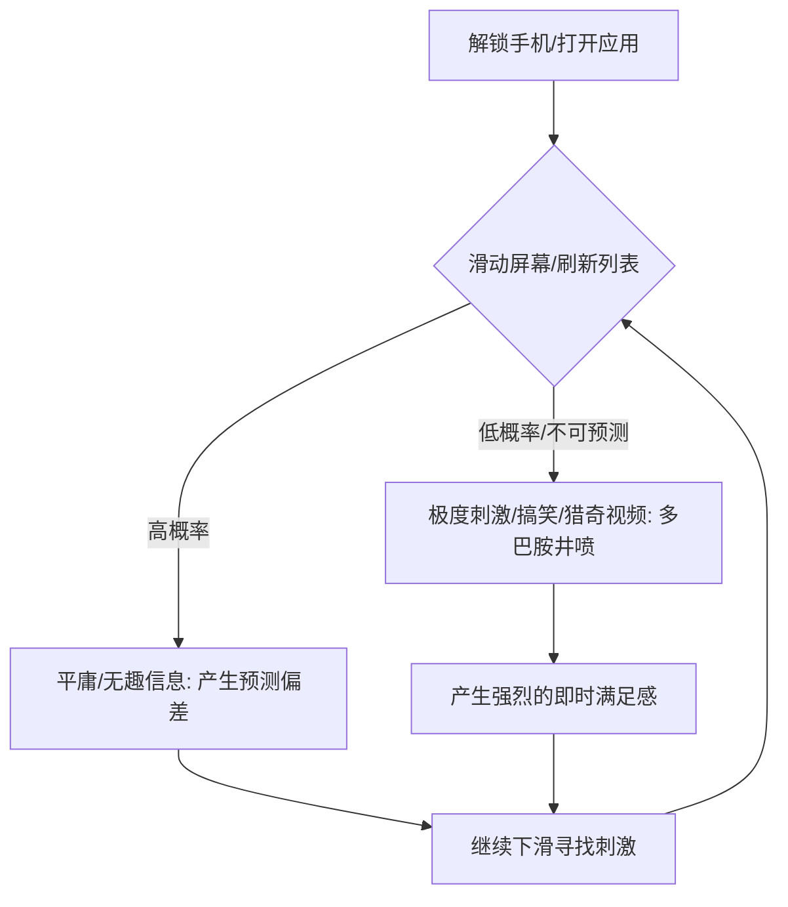

# 4.1 专注力危机：你正在失去什么

> [!IMPORTANT]
> **本章寄语**：注意力是你在数字时代唯一的“硬通货”。如果你无法控制自己的注意力，你就会被算法控制；如果你被算法控制，你的一生都将沦为他人流量变现的原材料。在这一节里，我们将用脑科学拆解为什么我们越来越难静下心来，并揭示那场发生在我们大脑深处的注意力掠夺战。

你是否也有过这样的体验：
打开手机本想查一个学习资料，却在看到一条推送后不知不觉点进去，等回过神来，两个小时已经过去，而最初要查的资料早已被抛之脑后；
翻开一本经典著作，读了不到三页，手就仿佛有自主意识一般伸向手机，解锁屏幕，即使上面没有任何新通知；
在写论文或做作业时，每隔几分钟就想切出去刷新一下网页、看一眼社交平台，否则就会感到莫名的焦虑与烦躁……

这并不是因为你“意志力薄弱”或“生性懒惰”。这是一场由全球顶尖的产品经理、算法工程师和脑科学专家联手发起的、针对你大脑前额叶的**精准围剿**。

---

## 一、 被蚕食的大脑：注意力衰退的真相

在互联网诞生之初，诺贝尔奖得主赫伯特·西蒙（Herbert A. Simon）就曾做出过神级预言：
> “信息的繁荣伴随着注意力的贫困。信息消耗了接收者的注意力。因此，信息的过载必然导致注意力资源的稀缺。”

在今天，这个稀缺已经演变成了严重的危机。加州大学欧文分校的一项研究表明，现代人在办公或学习时，**平均专注时间已经从 2004 年的 3 分钟，缩短到了如今的区区 47 秒**。这意味着，我们的大脑正在被碎片化的信息切成无数个细小的碎屑。

当我们频繁在不同的任务、视频和网页之间切换时，会产生一种被称为**“注意力残留”（Attention Residue）**的现象。当你从任务 A 切换到任务 B 时，你的注意力并不会立刻100%转移，仍会有一部分留在任务 A 上。频繁的切换会导致大脑负荷超载，认知带宽被极度压缩，最终导致深度思考能力的丧失。

---

## 二、 多巴胺与即时反馈机制的“脑劫持”

要理解注意力是如何被夺走的，我们必须认识大脑中的化学信使——**多巴胺（Dopamine）**。

很多人误以为多巴胺是“快乐递质”，但脑科学研究表明，**多巴胺不负责提供快乐，它负责提供“渴望”和“寻找快乐的动力”**。它是大脑的“预测误差补偿系统”。

在原始社会，多巴胺帮助我们的祖先寻找食物和水源。因为野外资源稀缺，当祖先看到红色的果实，多巴胺就会剧烈分泌，驱动他们去采摘。这种“寻找-获得”的回路构成了人类的生存本能。

然而，现代的社交媒体和短视频算法，精准地利用了这一本能，创造了**“间歇性变比强化”（Variable Ratio Reinforcement）**的成瘾模型——这与老虎机的原理完全一致。

当你每次向上滑动屏幕时，你都不知道下一秒会看到什么。可能是一个无聊的新闻，也可能是一个让你捧腹大笑的段子，或者是一个视觉效果炸裂的短视频。这种**“不可预测的奖励”**会促使大脑分泌海量的多巴胺。

大脑在习惯了这种“滑动屏幕 $\rightarrow$ 0.5秒获得刺激 $\rightarrow$ 多巴胺飙升”的超快反馈闭环后，就会对现实世界中那些**“反馈周期长但价值极高”**的事情产生生理上的排斥。

| 比较维度 | 刷短视频 / 社交媒体 | 深度阅读 / 编程学习 / 写作 |
| :--- | :--- | :--- |
| **反馈速度** | 毫秒级，滑动即可获得新刺激 | 小时级甚至天级，需要持续动脑 |
| **多巴胺水平** | 瞬间暴涨，随后陡然跌落，引发焦虑 | 缓慢平稳上升，维持心流状态 |
| **脑力消耗** | 几乎为零（被动接收） | 极高（需要前额叶主动控制） |
| **长期回报** | 认知碎片化，时间贬值 | 技能沉淀，个人资产增值 |

---

## 三、 前额叶皮层（PFC）退化危机

我们大脑中负责控制注意力、克制冲动、制定长期规划的核心区域，是位于额头后方的**前额叶皮层（Prefrontal Cortex, 简称 PFC）**。

前额叶就像是大脑的“交响乐指挥家”或“CEO”。它决定了你能否拒绝桌上手机的诱惑，专注于眼前的物理公式或代码逻辑。然而，前额叶是人类大脑中发育最晚（通常要到 25 岁左右才完全成熟）、也最脆弱的区域。

前额叶的运作极其消耗能量（葡萄糖）。当你不断抵制诱惑、或者不断在多巴胺诱惑中做思想斗争时，你的前额叶能量就会迅速消耗，进入**“自我损耗”（Ego Depletion）**状态。

当算法用无穷无尽的即时满足来轰炸你时，你的前额叶实际上处于被“解雇”的状态。大脑会顺从边缘系统（负责本能和情绪的原始大脑）的驱使，去寻找阻力最小的娱乐通道。长此以往，**前额叶的神经连接会因“用进废退”而弱化，导致注意力的物理掌控力下降**。这就是为什么很多人发现自己“书看不进去了”、“复杂一点的逻辑无法思考了”。

> [!WARNING]
> **专注力是智力的放大器**。如果你的专注力为 0，那么无论你拥有多么聪明的头脑，你的输出也只能是 0。在 AI 时代，大模型可以极其廉价地生成平庸的内容，但唯有依赖前额叶深度思考产出的**深度洞察、原创思想和复杂系统架构能力**才具有稀缺价值。保护前额叶，就是保护你作为人类最核心的竞争力。

---

## 四、 本节行动检查清单

要对抗这场针对注意力的掠夺，第一步是完成“认知觉醒”。请在今天完成以下三项检查：

*   [ ] **定量分析**：打开你手机的“屏幕使用时间”或“数字健康”设置，查看你昨天的手机使用总时长，以及“解锁次数”和“最常使用 App”。将数据记录在你的笔记本上。看着这个数字，问问自己：我真的有那么多紧急事务需要每天解锁手机 100 次吗？
*   [ ] **识别多巴胺陷阱**：在下一次你本想学习却突然想拿起手机时，暂停 10 秒钟，观察自己的身体反应（是否有焦躁、手心出汗或空虚感？）。在心中对自己说：“这是我的边缘系统在渴求多巴胺，我的前额叶正在重新接管控制权。”
*   [ ] **关闭首批红点**：将手机上除了微信视频通话、电话之外的**所有 App 的通知权限全部关闭**。尤其是社交、短视频和新闻类软件。取消所有的红点（Badge）显示，拒绝让屏幕上的小红点成为勾引你前额叶的视觉线索。

专注力不是一种与生俱来的性格特质，它是一块**可以被锻炼和修复的肌肉**。在下一节中，我们将介绍具体的“数字极简 SOP”，帮助你搭建物理防线，夺回你设备的主动权。

---

*上一节：[3.7 实战演练 - 设计你的个人商业模式](../Part3%20%E8%A7%89%E9%86%92/3.7%20%E5%AE%9E%E6%88%98%E6%BC%94%E7%BB%83%20-%20%E8%AE%BE%E8%AE%A1%E4%BD%A0%E7%9A%84%E4%B8%AA%E4%BA%BA%E5%95%86%E4%B8%9A%E6%A8%A1%E5%BC%8F.md) | 下一节：[4.2 数字极简 - 收回你的注意力](4.2%20%E6%95%B0%E5%AD%97%E6%9E%81%E7%AE%80%20-%20%E6%94%B6%E5%9B%9E%E4%BD%A0%E7%9A%84%E6%B3%A8%E6%85%8F%E5%8A%9B.md)*
