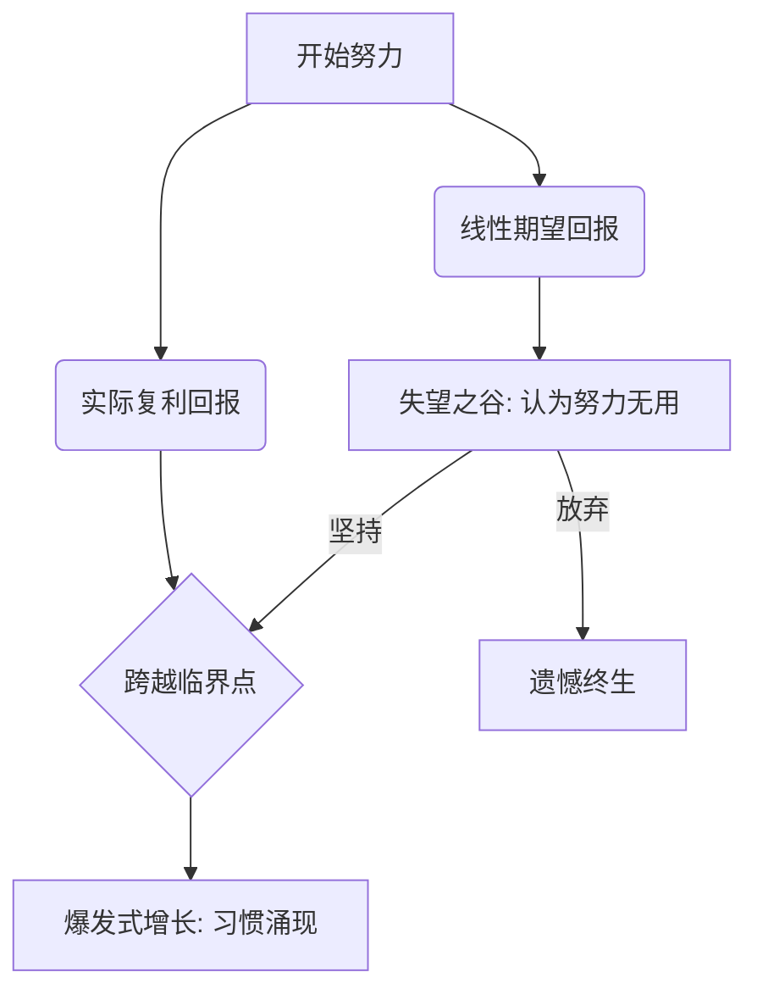

# 4.6 长期主义：跑赢时间的秘密

> [!IMPORTANT]
> **本章寄语**：世界上最强大的力量不是瞬间爆发的意志力，而是**微小习惯的日积月累**。在这一节中，我们将把“Scaling Law（缩放定律）”应用到你个人的成长习惯中，拆解如何通过重构行为阻力，建立一套无需消耗意志力也能自动运转的“复利操作系统”。

我们常常高估某一天做出重大改变的决定，却极度低估了每天进行微小改进的价值。

很多年轻人学习时，习惯于“突击式奋斗”：一天不吃不喝学 12 个小时，然后接下来的两周因为过度疲惫而彻底躺平。这种剧烈波动的模式，不仅对身体和前额叶伤害极大，而且根本无法形成有价值的资产沉淀。

真正的强者，都懂得利用**复利的杠杆**。

---

## 一、 习惯的 Scaling Law：每天进步 1% 的数学魔术

大模型的参数量每增加一个数量级，其能力就会发生戏剧性的非线性涌现（Emergence）。人体的神经连接和行为习惯同样遵循这一“缩放定律（Scaling Law）”。

我们来看一组著名的数学公式：

*   如果你每天进步 **1%**，持续一年：
    $$(1.01)^{365} \approx 37.78$$
*   如果你每天退步 **1%**，持续一年：
    $$(0.99)^{365} \approx 0.03$$

```
   能力水平
     ▲
37.8 ┼                                      🚀 每天进步1% (指数暴涨)
     │                                     .
     │                                   .
     │                                 .
     │                              .
 1.0 ┼───────────────────────────.───────── 保持现状 (1.0)
 0.0 ┼..................................... 📉 每天退步1% (滑落向0)
     └────────────────────────────────────► 时间 (365天)
```

在第一天、第十天甚至第三十天，每天进步 1% 和每天退步 1% 的人看起来几乎没有任何区别。但随着时间的拉长，两者的差距将发生**惊人的指数级分化**。

习惯，就是“自我改进的复利”。你重复某种行为越多，你就越是在加深大脑中特定神经通路（髓鞘质化）的物理厚度。一旦跨过某个临界点，这种行为就会变成潜意识的自动运行，不再消耗你的前额叶算力。

---

## 二、 原子习惯设计：重构行为的阻力

詹姆斯·克里尔（James Clear）在《原子习惯》中指出，设计一个新习惯有四大核心定律。如果我们想建立一套高效的学习习惯系统，可以如此落地：

### 1. 让它显而易见（Make it Obvious）
大脑是视觉主导的。如果你想养成背单词的习惯，不要把背单词软件藏在手机的第五级文件夹里。
*   **行动**：把单词书放在你每天睁眼就能看见的枕头旁；或者把背词App放在手机的 Dock 栏。
*   **习惯叠加（Habit Stacking）**：利用已有习惯作为新习惯的锚点。公式：`在 [已有习惯] 之后，我将执行 [新习惯]`。
    *   *示例*：“在每天早晨**泡好咖啡后**，我将立刻**阅读 2 页英文原著**。”

### 2. 让它简单易行（Make it Easy）
人性的底层逻辑是寻找阻力最小的通道。如果你把新习惯的门槛设得太高，你的前额叶在疲惫时就会选择拒绝。
*   **两分钟定律（The 2-Minute Rule）**：当你开始一个新习惯时，它的执行时间应该少于两分钟。
    *   *错误目标*：“我每天要写 2 小时代码。”（大脑感到痛苦，选择拖延）
    *   *正确目标*：“我每天只要打开 Cursor，写 1 行代码。”（极低阻力启动）
*   **降低物理阻力**：如果你想明天早晨运动，今晚睡前就把运动服和运动鞋整齐地摆在床边。

### 3. 让它阻力重重（针对坏习惯）
对于你想戒掉的坏习惯，反其道而行之——**增加它的启动阻力**。
*   如果你想减少刷短视频的时间，不要仅仅指望意志力。把该软件卸载，或者每次用完后退出登录，并把密码设为 20 位无规律随机字符，保存在另一个房间的电脑里。每次想刷，复杂的解锁流程会让你理智回归。

---

## 三、 对抗“失望之谷”：跨越潜能蓄积期

长期主义者面临的最大敌人是**“平台期”（Plateau of Latent Potential，潜能蓄积期）**。

我们往往期望改变是线性的，付出一分努力就应该立刻得到一分收获。但习惯的积累是非线性的，它需要漫长的孕育期。



在习惯建立的初期，你付出了大量努力，却发现成绩没有提高，技能没有变现。这个期望与现实之间的灰色地带，被称为**“失望之谷”（Valley of Disappointment）**。

大部分人都在“失望之谷”里选择了放弃，并得出结论：“长期主义都是骗人的”。然而，他们不知道的是，他们的努力并没有白费，而是被**储蓄**了起来。就像温度从 -5℃ 升到 -1℃，冰块看起来毫无变化，但一旦温度跨过 0℃ 临界点，冰块就会瞬间开始融化。

*   **信念重构**：当你感到停滞不前时，告诉自己：“这并不是我的努力没有效果，而是我正在经历我的‘潜能蓄积期’。我只需要继续维持系统的运行，等待涌现的一刻。”

---

## 四、 本节行动检查清单

请在今天利用“原子习惯”设计法，为自己定制一个微习惯：

*   [ ] **设计一个“两分钟微习惯”**：选择一项你想长期坚持的技能（如编程、英语、写作），将其压缩成一个“2分钟内即可完成”的最小启动动作（例如：每天打开背单词软件背 5 个词，或每天打开 IDE 写一个 `print("hello")`）。
*   [ ] **应用习惯叠加公式**：写下你明天的习惯叠加公式，明确指定新习惯的时间、地点和前置锚点。
*   [ ] **增加坏习惯阻力**：找出一个最消耗你精力的坏习惯（如熬夜玩游戏、无节制刷小红书），在物理层面为其增加至少 2 步以上的“启动阻力”（如睡前将平板电脑放进柜子锁起来，钥匙放在客厅）。

长期主义不是苦行僧式的自我折磨，而是基于脑科学的精妙游戏。在下一节中，我们将把前面所学的所有能量管理理论汇总，通过实战演练，设计出属于你个人的“能量收支审计系统”，完成第四章的闭环。

---

*上一节：[4.5 睡眠革命 - 被低估的超能力](4.5%20%E7%9D%A1%E7%9C%A0%E9%9D%A9%E5%91%BD%20-%20%E8%A2%AB%E4%BD%8E%E4%BC%B0%E7%9A%84%E8%B6%85%E8%83%BD%E5%8A%9B.md) | 下一节：[4.7 实战演练 - 设计你的能量管理系统](4.7%20%E5%AE%9E%E6%BC%98%E7%BB%83%20-%20%E8%AE%BE%E8%AE%A1%E4%BD%A0%E7%9A%84%E8%83%BD%E9%87%8F%E7%AE%A1%E7%90%86%E7%B3%BB%E7%BB%9F.md)*
