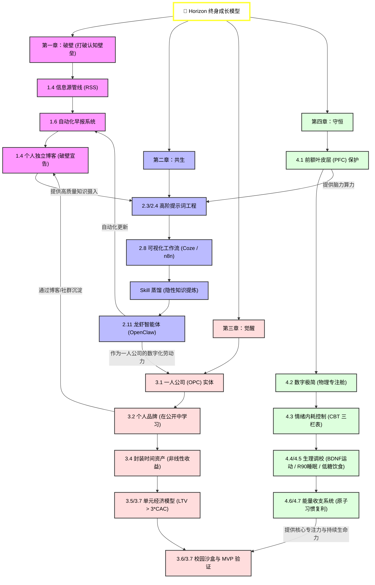

# 🗺️ 核心资源：知识图谱

> [!IMPORTANT]
> **本章寄语**：见树木，更要见森林。《Horizon》一书所构筑的，不是零散的技能碎片，而是一整套**自我演进、自给自足的闭环操作系统**。以下是全书四章（破壁、共生、觉醒、守恒）的终极逻辑拓扑图。通过这张图，您可以直观地看清每一个概念如何作为下一个技能的基石，以及个人能量如何支撑起整个商业架构。

---

## 一、《Horizon》全书知识图谱拓扑

请放大或滑动查看以下图表：

---

## 二、 图谱核心链路解读

1.  **“信息破壁”是认知的引擎**：
    没有高质量、未被算法污染的信息源管线（[1.4 节](<../Part1 破壁/1.4 信息源管理 - 建立你的知识管道.md>)），你的大脑就会充斥着垃圾信息，进而导致你的 AI 提示词和逻辑流（[第二章](<../Part2 共生/2.1 AI 时代已来 - 不是选择题.md>)）输出质量低下。垃圾进，垃圾出（Garbage in, Garbage out）。
2.  **“AI 共生”是一人公司的基建**：
    你不需要雇佣昂贵的团队。利用 `n8n/Coze 工作流 + 龙虾（OpenClaw）`（[2.8 节](<../Part2 共生/2.8 自动化与工作流 - 扣子与 n8n 的实操演练.md>) / [2.11 节](<../Part2 共生/2.11 自主智能体落地 - 部署你的第一个“龙虾”（OpenClaw）数字员工.md>)），你就可以将个人 Skill 固化并无边际成本地复制，这是你“一人公司（OPC）”的终极数字资产。
3.  **“商业觉醒”提供可持续的经济闭环**：
    掌握了技术，必须算得清商业账。通过“在公开中学习”（[3.2 节](<../Part3 觉醒/3.2 个人品牌 - 你就是你的产品.md>)）为博客和社群引流，核算 LTV 与 CAC 的比例（[3.5 节](<../Part3 觉醒/3.5 商业思维 - 像企业家一样思考.md>)），并在大学沙盒里进行 MVP 敏捷实验。你获得的利润，将进一步反哺你的设备和服务器投入。
4.  **“精力守恒”是整个操作系统的 CPU 风扇与电池**：
    这是最容易崩溃的一环。如果你把前额叶烧坏了（[4.1 节](<../Part4 守恒/4.1 专注力危机 - 你正在失去什么.md>)）、每天陷入情绪内耗和失眠，你的整个系统将会在瞬间陷入死机状态。保证生理能量和习惯复利，你才能在时间的长河中笑到最后。

---
