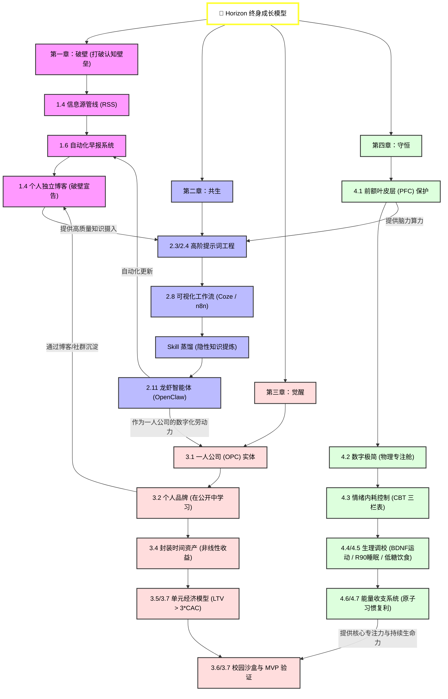

# 🗺️ 核心资源：知识图谱

> [!IMPORTANT]
> **本章寄语**：见树木，更要见森林。《Horizon》一书所构筑的，不是零散的技能碎片，而是一整套**自我演进、自给自足的闭环操作系统**。以下是全书四章（破壁、共生、觉醒、守恒）的终极逻辑拓扑图。通过这张图，您可以直观地看清每一个概念如何作为下一个技能的基石，以及个人能量如何支撑起整个商业架构。

---

## 一、《Horizon》全书知识图谱拓扑

请放大或滑动查看以下图表：

---

## 二、 图谱核心链路解读

1.  **“信息破壁”是认知的引擎**：
    没有高质量、未被算法污染的信息源管线（[1.4 节](../Part1%20%E7%A0%B4%E5%A3%81/1.4%20%E4%BF%A1%E6%81%AF%E6%BA%90%E7%AE%A1%E7%90%86%20-%20%E5%BB%BA%E7%AB%8B%E4%BD%A0%E7%9A%84%E5%8F%AA%E6%98%AF%E7%AE%A1%E9%81%93.md)），你的大脑就会充斥着垃圾信息，进而导致你的 AI 提示词和逻辑流（[第二章](../Part2%20%E5%85%B1%E7%94%9F/2.1%20AI%20%E6%97%B6%E4%BB%A3%E5%B7%B2%E6%9D%A5%20-%20%E4%B8%8D%E6%98%AF%E9%80%85%E6%8B%A9%E9%A2%98.md)）输出质量低下。垃圾进，垃圾出（Garbage in, Garbage out）。
2.  **“AI 共生”是一人公司的基建**：
    你不需要雇佣昂贵的团队。利用 `n8n/Coze 工作流 + 龙虾（OpenClaw）`（[2.8 节](../Part2%20%E5%85%B1%E7%94%9F/2.8%20%E8%87%AA%E5%8A%A8%E5%8C%96%E4%B8%8E%E5%B7%A5%E4%BD%9C%E6%B5%81%20-%20%E6%89%A3%E5%AD%90%E4%B8%8En8n%E7%9A%84%E5%AE%9E%E6%93%8D%E6%BC%94%E7%BB%83.md) / [2.11 节](../Part2%20%E5%85%B1%E7%94%9F/2.11%20%E8%87%AA%E4%B8%BB%E6%99%BA%E8%83%BD%E4%BD%93%E8%90%BD%E5%9C%B0%20-%20%E9%83%A8%E7%BD%B2%E4%BD%A0%E7%9A%84%E7%AC%AC%E4%B8%80%E4%B8%AA%E2%80%9C%E9%BE%99%E8%99%BE%E2%80%9D%EF%BC%88OpenClaw%EF%BC%89%E6%95%B0%E5%AD%97%E5%91%98%E5%B7%A5.md)），你就可以将个人 Skill 固化并无边际成本地复制，这是你“一人公司（OPC）”的终极数字资产。
3.  **“商业觉醒”提供可持续的经济闭环**：
    掌握了技术，必须算得清商业账。通过“在公开中学习”（[3.2 节](../Part3%20%E8%A7%89%E9%86%92/3.2%20%E4%B8%AA%E4%BA%BA%E5%93%81%E7%89%8C%20-%20%E4%BD%A0%E5%B0%B1%E6%98%AF%E4%BD%A0%E7%9A%84%E4%BA%A7%E5%93%81.md)）为博客和社群引流，核算 LTV 与 CAC 的比例（[3.5 节](../Part3%20%E8%A7%89%E9%86%92/3.5%20%E5%95%86%E4%B8%9A%E6%80%9D%E7%BB%B4%20-%20%E5%83%8F%E4%BC%81%E4%B8%9A%E5%AE%B6%E4%B8%80%E6%A0%B7%E6%80%9D%E8%80%83.md)），并在大学沙盒里进行 MVP 敏捷实验。你获得的利润，将进一步反哺你的设备和服务器投入。
4.  **“精力守恒”是整个操作系统的 CPU 风扇与电池**：
    这是最容易崩溃的一环。如果你把前额叶烧坏了（[4.1 节](../Part4%20%E5%AE%88%E6%81%92/4.1%20%E4%B8%93%E6%B3%A8%E5%8A%9B%E5%8D%B1%E6%9C%BA%20-%20%E4%BD%A0%E6%AD%A3%E5%9C%A8%E5%A4%B1%E5%8E%BB%E4%BB%80%E4%B9%88.md)）、每天陷入情绪内耗和失眠，你的整个系统将会在瞬间陷入死机状态。保证生理能量和习惯复利，你才能在时间的长河中笑到最后。

---

